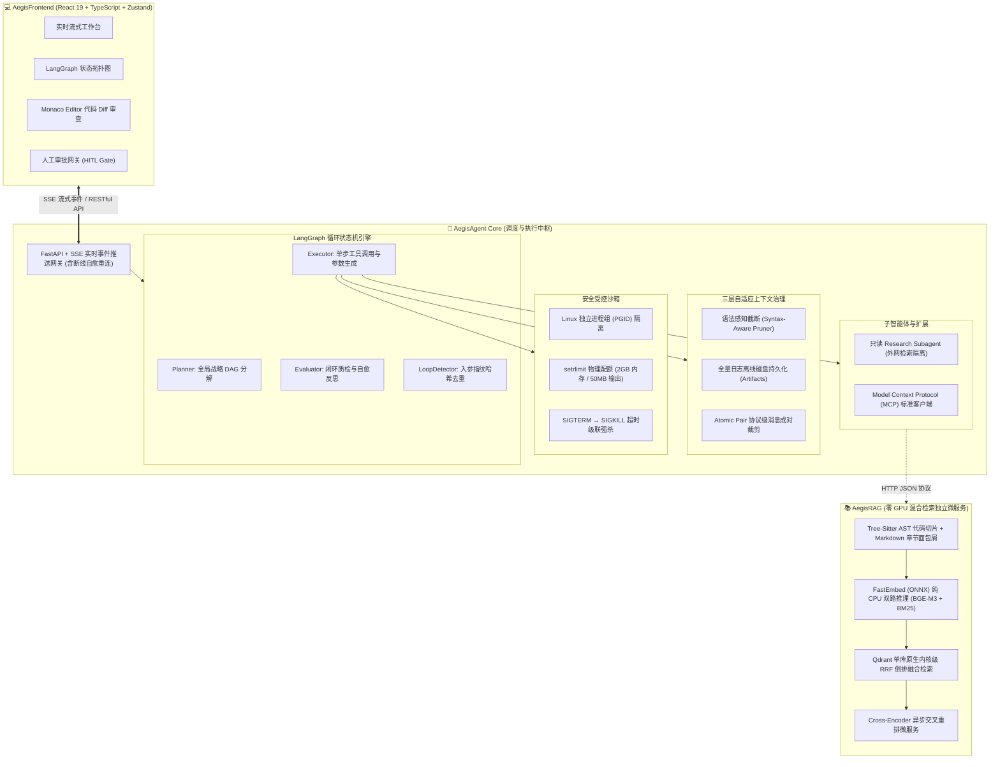

# 🛡️ Aegis: 工业级本地自主代码研发智能体与轻量 RAG 系统

<p align="center">
  
  
  
  
  
  
  
</p>

> **Aegis (Engineering Research Agent)** 是一套对标 Claude Code / Devin 的工业级本地自主代码研发智能体与检索增强微服务系统。  
> **核心设计哲学**：**用 100% 确定性的系统级软件工程体系，包裹非确定性的大语言模型推理**。

---

## 🌟 核心痛点与工程解法

在真实软件研发场景中，纯 Prompt 驱动的单体 ReAct 智能体通常面临四大致命缺陷。Aegis 针对性设计了全链路工业级解决方案：

| 生产级研发痛点 | 传统 Agent 缺陷 | Aegis 工业级工程解法 |
| :--- | :--- | :--- |
| **目标漂移与死循环** | 单步失败即链路断裂；重复调用同一工具陷入死循环 | **Planner-Executor-Evaluator 双层解耦状态机** + **入参指纹哈希校验**，100% 自动拦截死循环，连续报错自适应触发重规划 |
| **海量日志冲垮上下文** | 跑测试产生数千行输出，触发 API 400 Context Overflow | **语法感知三层上下文治理**：海量日志自动离线持久化至磁盘，仅提炼关键错误堆栈；结合 **Atomic Pair 消息成对裁剪**维持 10k tokens 安全水位 |
| **Shell 命令失控与逃逸** | 进程挂起阻塞整体调度；执行死循环留下大量僵尸孤儿进程 | **Linux PGID 进程组沙箱**：注入物理内存 (setrlimit) 与运行时间配额，实现 **两段式超时级联强杀（SIGTERM → SIGKILL）** |
| **代码 RAG 断章取义与 GPU 依赖** | 按固定字符切片切断语法块；传统向量化依赖高显存 GPU | **Tree-Sitter AST 语义保真切片** + **FastEmbed (ONNX) 纯 CPU 极速向量化** + **Qdrant 内核级原生 RRF 倒排融合**，零 GPU 依赖 |

---

## 🏗️ 系统全景架构拓扑

Aegis 采用物理与网络解耦的微服务架构：**Agent 核心调度引擎 (AegisAgent)** + **零 GPU 混合检索微服务 (AegisRAG)** + **响应式工作台 (AegisFrontend)**。



---

## ⚡ 核心子系统与技术细节

### 1. AegisAgent: 双层自愈状态机与受控沙箱
* **LangGraph 循环编排**：解耦全局规划与单步参数生成。引入 `LoopDetector`，通过计算工具入参的 SHA-256 结构化指纹，100% 自动拦截死循环；连续报错时自适应触发重规划。
* **三层上下文治理金字塔**：
  * **第一层**：终端海量输出（如 `pytest` 产生的数千行输出）通过 `ObservationPruner` 语法感知截断，仅向活跃 Prompt 注入首尾关键错误堆栈；
  * **第二层**：全量原始输出离线持久化至磁盘 Artifacts，为模型保留可查阅的完整证据链；
  * **第三层**：结合滑动窗口与 **Atomic Pair 成对裁剪**，保证活跃 Context 始终处于 **10k tokens 安全水位**，彻底杜绝 OpenAI / Anthropic 协议下的 400 Context Overflow。
* **Linux PGID 受控沙箱**：基于 `os.setpgid` 为每次 Shell 命令分配专属进程组，通过 `setrlimit` 注入物理资源配额；超时发生时执行 `SIGTERM → SIGKILL` 两段式级联强杀，杜绝孤儿僵尸进程残留与高危命令逃逸。
* **物理隔离的只读调研子智能体**：独立的只读 `Research Subagent` 负责外网检索，主工具表构造期直接拒绝不可信工具，通过权限单调衰减与 URL 白名单机制，从架构物理上杜绝 Prompt Injection 注入风险。

### 2. AegisRAG: 纯 CPU 混合检索基础设施
* **AST 语法级保真切片**：源码基于 **Tree-Sitter** 解析语法树，严格按函数、类、结构体 AST 节点边界切分，保留完整的代码语义单元；技术文档按标题树层级递归切分并自动注入**章节面包屑路径（Contextual Breadcrumbs）**，彻底消除语义孤岛。
* **纯 CPU 零 GPU 依赖**：采用 **FastEmbed (ONNX Runtime)** 在纯 CPU 上毫秒级运行 **BGE-M3**（稠密语义向量）与 **BM25**（关键词/符号稀疏向量），彻底摆脱 PyTorch/CUDA 庞大环境，微服务体积精简 80%+。
* **Qdrant 内核级原生 RRF 融合**：拒绝应用层二次网络拉取合并，直接调用 **Qdrant 原生内核级 RRF（Reciprocal Rank Fusion）互惠倒排秩算子**，端到端召回保持在毫秒级时延。
* **Cross-Encoder 交叉重排**：串联 `bge-reranker` 对 Top-K 候选集进行全交叉打分重排，筛选高相关代码片段，克服长上下文模型“迷失在中间 (Lost in the Middle)”现象。

### 3. AegisFrontend: 响应式流式工作台
* **流式交互与断线自愈**：基于 **FastAPI + SSE** 开发携带消息序列号的实时事件流，支持网络闪断自动从断点拉取快照续跑。
* **AI 原生工作台**：基于 **React 19 + TypeScript + Zustand** 构建，实时响应式呈现 Agent 状态机流转拓扑、思考瀑布流、工具调用日志以及 Monaco Editor 代码 Diff 审查面板，内嵌人工审批（HITL）网关。

---

## 📁 目录结构导航

```text
Aegis/
├── AegisAgent/               # 👑 核心调度引擎与沙箱服务
│   ├── src/
│   │   ├── agent_runtime/    # LangGraph 状态机、Planner/Executor/Evaluator、上下文治理
│   │   ├── services/         # 受控 Shell 沙箱 (PGID)、外网搜索、MCP 客户端
│   │   ├── tools/            # 结构化工具集与参数校验
│   │   └── api/              # FastAPI 异步微服务与 SSE 推送
│   ├── tests/                # 200+ 单元测试与集成测试套件
│   └── pyproject.toml        # Agent Python 依赖配置 (Python 3.12+)
│
├── AegisRAG/                 # 📚 独立代码与文档检索微服务
│   ├── src/
│   │   ├── chunking/         # Tree-Sitter AST 代码切片与 Markdown 面包屑解析
│   │   ├── embeddings/       # FastEmbed (ONNX) 纯 CPU 双路向量化 (BGE-M3 + BM25)
│   │   ├── storage/          # Qdrant 存储、索引与内核级 RRF 检索
│   │   └── reranking/        # Cross-Encoder 深度重排管道
│   ├── tests/                # RAG 全链路自动化测试
│   └── pyproject.toml        # RAG 服务独立依赖配置
│
├── AegisFrontend/            # 🎨 React 响应式工作台
│   ├── src/                  # 状态机拓扑、Monaco Diff、流式思考瀑布流
│   └── package.json          # 前端依赖配置 (React 19, Vite, TailwindCSS)
│
├── documents/                # 📖 完整系统架构设计与 ADR 决策记录
│   ├── README.md             # 架构文档总索引
│   ├── agent_runtime/        # Agent 运行时详细规格
│   ├── bash_shell/           # 受控沙箱实现规范
│   └── tech-stack/           # 核心依赖技术栈选型与理解手册
│
├── start                     # 统一系统启动器 (CLI)
├── start.sh                  # 启动脚本快捷包装
└── LICENSE                   # MIT 开源许可证
```

---

## 🚀 快速上手 (Quick Start)

### 1. 环境准备
* **Python**: 3.12+ (推荐使用 `uv` 或 `conda`)
* **Node.js**: 20+ (推荐使用 `pnpm`)
* **Docker**: 运行 Qdrant 向量数据库（可选，亦支持本地嵌入模式）

### 2. 配置环境变量
分别复制各子服务的环境变量模板：
```bash
cp AegisAgent/.env.example AegisAgent/.env
cp AegisRAG/.env.example AegisRAG/.env
```
在 `AegisAgent/.env` 中配置您的 LLM 模型 API Key（如 OpenAI / DeepSeek / Claude / 兼容 OpenAI 格式网关）。

### 3. 一键启动系统
Aegis 提供了统一的启动中枢脚本 `./start`：

```bash
# 赋予执行权限
chmod +x start start.sh

# 查看启动器帮助
./start all

# 选项 A: 启动 Agent 核心微服务 (默认端口 :8000)
./start agent

# 选项 B: 启动 RAG 检索微服务 (默认端口 :8001)
./start rag

# 选项 C: 启动前端交互工作台 (默认端口 :5173)
./start frontend
```

---

## 🧪 自动化测试与工程验证

Aegis 坚持测试驱动开发（TDD），构建了严密覆盖状态机迁移、受控沙箱边界、RAG 召回精度与并发网络协议的自动化测试套件：

```bash
# 运行 Agent 核心测试矩阵 (覆盖状态机、LoopDetector、上下文裁剪、沙箱强杀)
cd AegisAgent
pytest tests/ -v

# 运行 RAG 检索微服务全链路测试 (覆盖 AST 切分、ONNX 纯 CPU 向量化、Qdrant 存储)
cd ../AegisRAG
pytest tests/ -v
```

---

## 📄 开源许可证

本项目采用 [MIT License](./LICENSE) 协议开源。欢迎提交 Issue、PR 共同探索工业级自主研发智能体的未来！
