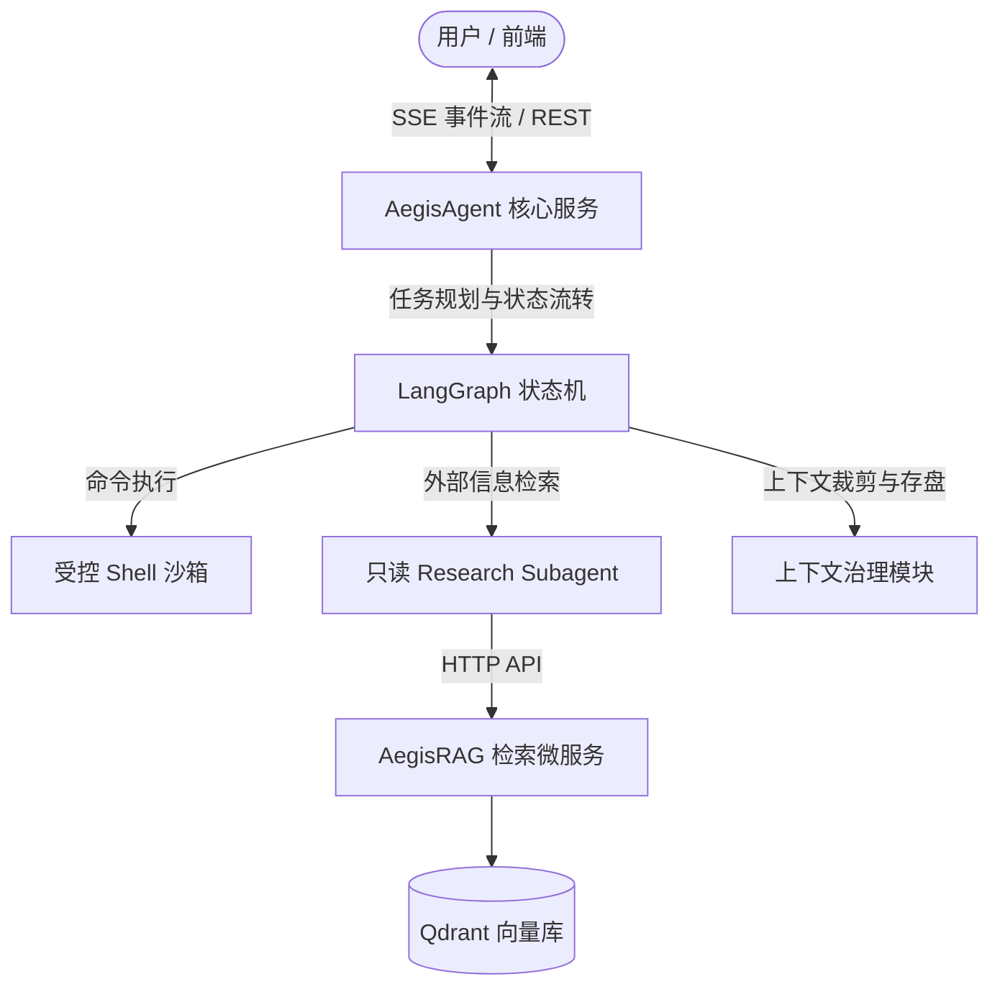

# Aegis

Aegis 是一个用于本地代码库分析与自动化任务执行的 Agent 系统，采用微服务架构设计，包含状态机调度核心、轻量混合检索服务与流式交互前端。

主要解决大语言模型在处理本地代码工程任务时常见的工具重复调用死循环、长日志上下文溢出、Shell 进程残留以及无 GPU 环境下的代码语义检索问题。

## 架构概览

Aegis 整体划分为三个解耦的服务组件：

```
Aegis
├── AegisAgent     # 核心调度服务：LangGraph 状态机、受控 Shell 执行、上下文管理
├── AegisRAG       # 检索微服务：Tree-Sitter AST 切片、CPU 向量化、Qdrant 存储与重排
└── AegisFrontend  # 前端交互界面：React + Vite，支持流式日志、状态图与代码 Diff
```

### 服务调用关系



## 核心设计与模块说明

### 1. AegisAgent (调度与执行引擎)
- **状态机任务编排**：基于 LangGraph 将任务流程拆解为规划（Planner）、执行（Executor）与校验（Evaluator）节点。
- **工具调用防死循环**：对工具名称与输入参数生成结构化哈希指纹，检测到相同参数连续重复调用时主动中断并触发重规划。
- **长日志截断与持久化**：针对测试与编译产生的大量标准输出，通过首尾提取关键堆栈信息注入上下文，完整输出同步存入本地磁盘（Artifacts），避免会话 Context 超过限制。
- **受控 Shell 执行**：为命令执行分配独立的 Linux 进程组（PGID），配置执行超时与内存配额，超时后通过两段式信号（SIGTERM ➔ SIGKILL）终止整个进程组，防止孤儿进程残留。
- **外部调研隔离**：独立的只读子智能体负责处理网络检索，主流程仅接收提炼后的结论，隔离外部不可信数据。

### 2. AegisRAG (代码与文档检索服务)
- **基于 AST 语法树切片**：源码文件通过 Tree-Sitter 解析语法结构，按照函数、类和结构体节点边界进行切分，保证代码语法块的完整性。
- **文档层级面包屑**：技术文档基于 Markdown 标题树层级递归切分，并在切片中注入所属章节层级路径，避免切片失去上下文语境。
- **纯 CPU 混合检索**：通过 FastEmbed (ONNX Runtime) 在 CPU 环境下并行生成稠密向量（BGE-M3）与稀疏关键词向量（BM25），不依赖 PyTorch 或 CUDA 环境。
- **Qdrant 内核级 RRF 融合**：在 Qdrant 存储层直接利用原生互惠倒排秩（RRF）算子融合双路召回结果，减少应用层网络往返。
- **Cross-Encoder 交叉重排**：使用轻量 Reranker 模型对初筛候选集进行重排，提高前排结果相关度。

### 3. AegisFrontend (流式交互界面)
- 基于 React 19、TypeScript 与 TailwindCSS 构建。
- 通过 Server-Sent Events (SSE) 实时接收 Agent 执行状态、思考流与工具调用日志。
- 集成 Monaco Editor 实现代码审查与 Diff 差异比对。

## 快速开始

### 环境依赖
- Linux 环境 (支持 process group 与 setrlimit 特性)
- Python >= 3.12
- Node.js >= 20, pnpm
- Docker (用于运行 Qdrant，亦支持嵌入式本地存储)

### 配置
复制并填写各子服务的环境配置文件：

```bash
cp AegisAgent/.env.example AegisAgent/.env
cp AegisRAG/.env.example AegisRAG/.env
```

在 `AegisAgent/.env` 中填入你的大模型 API 基础地址与 Key。

### 启动服务
根目录下提供统一启动脚本 `start`：

```bash
# 赋予执行权限
chmod +x start start.sh

# 查看启动指令
./start all

# 启动 Agent 核心服务 (默认端口 8000)
./start agent

# 启动 RAG 检索微服务 (默认端口 8001)
./start rag

# 启动前端页面 (默认端口 5173)
./start frontend
```

## 测试

各子模块包含单元测试与集成测试：

```bash
# 运行 AegisAgent 测试
cd AegisAgent
pytest tests/ -v

# 运行 AegisRAG 测试
cd ../AegisRAG
pytest tests/ -v
```

## 目录结构

```text
├── AegisAgent/               # 核心 Agent 服务与沙箱
│   ├── src/                  # 运行时编排、工具集、API 服务
│   ├── tests/                # 单元测试与状态机流转测试
│   └── pyproject.toml        # Python 依赖
├── AegisRAG/                 # 代码与文档检索微服务
│   ├── src/                  # 切片管道、向量化、Qdrant 存储
│   ├── tests/                # 检索精度与微服务接口测试
│   └── pyproject.toml        # 检索服务依赖
├── AegisFrontend/            # 前端 Web UI
│   ├── src/                  # 状态拓扑、Diff 比对、流式交互组件
│   └── package.json          # 前端依赖配置
├── documents/                # 系统技术规格与设计文档
├── start                     # 服务启动脚本
└── LICENSE                   # MIT License
```

## 许可证

本项目采用 [MIT License](LICENSE) 开源。
