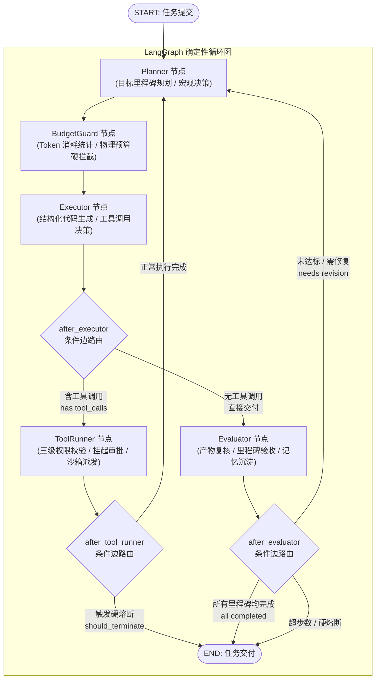

# 01 Agent 编排与状态机架构 (Orchestration & State Machine)

> **定位**：Aegis 核心调度中枢的架构设计规范。基于 **LangGraph StateGraph** 构建以“目标规划-物理预算-代码生成-沙箱执行-结果验收”为闭环的确定性循环图状态机。
> **核心原则**：
> - **节点与状态机解耦**：计算节点（`nodes/`）只负责读取状态并返回增量，路由决策完全外置于条件边（`edges/`）；
> - **闭包依赖注入工厂**：运行时依赖（模型网关、上下文装配器、提示词库、派发器）以闭包注入，绝不污染 Checkpoint 状态；
> - **原子对严格对称铁律**：`AIMessage(tool_calls)` 与 `ToolMessage` 必须 1:1 闭合，杜绝单向脱漏。

---

## 1. 状态机推演拓扑与控制流

Aegis 的执行图是由 5 大计算节点与确定性条件边构成的有向图状态机：



---

## 2. 状态模型定义 (`AgentState`)

状态机在节点间流转的全局载荷为 `AgentState`（定义于 [`src/agent_runtime/state.py`](file:///home/Skualeilu/Projects/Aegis/AegisAgent/src/agent_runtime/state.py)），受严格类型约束：

| 状态字段 | 类型 | 语义与更新策略 |
| :--- | :--- | :--- |
| `messages` | `Annotated[Sequence[BaseMessage], add_messages]` | LangChain 消息序列，追加更新；受原子对裁剪规则保护 |
| `task_goal` | `str` | 用户原始目标，初始化后只读不可篡改 |
| `milestones` | `List[Milestone]` | 任务分解出的阶段性目标与完成状态（`pending`/`running`/`completed`/`failed`） |
| `permission_level` | `PermissionLevel` | 当前任务的权限基线（`read_only` / `workspace_write` / `full_permissions`） |
| `should_terminate` | `bool` | 全局硬熔断标志位（金丝雀泄露、死循环或预算耗尽时置为 True） |
| `consecutive_errors` | `int` | 连续工具报错计数器，防死循环重试 |
| `artifacts` | `Dict[str, str]` | 任务离线落盘产物句柄映射表（`artifact_id -> 物理路径`） |
| `fingerprint_history` | `List[str]` | 工具调用参数指纹滑动窗口，用于死循环检测探针 |

---

## 3. 五大核心计算节点体系 (Compute Nodes)

计算节点均遵循统一签名规范：`NodeFn = Callable[[Mapping[str, Any]], Awaitable[Dict[str, Any]]]`，采用**闭包工厂注入模式（Closure Factory Injection）**构建。

### 3.1 Planner 规划节点 ([`nodes/planner.py`](file:///home/Skualeilu/Projects/Aegis/AegisAgent/src/agent_runtime/nodes/planner.py))
* **职责**：宏观决策中枢。在任务启动或重大偏差后，驱动高阶推理大模型（`gpt-5.6-terra`）拆解出 3~5 个具有确定性验收条件的 `Milestone`。
* **特性**：
  - 自动装配工作区长期记忆与会话历史；
  - 接收来自 `Evaluator` 或 `HITL` 的拒绝/失败观察值，具备自适应重规划能力。

### 3.2 BudgetGuard 预算守卫节点 ([`nodes/budget_guard.py`](file:///home/Skualeilu/Projects/Aegis/AegisAgent/src/agent_runtime/nodes/budget_guard.py))
* **职责**：物理层硬配额守门人。
* **特性**：
  - 在大模型调用前核算累计消耗 Token 与执行步数；
  - 一旦超过 `max_steps` 或 `max_total_tokens`，强制将 `should_terminate` 置为 True，优雅截断执行，防止烧穿 API 预算。

### 3.3 Executor 执行节点 ([`nodes/executor.py`](file:///home/Skualeilu/Projects/Aegis/AegisAgent/src/agent_runtime/nodes/executor.py))
* **职责**：微观动作生成器。调用快速执行模型（`gpt-5.6-luna`），结合当前里程碑生成具体的 `tool_calls`（如修改文件、执行测试等）。
* **特性**：
  - 严格输出结构化 JSON / Function Calling 格式；
  - 注入 XML 定界沙箱协议，防范提示词注入。

### 3.4 ToolRunner 工具派发节点 ([`nodes/tool_runner.py`](file:///home/Skualeilu/Projects/Aegis/AegisAgent/src/agent_runtime/nodes/tool_runner.py))
* **职责**：安全审计、人机协同（HITL）审批拦截与物理沙箱派发核心。
* **特性**：
  1. **三级权限前置判定**：通过 `permission.py` 计算动作等级，若动作等级超出当前基线，触发 LangGraph 原生 `interrupt()` 挂起；
  2. **人机审批流转**：支持外部注入 `Command(resume={"approved": True/False, "scope": "once"/"always"})` 恢复执行；
  3. **死循环与金丝雀检测**：拦截重复调用指纹，扫描 Canary Token；
  4. **原子对回填保障**：无论执行成功、失败、拒绝或异常，确保为每一个 `tool_call` 生成对应的 `ToolMessage`。

### 3.5 Evaluator 验收节点 ([`nodes/evaluator.py`](file:///home/Skualeilu/Projects/Aegis/AegisAgent/src/agent_runtime/nodes/evaluator.py))
* **职责**：独立终态复核与记忆沉淀。
* **特性**：
  - 不轻信 Executor 的自白，严格检查物理文件是否存在、单测输出是否包含 `exit_code: 0`；
  - 全部完成则收敛至 `END`；发现缺陷则将失败原因标注在 Milestone 中打回 `Planner` 进行修复；
  - 提炼踩坑教训上浮沉淀到工作区级长期记忆。

---

## 4. 控制流路由解耦机制

状态图节点间绝不硬编码彼此调用关系，所有跳转通过 [`routing.py`](file:///home/Skualeilu/Projects/Aegis/AegisAgent/src/agent_runtime/routing.py) 条件边路由：

```python
# 核心路由跳转表设计
EDGE_TABLE = {
    "planner": "budget_guard",
    "budget_guard": "executor",
    "executor": route_after_executor,      # 动态判定：有 tool_calls -> tool_runner；无 -> evaluator
    "tool_runner": route_after_tool_runner, # 动态判定：should_terminate -> END；正常 -> planner
    "evaluator": route_after_evaluator,    # 动态判定：全部完成 -> END；需修复 -> planner
}
```

---

## 5. 四层认知上下文治理与原子对裁剪

为了兼顾长任务上下文连贯性与 Token 水位安全，Aegis 采用分层上下文装配与治理模型：

1. **第 1 层：系统指令与安全规范**（约 850 Token，固定注入首部）；
2. **第 2 层：工作区级长期记忆**（架构定论、编码约定、跨会话避坑黑名单）；
3. **第 3 层：会话级压缩记忆**（前序任务总结、已确认的关键事实）；
4. **第 4 层：活跃滑窗对话轮次**（当前正在进行的最近 N 轮消息）。

**原子对对称裁剪法则（Atomic Pair Invariant）**：
当活跃上下文逼近 Token 上限触发消息裁剪时，**严禁单独裁剪掉 `AIMessage(tool_calls)` 或单独裁剪掉 `ToolMessage`**。裁剪算法以 `(AIMessage, ToolMessage)` 为不可分割的原子单元进行整体移出，坚决防止大模型 API 出现“Tool call without matching tool result”的 400 协议破坏。

---

## 6. 持久化检查点与故障自愈 (Crash Durability)

* **SQLite WAL 模式存储**：通过 [`agent_runtime/checkpoint.py`](file:///home/Skualeilu/Projects/Aegis/AegisAgent/src/agent_runtime/checkpoint.py)（`SqliteCheckpointStore`）持久化状态；
* **断电续跑**：每个 Step 结束后事务自动刷盘，主进程即使遭遇 `kill -9` 硬崩溃，重启后通过 `aget_state(thread_id)` 即可无缝还原整个状态机快照并通过 `/resume` 接续执行。
