# 02 代码语义检索 RAG 架构 (Code Semantic RAG Architecture)

> **定位**：`AegisRAG` 独立微服务（默认监听端口 `:8001`）的代码与文档混合语义检索基础设施架构设计规范。
> **核心原则**：
> - **语法边界零破坏**：以 AST（抽象语法树）解析为基准，按函数/类/结构体完整语义单元切分，杜绝字符定长机械截断；
> - **双路召回与重排保障**：Dense 语义泛化 + Sparse 词法精确匹配 -> Qdrant 原生 RRF 融合 -> Cross-Encoder 深度重排；
> - **纯 CPU/ONNX 离线优先**：零 GPU 与零外网强依赖，启动期维度探测强自检与 UUIDv5 确定性幂等。

---

## 1. RAG 全链路数据流架构拓扑

```mermaid
flowchart TD
    subgraph IngestionPipeline ["数据索引流水线 (Ingestion Pipeline)"]
        RawCode[" 原始工程代码 / Markdown 文档"] --> Dispatcher{"切分调度器\nDispatch"}

        Dispatcher --"C/C++/Go/Python"--> AST[" Tree-sitter AST 切分器\n(保留完整函数/结构体/吸收尾随分号)"]
        Dispatcher --"Markdown"--> MD[" Markdown 结构切分器\n(H1~H3 标题切片 + 面包屑注入)"]
        Dispatcher --"纯文本/配置"--> Fallback[" 通用定长滑动窗口降级"]

        AST & MD & Fallback --> Meta[" ChunkMetadata 强类型元数据\n(UUIDv5 确定性哈希 + 文件坐标)"]

        Meta --> EmbeddingPipe[" 双路向量化管道 (Embedding Pipeline)"]
        EmbeddingPipe --> DenseModel["Dense 稠密语义向量 (1024维)\n(jina-embeddings-v3 / ONNX CPU)"]
        EmbeddingPipe --> SparseModel["Sparse 稀疏词法向量 (BM25)\n(FastEmbed Qdrant/bm25)"]

        DenseModel & SparseModel --> QdrantUpsert[(" Qdrant 向量引擎 (:8001)\n分批 Upsert + 幂等去重 + 失效清理")]
    end

    subgraph RetrievalPipeline ["在线检索流水线 (Retrieval Pipeline)"]
        QueryIn([" Agent Query 输入\n(如 '找 Qdrant 启动强校验逻辑')"]) --> DualEmbed["双路向量化 Query"]
        DualEmbed --> QdrantHybrid["Qdrant 内核级混合多路召回\n(Dense 语义路 + Sparse 词法路)"]
        QdrantHybrid --> RRF[" RRF (Reciprocal Rank Fusion)\n倒排融合排序 (初筛 Top-30)"]
        RRF --> Reranker[" Cross-Encoder 交叉注意力精排\n(bge-reranker-base / ONNX CPU)"]
        Reranker --> TopK[" Top-5 高置信度代码切片\n(含精准文件路径与行号坐标)"]
    end
```

---

## 2. 核心架构层级深度剖析

### 2.1 语法感知切分层 (AST-Aware Chunking)
* **C/C++ AST 切分 ([`ast_splitter.py`](file:///home/Skualeilu/Projects/Aegis/AegisRAG/src/indexer/ast_splitter.py))**：
  - 基于 Tree-sitter 提取 `function_definition`、`struct_specifier`、`class_specifier` 等完整语法节点；
  - **兄弟节点吸收算法**：识别 C 语言尾随分号（如 `struct Point { int x; };`），完整吸附结尾的 `;` 兄弟节点，避免切片遗漏语法分号；
  - **模板声明整体打包**：针对 `template<typename T> class Foo`，将其作为整体语法切片捕获，内部类不再重复切分。
* **Markdown 面包屑层级切分 ([`markdown_splitter.py`](file:///home/Skualeilu/Projects/Aegis/AegisRAG/src/indexer/markdown_splitter.py))**：
  - 按 H1~H3 层级切分，自动为底层切片注入上下文路径（如 `"架构设计 > 存储引擎 > Qdrant 选型"`），解决小段落上下文丢失问题。
* **确定性 Point ID 与幂等去重 ([`ids.py`](file:///home/Skualeilu/Projects/Aegis/AegisRAG/src/storage/ids.py))**：
  - 计算 $\text{UUIDv5}(\text{repo\_name} + ":" + \text{file\_path} + ":" + \text{start\_line} + ":" + \text{content\_hash})$；
  - 代码未变动时重复 Ingest 自动跳过（`skipped == 100%`），无重复写入与数据膨胀。

### 2.2 双路向量化模型管道 (Dual Embeddings)
* **Dense 语义路**：使用 `jinaai/jina-embeddings-v3`（ONNX Runtime CPU 本地推理），生成 1024 维密集语义向量，具备强大的跨自然语言与多编程语言语义泛化能力；
* **Sparse 词法路**：使用 `Qdrant/bm25`（FastEmbed），生成稀疏词频权重向量，对函数名、变量名、专有名词具备 100% 精确命中能力。

### 2.3 Qdrant 混合召回与 RRF 融合 (Hybrid Search)
* 在 Qdrant 单个 Collection 内部同时配置 `dense` 与 `sparse` 向量空间；
* 利用 Qdrant 1.10+ 原生 Prefetch 算子，在数据库内核层执行 **RRF (Reciprocal Rank Fusion)**：
  $$\text{RRF\_Score}(d) = \sum_{m \in \{\text{dense}, \text{sparse}\}} \frac{1}{60 + \text{rank}_m(d)}$$
* 支持将语言过滤（`filter: language == "c"`）下推到 prefetch 查询层，杜绝跨语言脏切片。

### 2.4 Cross-Encoder 深度重排 (Reranking)
* 使用 `BAAI/bge-reranker-base` 交叉编码器模型；
* 将 Query 与候选代码片段进行全注意力交互重打分，彻底解决 RRF 仅凭排名无法衡量绝对相关度的局限，将最关键代码切片显著推向 Top-1 和 Top-3。

---

## 3. 全景消融基准与架构收益验证 (RAGBench)

基于 4:4:2 代码金标集（符号精确查找 40%、功能逻辑定位 40%、跨文件架构 20%），系统产出的权威消融实验基线如下：

| 架构消融配置 | 模式语义 | MRR@3 | NDCG@5 | HitRate@5 | 架构收益归因 |
| :--- | :--- | :---: | :---: | :---: | :--- |
| **`dense_only`** | 纯语义召回 | 0.4167 | 0.4540 | 0.7000 | 语义理解强，但在专有符号精确匹配上易脱靶 |
| **`sparse_only`** | 纯 BM25 词法 | 0.1667 | 0.2146 | 0.3500 | 仅命中硬关键字，无自然语言概念理解能力 |
| **`hybrid_rrf`** | 双路 + RRF 融合 | 0.3250 | 0.3632 | 0.6000 | 兼顾语义与精确符号，但缺乏深层交叉相关度计算 |
| **`hybrid_rerank`** | **生产全栈基准** | **0.5000** | **0.5432** | **0.7500** | **MRR@3 提升 +53.8%，NDCG@5 提升 +49.6%**，核心切片推向 Top-1/3 |

---

## 4. 健壮性防线与 Preflight 自检探针

1. **Collection 启动期维度强校验**：
   - 启动时自动探测当前 Dense 模型输出维度（1024 维）；
   - 若 Qdrant 已有集合维度与配置冲突，立即抛出 `DimensionMismatchError` 拒绝启动并置未就绪，防止静默写入脏数据。
2. **失效数据增量清理 (`delete_stale`)**：
   - 第二次 Ingest 时对比文件列表，自动批量删除已在磁盘上移除文件的遗留切片，保证知识库与工作区物理状态严格同步。
