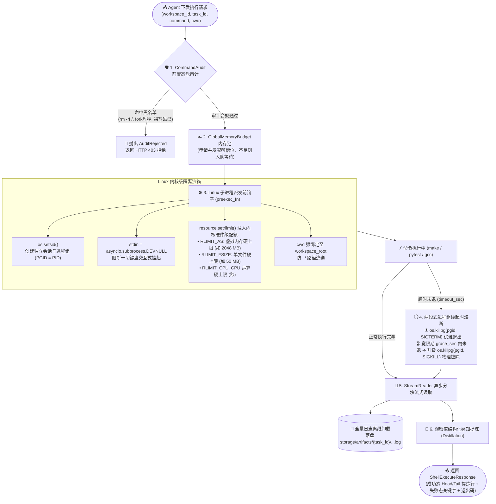

# 03 受控 Linux 沙箱与隔离架构 (Controlled Linux Sandbox)

> **定位**：Aegis 受控命令执行与代码沙箱子系统（微服务监听端口 `:8002`，源码位于 [`AegisAgent/src/services/bash_shell/`](file:///home/Skualeilu/Projects/Aegis/AegisAgent/src/services/bash_shell/)）的架构设计规范。
> **核心原则**：
> - **进程组级物理清场**：通过 `os.setsid` 建立独立进程组（PGID），两段式超时熔断（`SIGTERM ➔ SIGKILL`），绝不遗漏孤儿进程；
> - **Linux 内核级物理硬约束**：通过 `resource.setrlimit` 限制内存与文件大小，防止触发系统 OOM Killer 或写满磁盘；
> - **输入输出反挂死与离线卸载**：`stdin = DEVNULL` 反向注入 EOF 杜绝交互式卡死；全量日志流式刷盘，只给模型提供结构化提炼视图。

---

## 1. 沙箱执行链路架构拓扑

---

## 2. Linux 操作系统级五大安全支柱

### 2.1 进程生命周期与防“孤儿”治理 (Process Group PGID)
* **痛点**：当命令执行形如 `sh -c "make -j4 && ./run.sh"` 时，操作系统会生成一颗包含父进程、编译器、测试程序的深层进程树。如果仅调用 `proc.terminate()`，杀死的只是最外层父进程，内部的子孙程序将变为**孤儿进程**并被系统 `init/systemd (PID 1)` 接管，在后台长期霸占端口和 CPU。
* **架构解法**：
  - 在 `preexec_fn` 中调用 `os.setsid()`，使新派生的子进程成为新会话的主导进程与独立进程组组长；
  - 超时或取消时，调用 `os.killpg(pgid, sig)` 向**整个进程组**投递信号，连根拔起全部派生进程。

### 2.2 两段式硬超时熔断 (Two-Stage Timeout)
* **阶段一（SIGTERM 优雅释放）**：向进程组广播 `signal.SIGTERM`（信号 15），给被测程序提供 2 秒宽限期（`sigterm_grace_sec`），允许其正常刷新 I/O 缓冲区并释放互斥锁；
* **阶段二（SIGKILL 强制拔除）**：若宽限期内进程组仍未终止，立即升级发送内核不可捕获、不可忽略的 `signal.SIGKILL`（信号 9），确保 100% 物理清退。

### 2.3 内核级硬件配额约束 (`resource.setrlimit`)
在执行用户与大模型代码时，绝不能依赖应用层自觉，必须施加 Linux 内核级硬配额：
* **`RLIMIT_AS`（虚拟内存硬上限）**：
  - 限制最大申请内存（默认 2048 MB）；
  - 代码若出现死循环 `malloc`，在触碰阈值时内核直接返回 `NULL` 或向该程序抛出 `SIGSEGV`，由被测程序自行崩溃退出，**坚决杜绝耗尽宿主机内存触发系统级 OOM Killer 误杀主干服务**。
* **`RLIMIT_FSIZE`（单文件写出硬上限）**：
  - 限制最大文件写出大小（默认 50 MB）；
  - 代码若进入死循环狂写日志，达到 50MB 时内核直接抛出 `SIGXFSZ` 强杀写操作，**坚决杜绝把宿主机磁盘打满**。
* **`RLIMIT_CPU`**：限制进程消耗的 CPU 真实时间。

### 2.4 输入输出反挂死与离线卸载 (I/O Governance)
* **`stdin = DEVNULL`**：
  - 许多工具（如 `apt-get`、`git push`、误敲的交互式 `python/vim`）会在遇到不确定性时等待终端键盘输入；
  - 将标准输入重定向至 `/dev/null`，程序试图读取输入时立即读到 `EOF`（文件结束符），迫使其快速失败退出，绝对不挂起线程循环。
* **全量日志离线卸载与观察值蒸馏**：
  - 几万行的编译输出异步分块写入磁盘（`storage/artifacts/{task_id}/...log`），不在 Python 内存中驻留；
  - 内存中仅保留前 10 行与后 20 行（Head/Tail）或者过滤包含 `error:` / `fatal:` 的关键字错误行回传给大模型，兼顾上下文治理与内存安全。

### 2.5 路径沙箱与高危指令审计 (Path Sandbox & Audit)
* **CWD 绝对绑定**：命令严格在当前 `workspace_root` 下执行；
* **路径防逃逸**：通过 `Path.resolve()` 计算真实规范化绝对路径，拦截任何包含 `../../` 试图越过当前工作区边界的写操作；
* **黑名单命令审计**：拦截 `rm -rf /`、格式化硬盘 `mkfs`、磁盘裸写 `dd`、关机命令 `reboot/shutdown`、Linux Fork 炸弹 `:(){ :|:& };:` 以及修改 `/etc/passwd` 等高危破坏性指令。
