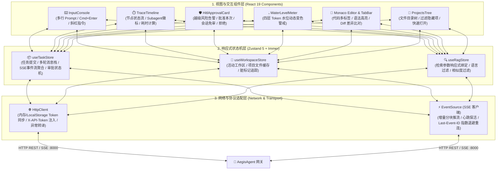

# 04 Web 前端与人机协同交互架构 (Frontend & HITL Architecture)

> **定位**：`AegisFrontend` 独立控制台（默认监听端口 `:5173`，源码位于 [`AegisFrontend/`](file:///home/Skualeilu/Projects/Aegis/AegisFrontend/)）的前端技术架构与人机交互设计规范。
> **核心原则**：
> - **人机协同安全受控（Human-in-the-Loop, HITL）**：高危动作卡片式可视化审批，支持单次放行、会话免审与拒绝重规划；
> - **长任务响应式状态栈**：同会话多轮对话上下文连续保留，SSE 增量流式渲染；
> - **Monaco 代码沉浸式审阅**：多标签页管理、代码 Diff 差异高亮与脏标记防丢保护；
> - **极简极客视觉设计**：浅色干净基底、信息高密度、拒绝光污染与高饱和脏色。

---

## 1. 前端分层技术架构拓扑

---

## 2. 核心交互机制深度剖析

### 2.1 人机协同越级审批流 (HITL Approval Loop)
* **触发机制**：当 Agent 执行高危命令（如 `git push`、跨目录写操作）被后端 `interrupt()` 挂起时，SSE 推送 `task.waiting_for_approval` 事件；
* **卡片式阻断呈现 ([`HitlApprovalCard.tsx`](file:///home/Skualeilu/Projects/Aegis/AegisFrontend/src/components/chat/HitlApprovalCard.tsx))**：
  - 界面立即弹出黄色/红色安全警示卡片，输入控制台暂时锁定；
  - 清晰呈现 4 大核心要素：**待执行命令**、**动作类型（如 `network_egress`）**、**越级原因** 与 **工作目录 `cwd`**；
* **三向决策闭环**：
  1. **批准本次 (`scope="once"`)**：仅放行当前这次操作，下次同类命令继续阻断；
  2. **会话免审 (`scope="always"`)**：将该动作签名加入会话白名单，当前任务后续执行同一动作无需再次打扰用户；
  3. **拒绝执行 (`reject`)**：用户可附带拒绝说明，后端将其转化为工具观察值回灌给大模型，驱动模型在下一步自适应调整方案。

### 2.2 多轮会话消息栈与 SSE 聚合 ([`useTaskStore.ts`](file:///home/Skualeilu/Projects/Aegis/AegisFrontend/src/stores/useTaskStore.ts))
* **同会话多轮提交上下文不丢失**：用户在同一 Session 内连续提问时，前端状态机绝不粗暴清空历史，而是将新生成的任务与前序轮次的问答按时间正序累加维护在消息栈中；
* **增量流式字符串拼接**：处理后端高频推送的 `token` 碎片，利用不可变数据模式平滑渲染，杜绝界面闪烁；
* **断网指数退避重连**：当 SSE 长连接中断时，客户端携带 `Last-Event-ID` 自动发起退避重试，服务端自动重放遗漏帧。

### 2.3 Token 水位三级预警 ([`WaterLevelMeter.tsx`](file:///home/Skualeilu/Projects/Aegis/AegisFrontend/src/components/domain/WaterLevelMeter.tsx))
根据服务端返回的 `water_level_pct` 动态渲染水位进度条，实时提示上下文健康度：
* **$< 70\%$（安全态）**：显示清爽绿色；
* **$70\% \sim 90\%$（预警态）**：显示警告黄色，提示长任务可能即将触发原子对裁剪；
* **$> 90\%$（危险态）**：显示赤红色，提示正在接近物理配额极限。

### 2.4 Monaco Editor 与工作区文件联动
* 实时加载工程代码树；
* 点击查看时激活 Monaco 语法高亮（支持 C、C++、Go、Python、TS/TSX、Rust 等）；
* 支持双栏 Diff 模式，清晰对比 Agent 生成的补丁与原始代码的增删改差异；
* 标签关闭前进行脏检查（Dirty Check），未保存修改弹出防护确认弹窗。

---

## 3. 视觉与 UI/UX 设计规范

* **基底色调**：以浅色、冷白为基调，搭配干净淡色调辅助，杜绝高饱和光污染、暗色刺眼与脏色；
* **信息密度**：遵循工程师专业工作台布局，侧边栏（目录树与会话）、主视区（代码与 Monaco）、交互区（时间线与控制台）比例黄金分割；
* **状态确定性**：每一个动作（思考中、生成中、执行中、挂起中、已完成、已失败）均有具象的状态图元和耗时毫秒展示，拒绝模糊加载。
