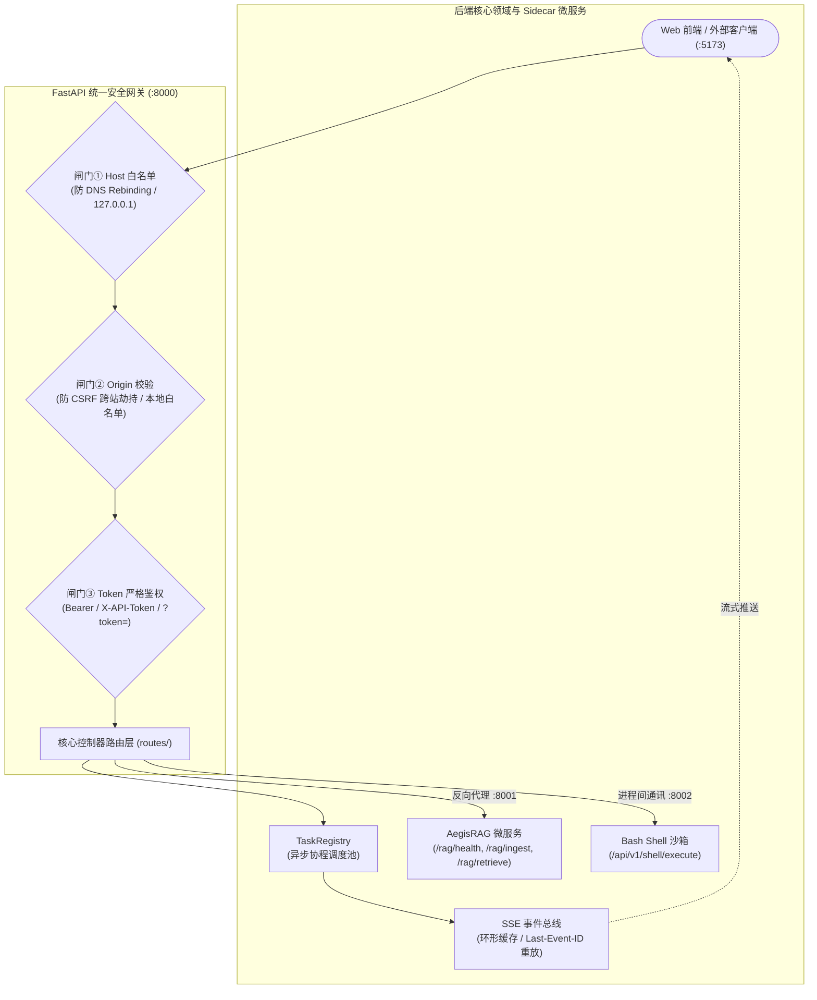

# 05 服务通信与网关契约架构 (Service Communication & API Gateway)

> **定位**：Aegis 体系中跨微服务进程通信、接入层安全闸门、异步任务调度模型与 Server-Sent Events (SSE) 事件总线的网络与协议设计规范。
> **核心原则**：
> - **纵深防御与 Fail-Closed**：接入层三道硬闸门（Host/Origin/Token），未配置密钥时全局拒绝（Fail-Closed）；
> - **只登记不阻塞（Fire-and-Forget）**：复杂任务调度立即返回 HTTP 202 Accepted，状态与进度由 SSE 流式下发；
> - **断线重连与游标重放**：支持标准 `Last-Event-ID`，网络抖动恢复后自动补发断点后丢失的事件帧；
> - **微服务统一收敛代理**：Agent 充当统一对外网关，对下反向代理 RAG (`:8001`) 与沙箱 (`:8002`)，下游不可用时优雅软降级。

---

## 1. 网络通信与微服务反向代理拓扑

---

## 2. 接入层三道安全闸门 (Three Security Gates)

实现于 [`agent_runtime/api/auth.py`](file:///home/Skualeilu/Projects/Aegis/AegisAgent/src/agent_runtime/api/auth.py)，在中间件层前置拦截非法请求：

### 2.1 闸门①：Host 校验（防 DNS Rebinding 攻击）
* **风险**：恶意网站可通过 DNS 重绑定将外部域名解析为 `127.0.0.1`，利用浏览器发起未经授权的本地请求。
* **防御**：
  - 仅放行合规回环地址：`127.0.0.1`、`localhost`、`[::1]` 及配置白名单主机；
  - 虚构或外网 Host 立即拦截，返回 `403 Forbidden` (`HOST_NOT_ALLOWED`)。

### 2.2 闸门②：Origin 校验（防 CSRF 跨站非法调用）
* **风险**：第三方网页恶意跨站向本地 `:8000` 提交删库或执行代码请求。
* **防御**：
  - GET / HEAD 安全幂等方法放行，无 Origin 的桌面客户端/脚本放行；
  - POST / DELETE / PATCH 请求严格比对 `Origin` 头是否落在允许的本地控制台（如 `http://localhost:5173`）；非法跨站直接返回 `403 Forbidden` (`ORIGIN_NOT_ALLOWED`)。

### 2.3 闸门③：令牌鉴权（Token 校验与 Fail-Closed）
* **多渠道鉴权识别**：
  - HTTP 标头：`Authorization: Bearer <TOKEN>`、`X-API-Token: <TOKEN>`；
  - EventSource 专用：URL 查询参数 `?token=<TOKEN>`（用于浏览器原生 SSE 握手）；
* **Fail-Closed 保护**：若服务端启动时未配置任何 Token，则除公开健康检查外，所有接口默认全部拒绝（`401 AUTH_MISCONFIGURED`），杜绝空密码无防护暴露；
* **权限凭据最小化**：自动生成的临时 Token 写入本地磁盘时，权限严格限制为 `0600`（仅当前用户可读）。

---

## 3. 异步任务与 SSE 事件总线协议

### 3.1 只登记不阻塞架构
* 客户端发起 `POST /sessions/{id}/tasks` 提交复杂任务；
* 服务端在校验参数后，立即向 `TaskRegistry` 登记任务并返回 HTTP 202 Accepted（包含 `task_id`，初始状态 `queued`）；
* 耗时的 LangGraph 状态机推演在后台异步协程中拉起，HTTP 连接无需长久挂起等待。

### 3.2 SSE 事件流协议与游标重放
* 客户端通过 `GET /tasks/{task_id}/stream` 订阅长连接事件流；
* **事件名白名单约束（`_KNOWN_EVENTS`）**：
  - 覆盖 `node.started`、`plan`、`tool.call`、`task.waiting_for_approval`、`task.finished` 等；
  - 杜绝后端内部未过滤异常直接穿透至外部协议。
* **断网恢复（`Last-Event-ID`）**：
  - 服务端为每个任务维护环形事件缓冲区；
  - 客户端断线重连时携带最后接收到的事件 ID，服务端自动截取未发送的增量事件回放补发；若事件已滑出环形缓冲区，则下发 `STREAM_GAP` 引导客户端拉取完整快照重新对齐。
* **定时心跳**：空闲时自动发送 `event: heartbeat`，防止中间 Nginx / 代理网关因闲置断开 TCP 连接。

---

## 4. 微服务反向代理与软降级机制

Agent 宿主作为整套系统的单一对外窗口，反向代理下游专业微服务：

| 代理路由 | 代理目标 | 业务操作 | 超时与熔断保护 |
| :--- | :--- | :--- | :--- |
| `/api/v1/rag/health` | `AegisRAG (:8001)` | 检查向量模型与 Qdrant 存活 | 5.0 秒超时，返回软就绪状态 |
| `/api/v1/rag/ingest` | `AegisRAG (:8001)` | 触发当前工程代码分块向量化 | 180.0 秒长超时，支持异步增量 |
| `/api/v1/rag/retrieve` | `AegisRAG (:8001)` | 语义混合检索与精排切片 | 10.0 秒超时，模型异常安全转译 |
| `/api/v1/health/dependencies` | `RAG / Shell / Web` | 并发全景体检三个 Sidecar | **软降级设计**：下游挂掉仍返回 200，在响应体标 `reachable: false`，不拖垮主服务 |
