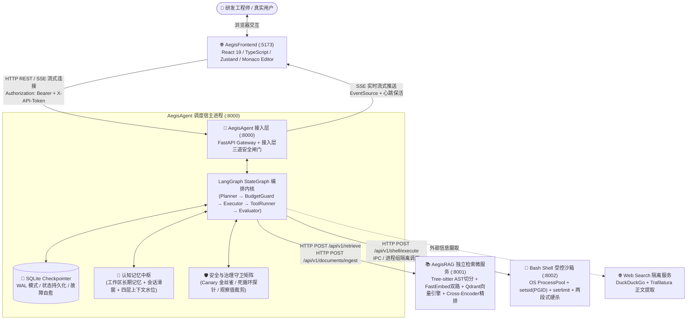

# Aegis 系统架构设计全景总纲 (System Architecture Master)

> **定位**：Aegis (Engineering Research Agent) 工业级智能体系统的顶层设计蓝图、分层架构模型与微服务协同全景总入口。
> **核心原则**：
> 1. **确定性包裹非确定性**：以严格的状态机（LangGraph）、强类型 Pydantic Schema、AST 语法树切片与离线数学评测，约束大模型生成的不确定性；
> 2. **单一职责微服务化**：调度宿主（`:8000`）、代码检索（`:8001`）、受控沙箱（`:8002`）、前端控制台（`:5173`）物理隔离，独立生命周期；
> 3. **物理配额硬约束**：Linux 进程组隔离（PGID）、内核级资源配额（`setrlimit`）、两段式硬超时熔断（SIGTERM ➔ SIGKILL）；
> 4. **双轨可观测与证据闭环**：SSE 实时事件流与全量因果 NDJSON 轨迹落盘，所有工具调用与代码生成必须具备可追溯证据链。

---

## 1. 系统宏观物理拓扑

Aegis 由四大高内聚、低耦合的物理子系统协同构成，各子系统具备独立的虚拟环境、依赖定义与进程边界：

---

## 2. 五层分层架构模型

系统遵循清晰的五层架构设计，自顶向下单向依赖：

| 架构分层 | 核心承载工程 | 职责定位 | 核心技术栈 |
| :--- | :--- | :--- | :--- |
| **1. 展示与交互层 (Presentation)** | `AegisFrontend/` | 人机协同交互、状态时间线瀑布流、Monaco 代码 Diff 审阅、HITL 越级审批卡片、Token 水位预警 | React 19, TypeScript, Zustand, Monaco Editor, Tailwind CSS, Vite |
| **2. 接入与网关层 (Gateway)** | `AegisAgent/src/agent_runtime/api/` | 接入层三道安全闸门（Host/Origin/Token）、SSE 流式总线、异步任务调度、子微服务反向代理 | FastAPI, Starlette SSE, Pydantic v2, Uvicorn |
| **3. 调度与编排层 (Orchestration)** | `AegisAgent/src/agent_runtime/` | 确定性状态机推演、目标里程碑拆解、工具调用派发、认知上下文分层装配、子智能体委派 | LangGraph, LangChain Core, SQLite WAL |
| **4. 领域微服务层 (Domain Services)** | `AegisRAG/` `AegisAgent/src/services/` | 语法感知代码语义检索（`:8001`）、受控进程执行沙箱（`:8002`）、外部网络信息摄取 | Tree-sitter, FastEmbed, Qdrant, Cross-Encoder, Linux OS 原语 |
| **5. 治理与安全层 (Governance & Security)** | `AegisAgent/src/agent_runtime/guardrails/` | 三级权限基线管控、Bash 命令黑名单审计、动态 Canary Token 金丝雀探针、死循环指纹熔断 | Linux `setrlimit`, 正则状态机, 算法探针 |

---

## 3. 子系统微服务协同矩阵

| 微服务角色 | 独立端口 | 物理路径 | 部署形态 | 与 Agent 交互协议 | 数据隔离保障 |
| :--- | :---: | :--- | :--- | :--- | :--- |
| **AegisAgent** | `127.0.0.1:8000` | `AegisAgent/` | 主守护进程 | — (核心宿主) | 本地回环绑定，Token 文件 `0600` 权限 |
| **AegisRAG** | `127.0.0.1:8001` | `AegisRAG/` | 独立微服务 | HTTP REST (JSON) | 独立依赖空间，Qdrant Collection 仓库级隔离 |
| **Bash Sandbox** | `127.0.0.1:8002` | `AegisAgent/src/services/bash_shell/` | 独立/托管 Sidecar | HTTP REST (JSON) | 独立会话 `os.setsid()`，CWD 强绑定，内存配额限制 |
| **AegisFrontend** | `localhost:5173` | `AegisFrontend/` | 独立 Web 前端 | HTTP REST + EventSource (SSE) | 浏览器沙箱，无直接物理磁盘访问权限 |

---

## 4. 架构专项深度文档导航

为了使系统架构脉络清晰直观，各核心技术领域拆解为独立的专项架构规范：

1. **[`01_Agent编排与状态机架构.md`](./01_Agent编排与状态机架构.md)**
   - LangGraph StateGraph 状态推演模型、五大核心计算节点（Planner、BudgetGuard、Executor、ToolRunner、Evaluator）生命周期与闭包工厂注入、控制流路由解耦、三层上下文治理与 SQLite 状态机故障自愈。
2. **[`02_代码语义检索RAG架构.md`](./02_代码语义检索RAG架构.md)**
   - Tree-sitter 语法感知 AST 切片算法、Markdown 标题面包屑注入、FastEmbed Dense (1024维) + Sparse (BM25) 双路向量化管道、Qdrant 内核级 RRF 多路召回融合与 Cross-Encoder 深度重排。
3. **[`03_受控Linux沙箱与隔离架构.md`](./03_受控Linux沙箱与隔离架构.md)**
   - Linux 进程会话隔离（`os.setsid` 防孤儿进程）、内核级物理配额（`RLIMIT_AS`、`RLIMIT_FSIZE`、`RLIMIT_CPU`）、两段式硬超时熔断（`SIGTERM ➔ SIGKILL`）、标准输入防挂死（`DEVNULL`）与全量日志离线卸载。
4. **[`04_Web前端与人机协同交互架构.md`](./04_Web前端与人机协同交互架构.md)**
   - React 19 响应式状态流、Zustand 多轮会话栈治理、Monaco Editor 差异比对、人机协同越级审批卡片（HITL）交互流转与 Token 水位三级预警。
5. **[`05_服务通信与网关契约架构.md`](./05_服务通信与网关契约架构.md)**
   - 接入层三道安全闸门（Host/Origin/Token 严格校验）、异步任务非阻塞调度、支持 `Last-Event-ID` 断网重连的 SSE 流式事件协议与 Sidecar 微服务反向代理契约。
