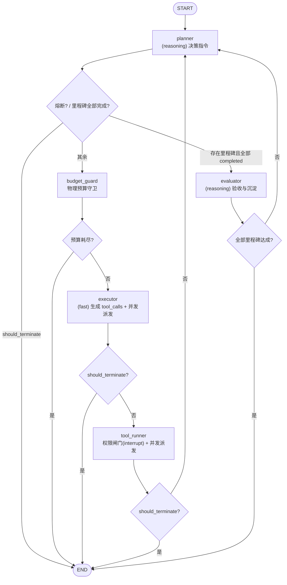

# 路由与控制流

> **责任领域**：`AegisAgent/src/agent_runtime/routing.py`、`AegisAgent/src/agent_runtime/workflow.py`
> **契约基线**：`02_state_definition.md`（AgentState）、`03_node_specification.md`（节点规范）、`05_guardrails_implementation.md`
> **文档状态**：统一修订版（v2）。与 `03_node_specification.md` 同步废弃 `cost_usd` 与 `supervisor` 节点。

---

## 1. 路由决策树

图拓扑为**单一主循环 + 一个验收出口**：



**四条不变式**：

1. 图内**不存在** `supervisor` 节点，也**不按 `cost_usd` 路由**（`05` §1/§2）。
2. 只存在**一个** ReAct 主循环：`planner → budget_guard → executor → tool_runner → planner`。
   `executor` 只生成 `tool_calls`，`tool_runner` 执行；后者的权限闸门会在越级时
   调用 `interrupt()` 挂起（HITL），恢复后本节点重跑并继续派发。
3. 进入 `evaluator` 由**确定性条件**触发（存在里程碑且全部 `completed`），不依赖 LLM 自述。
4. 任何硬熔断（预算耗尽 / LLM 全链路不可用）都直达 `END`，不再经过任何节点。

---

## 2. 路由函数实现

所有路由函数必须是**纯函数**：只读 `state`，零 I/O，零 LLM，零副作用。

**实现位置**：每条迁移一个模块，位于 `agent_runtime/edges/after_*.py`，与 `nodes/` 一一对称；
每个模块同时导出 `route_after_xxx()`（决策）与 `TARGETS`（供 `add_conditional_edges` 使用的目标映射）。
`agent_runtime/routing.py` **不再实现逻辑**，只把四个路由函数与 `EDGE_TABLE` 聚合导出，
供 `workflow.build_agent_graph()` 遍历挂载条件边——新增一条边无需修改图构建代码。

### 2.1 `planner` 之后

```python
def route_after_planner(state: AgentState) -> str:
    """
    返回值：
    - END:          planner 已置位熔断信号（如 LLM 全链路不可用）
    - "evaluator":  存在里程碑且全部 completed —— 交给验收节点复核
    - "budget_guard": 正常继续执行
    """
    if state["should_terminate"]:
        logger.info(f"[Router] planner 置位终止信号: {state['termination_reason']}")
        return END

    milestones = state["milestones"]
    if milestones and all(m.status == "completed" for m in milestones):
        logger.info("[Router] 全部里程碑标记完成，进入 evaluator 复核")
        return "evaluator"

    return "budget_guard"
```

### 2.2 `budget_guard` 之后

```python
def route_after_budget_guard(state: AgentState) -> str:
    """
    返回值：
    - END:        物理预算耗尽（步数 / Token / 挂钟时间）
    - "executor": 预算充足
    """
    if state["should_terminate"]:
        logger.warning(f"[Router] 预算守卫熔断: {state['termination_reason']}")
        return END
    return "executor"
```

### 2.3 `executor` 之后

```python
def route_after_executor(state: AgentState) -> str:
    """
    返回值：
    - END:        executor 触发了硬熔断
    - "planner":  回到规划节点继续主循环

    说明：连续错误熔断与指纹死循环**不改变**目的节点（都回 planner 重规划），
    熔断语义由 executor 追加的 SystemMessage 承载，因此不引入额外分支。
    """
    if state["should_terminate"]:
        logger.warning(f"[Router] executor 熔断: {state['termination_reason']}")
        return END
    return "planner"
```

**重规划通知的注入位置**：由 `executor` 负责，因为它才持有 `consecutive_errors` 与 `fingerprint_history`：

```python
# executor 内部（节选）
if (
    consecutive_errors >= cfg.consecutive_errors_limit
    or is_fingerprint_loop(fingerprint_history, cfg.identical_fingerprint_limit)
):
    tool_messages.append(SystemMessage(content=build_replan_notice(state, consecutive_errors)))
```

> **原子对铁律**：即使命中指纹死循环需要「阻断」，也**必须**为原 `AIMessage` 的每个 `tool_call` 生成配对 `ToolMessage`（内容为拦截说明），否则下一次请求会因 `tool_call_id` 不匹配被 OpenAI 兼容端点以 400 拒绝（`05` §4）。

### 2.4 `evaluator` 之后

```python
def route_after_evaluator(state: AgentState) -> str:
    """
    返回值：
    - END:       全部里程碑达成，任务交付
    - "planner": 验收未通过或仍有后续里程碑，回到规划继续推进
    """
    if state["should_terminate"]:
        logger.info("[Router] 验收通过，任务交付")
        return END
    return "planner"
```

---

## 3. 图的构建

```python
from langgraph.graph import StateGraph, END

def build_agent_graph() -> StateGraph:
    """构建 Agent 工作流图（4 节点单一主循环）"""

    graph = StateGraph(AgentState)

    # ========== 节点注册 ==========
    graph.add_node("planner", planner)
    graph.add_node("budget_guard", budget_guard)
    graph.add_node("executor", executor)
    graph.add_node("evaluator", evaluator)

    # ========== 入口 ==========
    graph.set_entry_point("planner")

    # ========== 条件边 ==========
    graph.add_conditional_edges(
        "planner",
        route_after_planner,
        {"evaluator": "evaluator", "budget_guard": "budget_guard", END: END},
    )
    graph.add_conditional_edges(
        "budget_guard",
        route_after_budget_guard,
        {"executor": "executor", END: END},
    )
    graph.add_conditional_edges(
        "executor",
        route_after_executor,
        {"planner": "planner", END: END},
    )
    graph.add_conditional_edges(
        "evaluator",
        route_after_evaluator,
        {"planner": "planner", END: END},
    )

    return graph
```

**死循环上界推导**：`planner → budget_guard → executor → planner` 每完成一圈 `step_count += 1`，而 `budget_guard` 强制 `step_count >= max_steps(25)` 时熔断，因此主循环**必然终止**，不存在无限 ReAct 风险。

---

## 4. 编译与执行入口

### 4.1 Checkpoint 依赖说明

`AsyncSqliteSaver` **不属于** `langgraph` 主包，而位于独立包 **`langgraph-checkpoint-sqlite`**。

**状态（已闭环）**：该依赖已在 `pyproject.toml` 声明并锁定于 `uv.lock`（`langgraph-checkpoint-sqlite>=3.1.1,<4.0.0`）。断点续跑的依赖条件已具备，待 `workflow.py` 实现后即可启用。

> 导入路径与构造函数以该包**当前版本**的官方 API 为准（历史上 `AsyncSqliteSaver` 的导入路径与连接方式发生过变更），本规范不锁定具体签名，避免再次产生文档与实现漂移。

### 4.2 编译（带 Checkpoint）

```python
async def create_runnable_app():
    """构建图并编译为可执行 App（带 SQLite 检查点）"""

    graph = build_agent_graph()

    # 依赖：langgraph-checkpoint-sqlite（见 §4.1）
    checkpointer = await create_sqlite_checkpointer(
        db_path=get_config().runtime.storage.checkpoint_db_path
    )

    return graph.compile(checkpointer=checkpointer)
```

### 4.3 首次执行

```python
async def run_agent(task_goal: str, workspace_id: str, session_id: str) -> AgentState:
    """装配初始状态并执行任务"""

    initial_state = await assemble_initial_state(
        task_goal=task_goal,
        workspace_id=workspace_id,
        session_id=session_id,
    )

    # thread_id 绑定 task_id，实现同一任务的断点续跑与 Time-Travel
    run_config = {"configurable": {"thread_id": initial_state["task_id"]}}

    app = await create_runnable_app()

    final_state = None
    async for event in app.astream(initial_state, run_config):
        node_name = next(iter(event))
        final_state = event[node_name]
        logger.info(
            f"[{node_name}] 完成 | step={final_state.get('step_count', 0)} "
            f"tokens={final_state.get('total_tokens', 0)} "
            f"errors={final_state.get('consecutive_errors', 0)}"
        )

    logger.info(
        f"任务结束: {initial_state['task_id']} | "
        f"原因={final_state['termination_reason']} | "
        f"步数={final_state['step_count']} | Token={final_state['total_tokens']}"
    )
    return final_state
```

### 4.4 恢复执行

```python
async def resume_agent(task_id: str) -> AgentState:
    """从最近一次 Checkpoint 恢复执行"""

    run_config = {"configurable": {"thread_id": task_id}}
    app = await create_runnable_app()

    final_state = None
    async for event in app.astream(None, run_config):   # None = 从检查点续跑
        node_name = next(iter(event))
        final_state = event[node_name]
        logger.info(f"[恢复] [{node_name}] 继续执行")

    return final_state
```

> **`start_time` 语义**：挂钟时间守卫的 `start_time` 由 `PhysicalBudgetGuard` 实例持有（`05` §2）。**任务恢复时必须重新实例化守卫**，否则挂钟预算会因进程重启而被"重置"——这是恢复路径上必须显式处理的已知语义点。

### 4.5 人机协同审核挂起与恢复（Human-in-the-Loop & `interrupt`）

> **实现状态：✅ 已落地**。判定在 `guardrails/permission.py`（纯函数），
> 挂起点在 `nodes/tool_runner.py`，恢复入口为 `POST /tasks/{id}/approve|reject`
> （见 `11_http_api.md` §4.4）。会话级"永久放行"由 `TaskRegistry` 持有的
> 指纹集合实现，跨 `resume` 存活。

当 `executor` 或工具层检测到待执行动作超出当前会话已授权权限级别（如 `read_only` 下写文件、`workspace_write` 下跨区写或执行 `git push`）时，系统触发 LangGraph `interrupt()` 挂起状态图：

1. **挂起（Suspend）**：
   - 当前节点中断执行，LangGraph 自动保存当前快照到 SQLite Checkpoint；
   - 任务状态流转为 `waiting_for_approval`，向 SSE 推送 `task.waiting_for_approval` 事件及审批详情（包含待执行指令、越级类型与判定原因）；
2. **用户审批注入（Resume with Decision）**：
   - 用户通过 Web UI 审查后调用 `POST /api/v1/tasks/{task_id}/approve` 或 `POST /api/v1/tasks/{task_id}/reject`；
   - 服务端使用 `app.astream(Command(resume=decision), run_config)` 向中断点注入审批决策：
     - **批准（Approve Once / Always Allow）**：原动作继续受控执行；
     - **拒绝（Reject）**：动作被安全取消，将拒绝说明构造为反馈消息传递给 `planner` 重新规划替代方案。

---

## 5. 路由验证

### 5.1 图拓扑验证

```python
def validate_graph_structure() -> bool:
    """编译期校验图结构完整性"""

    graph = build_agent_graph()
    try:
        app = graph.compile()
    except Exception as exc:
        logger.error(f"图编译失败（结构错误）: {exc}")
        return False

    nodes = set(app.get_graph().nodes)
    expected = {"planner", "budget_guard", "executor", "evaluator"}
    assert expected <= nodes, f"缺失节点: {expected - nodes}"
    assert "supervisor" not in nodes, "已废弃节点 supervisor 不得重新引入"

    logger.info(f"图结构校验通过，节点={sorted(expected)}")
    return True
```

### 5.2 路由函数单测

```python
def test_route_after_planner():
    # 1) 熔断信号优先
    assert route_after_planner(make_state(should_terminate=True)) == END

    # 2) 里程碑全部完成 → 验收
    done = [Milestone(id=1, title="t", description="d", status="completed")]
    assert route_after_planner(make_state(milestones=done)) == "evaluator"

    # 3) 正常继续
    pending = [Milestone(id=1, title="t", description="d", status="in_progress")]
    assert route_after_planner(make_state(milestones=pending)) == "budget_guard"


def test_route_after_executor():
    assert route_after_executor(make_state(should_terminate=True)) == END
    assert route_after_executor(make_state(consecutive_errors=3)) == "planner"
    assert route_after_executor(make_state()) == "planner"


def test_route_after_evaluator():
    assert route_after_evaluator(make_state(should_terminate=True)) == END
    assert route_after_evaluator(make_state()) == "planner"


def test_route_after_budget_guard():
    assert route_after_budget_guard(make_state(should_terminate=True)) == END
    assert route_after_budget_guard(make_state()) == "executor"
```

### 5.3 循环上界回归

```python
@pytest.mark.asyncio
async def test_main_loop_always_terminates():
    """step_count 达到 max_steps 时主循环必须终止（防无限 ReAct）"""
    state = make_state(step_count=999, milestones=[])
    assert route_after_planner(state) == "budget_guard"

    result = await budget_guard(state)
    assert result["should_terminate"] is True
    assert "步数" in result["termination_reason"]
```

---

## 6. 高级路由模式

### 6.1 按步数跳过守卫（低开销快速路径）

```python
def route_skip_guard(state: AgentState) -> str:
    """低频调用场景可跳过守卫，节省一次确定性检查"""
    if state["step_count"] < 3:
        return "executor"
    return "budget_guard"
```

### 6.2 并行分支（Fan-Out）留在 executor 内部

工具级并发**不**在图的边层实现，而是 `executor` 内的 `asyncio.gather`（`03` §4.3）。图只负责节点级流转，避免图拓扑随工具数量爆炸。

### 6.3 路由异常兜底

```python
def safe_route(state: AgentState) -> str:
    """路由函数异常时安全收敛到 END，绝不让图崩溃"""
    try:
        return decide_next_node(state)
    except Exception as exc:
        logger.error(f"路由决策异常，安全终止: {exc}")
        return END
```

### 6.4 优先级排序原则

多条件同时满足时，严格按「**硬熔断 > 验收交付 > 正常流转**」排序：

```python
def prioritized_route(state: AgentState) -> str:
    # 1. 最高优先级：物理预算熔断
    terminated, reason = PhysicalBudgetGuard.from_config(
        get_config().runtime.guardrails
    ).check(state)
    if terminated:
        return END

    # 2. 次优先级：全部里程碑完成，进入验收
    if state["milestones"] and all(m.status == "completed" for m in state["milestones"]):
        return "evaluator"

    # 3. 最低优先级：正常主循环
    return decide_normal_route(state)
```

---

## 7. 常见问题

**Q1：如何新增节点？**
实现 `async def my_node(state: AgentState) -> Dict[str, Any]`，`graph.add_node("my_node", my_node)`，再用条件边接入。禁止绕过条件边用普通边形成无界回路。

**Q2：为什么不再有 `supervisor` 节点？**
其职责（注入修正建议 + 重试计数）已由「`consecutive_errors` 熔断 + `executor` 追加重规划通知 + 回退 `planner`」覆盖（`05` §1.2）。独立节点只会增加一次无意义的图跃迁与一份重复状态。

**Q3：为什么 `route_after_executor` 几乎没有分支？**
因为连续错误与指纹死循环的**目的节点相同**（都回 `planner` 重规划），差异只在注入了什么消息。把差异塞进路由返回值会造成"看起来有分支实则等价"的伪复杂度。

**Q4：路由函数的异常如何处理？**
用 `safe_route` 包装并收敛到 `END`。路由是编排层，任何未捕获异常都会破坏 Checkpoint 一致性。

**Q5：如何调试路由问题？**
开启 `loguru` DEBUG，路由函数只打印**判定输入与结论**，不要打印整个 `messages`（会污染日志并拖慢主循环）。

**Q6：任务恢复后挂钟预算怎么算？**
见 §4.4：`PhysicalBudgetGuard` 必须重新实例化，恢复路径需显式重建 `start_time`。
