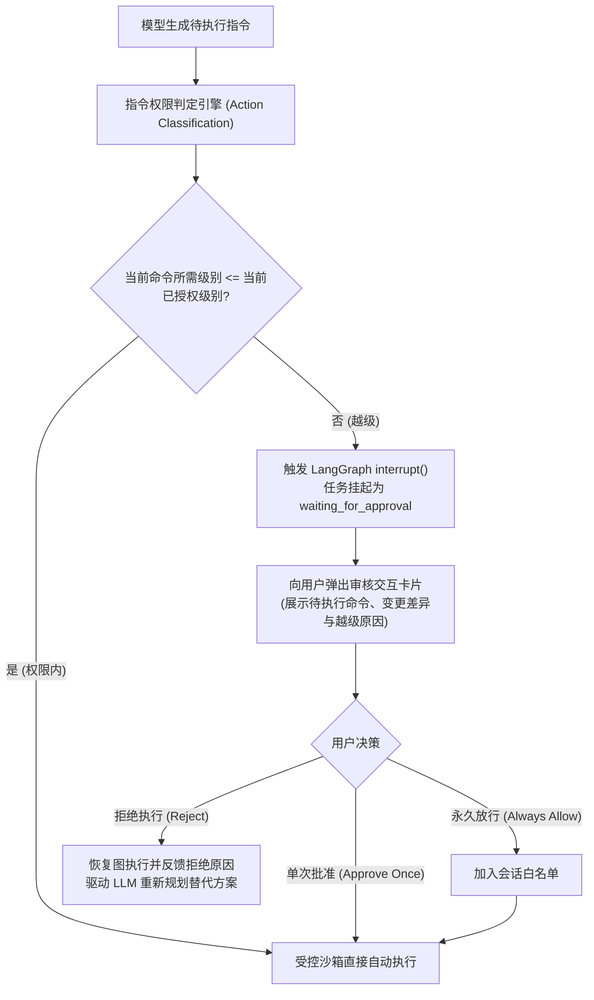

# Bash 执行沙箱 - 命令审计与工作区沙箱规范

> **责任领域**：`AegisAgent/src/services/bash_shell/audit.py` 与 `sandbox.py`
> **核心原则**：高危破坏性指令前置正则拦截、三级权限分级管控、越级人工审核（HITL）、工作目录绑定工作区根路径 (CWD)、路径越界逃逸防护、工作区修改与内部产物落盘严格物理解耦。

---

## 1. 高危指令前置审计 (`CommandAudit`)

大模型在面对复杂的系统排查时，可能因幻觉误生成高危破坏性指令。系统在命令派发至子进程前，由 `CommandAudit` 做**确定性的前置判定**——判定逻辑由一组可单测的检测函数构成，并非简单的正则串联（见 §1.2）。

### 1.1 规则矩阵（与实际 `_RULES` 一一对应）

**唯一真源**为 `audit.py` 的 `_RULES` 元组。命中即抛 `AuditRejected`，
HTTP 层返回 **`403 FORBIDDEN`**，错误体 `code = "AUDIT_REJECTED"`。

| 规则 ID（`AuditRejected.rule`） | 拦截目标 | 说明 |
| :--- | :--- | :--- |
| `RM_RF_ROOT` | `rm -rf /`、`rm -fr /` 等递归强制删除根目录 | 覆盖 `-rf/-fr/-Rf` 等旗标顺序变体 |
| `MKFS` | `mkfs`、`mkfs.ext4` 等格式化文件系统 | 任意 `mkfs.*` |
| `DD_TO_DEVICE` | `dd if=... of=/dev/sdX` 裸写块设备 | 仅拦"写入裸设备"，`of=/dev/null` 等安全伪设备放行 |
| `POWER_CONTROL` | `shutdown`、`reboot`、`systemctl reboot` 等 | 防止关闭/重启宿主机 |
| `FORK_BOMB` | `:(){ :|:& };:` 及变体 | Shell fork 炸弹 |
| `SENSITIVE_SYSTEM_WRITE` | **写入**敏感系统路径（`/etc/passwd`、`/etc/shadow`、`/etc/sudoers`、`/etc/fstab` 等） | **只拦写操作**：`cat /etc/passwd`、`grep root /etc/shadow` 属只读，放行 |
| `RECURSIVE_ROOT_PERMISSION` | `chmod -R 777 /` 等递归修改根目录权限 | 防止权限体系被整体破坏 |
| `EMPTY_COMMAND` | 空白命令 | 早失败，避免空命令占用执行槽位 |

**设计取向**：规则集**刻意保持小而精确**，只拦"不可逆灾难"与"直接危害宿主"，
不试图穷举所有危险命令。理由是误报会直接破坏 Agent 的自主排错能力
（例如编译、`git clean`、删构建产物都是正常操作）。真正的兜底是
**工作区边界 + 内核配额 + 两段式熔断**，而不是黑名单。

#### 交互式挂起（HANG）为何不在规则表内

`sudo` 密码、`apt-get` 确认等"等待输入"场景**不是靠正则识别的**，而是靠
**结构性隔离**消除：子进程 `stdin` 绑定 `DEVNULL`，交互式提示立即得到 EOF 并快速失败。
详见 [`01_process_lifecycle_and_isolation.md`](./01_process_lifecycle_and_isolation.md) §5。

原因：正则无法穷举交互式场景（`ssh` 指纹、`gpg` 口令、`read` 内建、程序自定义 prompt），
且会误伤 `sudo -n`、`DEBIAN_FRONTEND=noninteractive apt-get install -y` 等合法用法。

### 1.2 审计实现架构 (`audit.py`)

**不是"一串正则"，而是"规则对象 + 检测函数"**。这样拆分的理由：真实判定
（例如"是写操作还是只读"、"命令里出现的是 `of=/dev/sda` 还是 `of=/dev/null`"）
需要词法分析，纯正则既写不准也读不懂。

```python
@dataclass(frozen=True)
class _Rule:
    rule: str                        # 稳定 ID，会随异常返回给调用方与前端
    reason: str                      # 面向人类/模型的拒绝原因
    detector: Callable[[str], bool]  # 纯函数检测器，可单测

_RULES: tuple[_Rule, ...] = (
    _Rule("RM_RF_ROOT", "禁止递归强制删除根目录（rm -rf /）", _detect_rm_rf_root),
    _Rule("MKFS", "禁止格式化文件系统（mkfs）", _detect_mkfs),
    _Rule("DD_TO_DEVICE", "禁止向裸设备写入（dd of=/dev/*）", _detect_dd_to_device),
    _Rule("POWER_CONTROL", "禁止关机/重启宿主机（shutdown/reboot）", _detect_power_control),
    _Rule("FORK_BOMB", "禁止 Shell fork bomb", _detect_fork_bomb),
    _Rule("SENSITIVE_SYSTEM_WRITE", "禁止写入敏感系统路径（如 /etc/passwd）", _detect_sensitive_write),
    _Rule("RECURSIVE_ROOT_PERMISSION", "禁止递归修改根目录权限", _detect_recursive_root_permission),
)

class CommandAudit:
    def audit(self, command: str) -> None:
        """审计命令；命中即抛 AuditRejected（携带 rule 与 reason）。"""

    def extract_write_targets(self, command: str) -> list[str]:
        """从命令中启发式提取写入/删除目标，供 §4 的越界校验使用。"""
```

> **`extract_write_targets` 的作用**：供调用方显式声明 `write_paths` 时做二次校验，
> 属于"尽力而为"的辅助，不是安全边界——真正的边界见 §4。

## 2. 三级权限模型与越级人工审核（Human-in-the-Loop, HITL）

> ### 本节为**规划中设计，尚未实现**
>
> 代码中**不存在** `permission_level` 字段、权限分级判定、`interrupt()` 挂起或审核端点。
> 当前唯一的前置防线是 §1 的 `CommandAudit` 与 §4 的路径越界校验。
>
> 保留本节是为了记录设计意图与取舍依据；**在实现之前，不得据此认为系统具备越级审核能力**。
> 落地需要跨模块改动：`ShellExecuteRequest` 增加权限字段 → 判定引擎 →
> LangGraph `interrupt()` 与 `waiting_for_approval` 状态 → Agent API 审核端点 → 前端审核卡片。

为了兼顾开发效率与系统安全性，系统**计划**引入**三级权限分级管控机制**。用户或会话可配置当前的权限基线，**任何超出当前权限级别的操作都将触发交互式人工审核**。

### 2.1 三级权限定义

| 权限级别 | 标识 | 核心定位 | 允许自动执行的指令集（免审核白名单） |
| :--- | :--- | :--- | :--- |
| **1. 只读模式** | `read_only` | 安全审查、代码只读排查、审计 | • 纯读操作（`cat`, `head`, `view_file`）<br>• 文件探测（`ls`, `find`, `grep`, `pwd`）<br>• Git 只读（`git status`, `git diff`, `git log`） |
| **2. 工作区写入模式**<br>*(推荐默认模式)* | `workspace_write` | 日常自主结对编程、Bug 修复与重构 | • `read_only` 的全部能力<br>• 工作区内文件创建、修改与删除（`write_file`, `replace_file`）<br>• 工作区内测试与编译（`pytest`, `cargo check`, `make`）<br>• Git 本地提交与分支切换 |
| **3. 全权限模式** | `full_permissions` | 全自动化 CI/CD、受控容器内运行 | • `workspace_write` 的全部能力<br>• 外部网络请求与依赖拉取（`curl`, `pip install`, `npm install`）<br>• 全局容器操作（`docker run`）<br>• Git 远端推送（`git push`） |

### 2.2 越级行为与人工审核判定矩阵



### 2.3 越级触发规则详表

1. **在 `read_only` 模式下**：
   - 触发审核：任何写文件、文件修改、执行编译脚本（可能产生构建产物）、包安装等操作。
2. **在 `workspace_write` 模式下**：
   - 触发审核：
     - **跨工作区文件写入**：试图修改系统目录（如 `/etc/`、`/var/`）或上级目录文件；
     - **网络外联与代码推送**：执行 `git push`、`curl -X POST`、`ssh` 等向外传输数据的操作；
     - **全局环境变更**：执行全局包安装（`pip install -g`、`sudo apt-get`）、数据库全局迁移等可能对宿主机产生全局副作用的操作。
3. **在 `full_permissions` 模式下**：
   - 仅第 1 节的不可逆灾难级破坏指令（`rm -rf /`、Fork 炸弹等）会被系统代码级直接硬拦截，其余命令免打扰全自动执行。

---

## 3. 工作区沙箱绑定规范 (Workspace-bound CWD)

### 3.1 历史教训：CWD 与落盘目录的混淆
* **原错误设计**：曾有人尝试将子进程 `cwd` 锁定在临时目录（如 `/tmp/aegis_sandbox`）以求"绝对安全"；
* **根本矛盾**：Aegis 的定位是**代码工程研究与修改智能体**，若 `cwd` 锁在临时目录，Agent 执行 `make`、`git diff`、修代码均无法作用在目标工程上，导致任务根本无法完成；
* **裁决结论**：**执行目录（`cwd`）必须强绑定目标工作区的物理根路径 `root_path`！**

```python
# 必须由上层携带工作区标识与根路径，并做一致性校验
workspace_root = Path(request.workspace_root).resolve()
if not workspace_root.is_dir():
    raise WorkspaceInvalidError(...)   # HTTP 层转 422，错误码 WORKSPACE_INVALID
```

**状态码约定**：工作区非法与路径越界同为 **`422`**（`WORKSPACE_INVALID` /
`PATH_ESCAPE_DETECTED`）；命令审计拒绝为 **`403`**（`AUDIT_REJECTED`）。
三者都是"请求合法但被策略拒绝/无法处理"，与 400（请求本身不合法）语义区分开。

---

## 4. 路径越界逃逸防护 (Path Escape Guard)

为防止命令通过 `../../` 恶意操作宿主机其他敏感工程目录：
1. **显式路径校验**：对所有随请求下发的文件参数进行 `Path.resolve()` 解析；
2. **子树包含断言**：断言目标解析后的绝对路径必须以 `workspace_root` 作为前缀：
   ```python
   def assert_within_workspace(target_path: Path, workspace_root: Path) -> None:
       resolved_target = target_path.resolve()
       resolved_root = workspace_root.resolve()
       if not str(resolved_target).startswith(str(resolved_root)):
           raise PermissionError(
               f"路径逃逸违规: 目标路径 {resolved_target} 超出工作区根目录 {resolved_root}"
           )
   ```

---

## 5. 目标工程与内部资产隔离原则

* **用户工程（`root_path`）**：仅允许 Agent 生成或修改用户业务代码、测试用例和补丁文件；
* **Aegis 内部资产（`storage/`）**：执行日志、产物离线卸载、Checkpoint 快照一律写入 Aegis 自己的 `storage/artifacts/{task_id}/`，**严禁向用户目标工程中倾倒任何 Aegis 运行时系统垃圾**。
