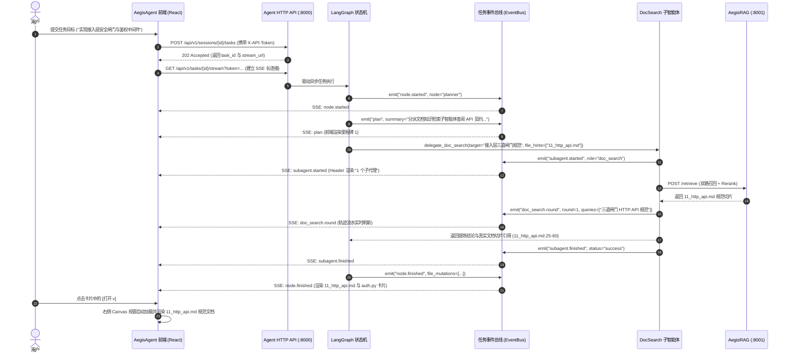
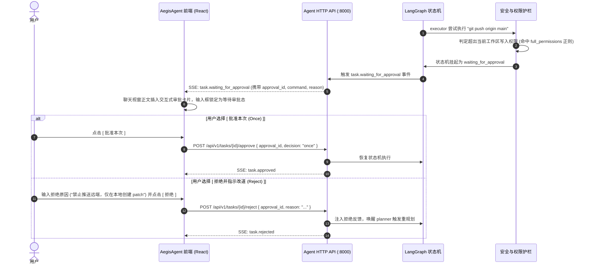

# AegisAgent + Workspace 前端架构与交互系统设计规范 (Agent + Workspace Frontend Architecture & System Specification)

> **文档版本**：v4.0 权威定稿
> **文档定位**：专为 **`AegisAgent`（智能体运行时）与工作区（Workspace）协同体系**量身定制的工程级前端设计与实现规范。
> **核心设计哲学**：
> 1. **工作区是一等公民（First-Class Citizen）**：工作区不仅是物理文件目录，更是 Agent 的物理真源（Ground Truth）、规范文档库（Knowledge Base）、执行沙箱（Sandbox）与长期共享记忆（Shared Memory）承载体。
> 2. **双屏并行联动（Chat + Canvas）**：左屏对话编排与因果轨迹，右屏文档规范阅读、代码审查与 Diff 对比，并列为第一公民。
> 3. **全透明认知与因果追溯**：彻底透明化展示三级实体（Workspace $\to$ Session $\to$ Turn）、四层上下文装配（Context Inspector）、状态图跃迁（Trace Stream）与物理预算水位。
> 4. **安全前置与 HITL 人机协同**：三道接入层安全闸门前置，越级高危操作触发阻塞式交互审批卡片。
> 5. **模块化分区与专业控制台**：清晰划分工作区管理、会话编排、RAG 知识库管理、系统设置与深度画布五大核心职能分区。

---

## 1. 页面级宏观网格与全局视图分区体系 (Page Layout & View Partitioning)

前端系统采用 **三栏式响应式栅格布局（Sidebar + Dual-Pane Main Stage）** 配合顶层全局控制栏与独立功能模态弹窗系统：

```
+---------------------------------------------------------------------------------------------------------------------------------------------------------------------+
| [ AegisAgent] [Toggle] | Aegis Core [/home/user/projects/aegis] | [ RAG知识库] [ 设置] | 令牌: [●●●●●●] 有效 | Sidecars: [RAG:8001 ● Shell:8002 ● Web:8003 ●]  |
+--------------------------+---------------------------------------------------------------------------------------------------+--------------------------------------+
| [+ 新建会话 (N)]        | [ 对话协商]  [ 执行轨迹 (Trace)]  [ 上下文装配检视]                                             | 磁盘文档已更新 [ 重新载入 ]       |
|                          |---------------------------------------------------------------------------------------------------+--------------------------------------|
| 工作区: Aegis Core    |  ### Planner 阶段目标与里程碑推进 (LangGraph State Machine)                                          | /home/user/projects/aegis/docs/...   |
|  ├─  接入层安全闸门 [完]|  - [x] **里程碑 1**：调用 delegate_doc_search 检索 11_http_api.md 鉴权规范                            | [Markdown 规范] [源码] [Diff] []   |
|  ├─  RAG 混合检索改造   |  - [x] **里程碑 2**：在 auth.py 落地 Host -> Origin -> Token 三道闸门                                 |                                      |
|  └─  记忆引擎水位压缩   |  - [ ] **里程碑 3**：运行 pytest 验证 27 个端点安全覆盖率与断线重连                                    | ## 1.1 三道闸门机制                  |
|                          |                                                                                                   |                                      |
| 工作区: Linux Kernel  |  本次文档与代码改动 </> 11_http_api.md </> auth.py + 产物 obs_step_7_bash                             | 1. **Host** 闸门：防 DNS 重绑定...   |
|  └─  eBPF 规范阅读     |  +---------------------------------------+  +---------------------------------------+             | 2. **Origin** 闸门：防跨站提交...    |
|                          |  | 11_http_api.md              [打开v]|  | auth.py                     [打开v]|             | 3. **令牌** 闸门：恒定时间比较...    |
| 工作区记忆 [3条定论]  |  | API 契约：三道闸门与令牌规范规范...   |  | 接入层安全中间件落地实现...           |             |                                      |
| 新建工作区...         |  +---------------------------------------+  +---------------------------------------+             | ```http                              |
|                          |                                                                                                   | Authorization: Bearer <token>        |
|                          |  [ 人机协同权限越级审批卡片 (HITL Approval Required)]                                           | ```                                  |
|                          |  检测到网络外联命令: git push origin main (超出当前工作区写入权限)                               |                                      |
|                          |  [ 批准本次 (Once) ]  [ 当前会话免审 (Always) ]  [ 拒绝并指示改道 (Reject) ]                      |                                      |
|                          |                                                                                                   |                                      |
|                          |  [] [] [] [ 重跑]   用时 35.8s  18:45  (Reasoning: 1.2s / Fast: 0.8s)                     |                                      |
|                          |---------------------------------------------------------------------------------------------------+--------------------------------------|
|                          | +-----------------------------------------------------------------------------------------------+ |                                      |
|                          | | 输入任务目标，/ 调用 Slash 指令，@ 引用工作区文档、规范或记忆                                 | |                                      |
|                          | | [+] [] [ 工作区修改 v]                                   [Reasoning: DeepSeek-R1 / Fast v] [↑]| |                                      |
|                          | +-----------------------------------------------------------------------------------------------+ |                                      |
|                          | 5 轮 14 步 | 271 tok/s | 28.5k tok | 缓存命中 99.8% | 水位 32% / 80%               |                                      |
+--------------------------+---------------------------------------------------------------------------------------------------+--------------------------------------+
```

### 1.1 页面五大功能分区划分

| 分区编号 | 分区名称 | 空间占比 | 核心职责与包含组件 |
| :--- | :--- | :--- | :--- |
| **Zone 1** | **左侧导航与工作区资产树** | 固定宽 ~240px (可折叠) | 多工作区切换/新建/删除、1:N 会话树、工作区共享记忆入口、Sidecar 存活指示器 |
| **Zone 2** | **中间智能体编排与轨迹视窗** | 弹性 ~50% (可拖拽调整) | 对话协商流、里程碑追踪、子智能体汇报信封、HITL 审批卡片、因果轨迹流、上下文透视器、控制台 |
| **Zone 3** | **右侧工作区深度画布视窗** | 弹性 ~50% (可拖拽调整) | 多标签页管理、Markdown 规范阅读器、Monaco 源码编辑器、Side-by-side Git Diff 对比、产物日志查看 |
| **Zone 4** | **RAG 知识库与文档索引管理** | 模态全屏/抽屉中心 | 独立子工程连通状态、Qdrant 向量库统计、语法分块检视、全量/增量重索引、检索三阶段调试器 |
| **Zone 5** | **系统配置与安全闸门管理** | 模态弹窗中心 | 三道安全闸门（Host/Origin/Token）、双模型分层网关配置、Sidecar 沙箱配额、MCP 服务器治理 |

---

## 2. 工作区全生命周期管理与交互规范 (Workspace Lifecycle Management)

工作区是 Aegis 的**一等公民实体**，前端提供完整闭环的管理与交互界面：

```text
┌──────────────────────────────────────────────────────────────────────────────────┐
│                   Aegis 实体层级与记忆生命周期拓扑 (Multi-Workspace)             │
│                                                                                  │
│  [第一级: 工作区] Workspace (一等公民：支持开多个独立项目工作区)                 │
│  - 物理绑定: 对应磁盘真实项目根目录 root_path (如 /home/user/project_a)          │
│  - 共享记忆: workspace_memories (项目架构定论、编码规范、全局踩坑黑名单)          │
│  - 机制职责: 跨会话持久共享；决定工具层默认 CWD；统一管理会话生命周期            │
│                                      │                                           │
│                                      ▼ (1 : N 级联从属)                           │
│  [第二级: 会话] Session (一个工作区下可开辟 N 个独立任务会话)                    │
│  - 情境记忆: session_memories (本会话已压缩阶段摘要、上轮操作实体句柄)            │
│  - 机制职责: 隔离不同任务局部认知；驱动会话级 80%/40% 高低水位对话压缩           │
│                                      │                                           │
│                                      ▼ (1 : N 级联从属)                           │
│  [第三级: 对话轮次] Dialogue Turn (一个会话包含 N 轮原子人机交互记录)            │
│  - 流水载体: session_turns 表 (id, session_id, role, content, token_count)       │
│  - 切分机制: 水位线以上的活跃轮次送入 Prompt，水位线以下的溢出轮次进入压缩归档   │
└──────────────────────────────────────────────────────────────────────────────────┘
```

### 2.1 工作区创建 (Create Workspace Flow)
- **触发路径**：左侧侧边栏点击 `[ 新建工作区]` 或快捷键 `Ctrl+Shift+N`；
- **输入与校验字段**：
  - `name`：工作区友好名称（如 `Aegis Agent Core`）；
  - `root_path`：本地物理路径（如 `/home/user/projects/aegis`）——前端提供路径有效性即时校验与目录浏览选择器；
  - `description`：项目技术栈与背景说明；
- **防冲突与幂等保证**：调用 `POST /api/v1/workspaces`，若 `root_path` 已存在则自动返回既有工作区（HTTP 200），若路径被其他 ID 占用则弹出 `409 WORKSPACE_PATH_CONFLICT` 友好引导。

### 2.2 工作区切换 (Switch Workspace Flow)
- **交互形式**：侧边栏工作区树形卡片直接点击；
- **状态流转**：
  1. 瞬间切换当前激活的 `workspace_id`；
  2. 重新拉取该工作区专属的会话列表（`GET /api/v1/workspaces/{id}/sessions`）；
  3. 重置工具层基准工作目录（`cwd = root_path`）；
  4. 刷新右侧 Canvas 的文件树与 RAG 知识库绑定状态。

### 2.3 工作区编辑与元数据维护 (Edit Workspace)
- 支持修改工作区名称、项目工程描述与关联标签；
- 调用 `PATCH /api/v1/workspaces/{id}` 实时保存。

### 2.4 工作区级联删除 (Cascade Deletion Flow)
- **高危操作防误触**：弹出危险警示确认弹窗，要求用户显式输入该工作区名称以确认删除；
- **级联清理机制**：调用 `DELETE /api/v1/workspaces/{id}`，依托 SQLite `ON DELETE CASCADE` 级联物理清理其名下的所有会话（`sessions`）、记忆体（`session_memories`）、流水记录（`session_turns`）及工作区记忆（`workspace_memories`）。

### 2.5 工作区长期共享记忆治理中心 (Workspace Shared Memory Governance)
点击左侧 `[ 工作区记忆]` 呼出共享记忆管理抽屉，提供分类维护：
1. **项目架构定论 (`confirmed_architecture`)**：维护核心模块分层、服务端口分配与依赖拓扑；支持手动新增、事实置顶与上浮；
2. **项目编码与工程规范 (`project_conventions`)**：维护严格代码风格、单测覆盖要求、纯函数设计纪律；
3. **全局避坑黑名单 (`global_failed_attempts`)**：维护历史尝试失败的方案与已知不可行指令，防止所有会话重蹈覆辙。

---

## 3. 会话与多任务对话协商系统 (Session & Dialogue System)

### 3.1 会话管理 (Session Management)
- **1:N 独立会话**：在当前激活工作区下支持并行创建多个独立任务会话（`POST /api/v1/workspaces/{id}/sessions`）；
- **会话操作菜单**：
  - `+ 新建会话`（`Ctrl+N`）；
  - 会话自动命名：根据首轮用户 Prompt 自动生成精炼标题，支持双击手动重命名；
  - 会话删除：调用 `DELETE /api/v1/sessions/{id}` 级联清理其对话流水与情境记忆；
  - 全局搜索：支持在会话列表中模糊搜索标题与历史对话关键词。

### 3.2 沉底悬浮输入控制台 (Floating Input Console)
- **指令与实体联想响应**：
  - 输入 `/` 弹出 Slash Commands（`/resume` 续跑断点、`/cancel` 终止任务、`/skills` 技能清单、`/mcp` 服务器、`/memory` 记忆检视）；
  - 输入 `@` 弹出工作区文档树、代码符号与共享记忆联想列表。
- **权限基线选择器 (Permission Baseline Selector)**：
  - ` 只读免审批 (readonly)`：严格限制为只读工具，适合纯分析与代码审查；
  - ` 工作区修改 (workspace_write - 默认推荐)`：允许在 `root_path` 内部创建、修改文件与执行安全构建命令；
  - ` 全权限模式 (full_access - 需 HITL 授权)`：允许网络外联、特权命令与外部系统交互。
- **双模型分层网关选择器 (Dual-Tier LLM Gateway)**：
  - 思考模型层（Reasoning Tier: DeepSeek-R1 / OpenAI o1，`temp=0.0`，负责宏观任务拆解、反思规划与最终报告）；
  - 快速动作层（Fast Tier: DeepSeek-V3 / GPT-4o-mini，`temp=0.2`，负责工具参数填充、切片事实提炼与低延迟响应）。

### 3.3 对话流核心卡片体系 (Dialogue Stream Cards)
- **里程碑达成卡片 (`milestones.updated`)**：
  - 宏观目标自动拆解为里程碑任务清单（`[x] [ ]`）；
  - 实时响应 Evaluator 节点的判定结果并动态勾选。
- **文档知识检索子智能体汇报卡片 (Doc & Knowledge Search Envelope)**：
  - 展示多轮 RAG 自适应改词过程（Query Reformulation）；
  - 呈现真实命中的文档切片与行号白名单范围（如 `11_http_api.md:25-60`）；
  - 确定性拒答状态透明回显（3 轮无果如实承认没有，杜绝幻觉推测）。
- **外部隔离研究子智能体汇报卡片 (Research Subagent Envelope)**：
  - 标记 ` 外部不可信数据隔离` 警示徽标；
  - 内容经过严格防 XSS 净化转义后渲染。
- **文档与文件改动专区 (Mutation Cards)**：
  - 双列网格卡片，展示多彩文件类型图标、相对路径与简要修改说明；
  - 点击 `[打开 v]` 按钮直接联动右侧 Canvas 视窗加载并定位。
- **离线长日志产物卡片 (`ObservationPruner` Handles)**：
  - 工具输出过长时自动落盘并以 ` obs_step_7_bash (51.2 KB, 1,820 tok)` 卡片呈现；
  - 点击卡片在右侧视窗中以只读日志模式快速阅览全文。

### 3.4 人机协同 (HITL) 权限越级审批卡片
当 Agent 尝试执行超出当前权限基线的操作时，状态机挂起为 `waiting_for_approval`：
1. **高危动作类型回显**（`action_type: network_egress` / `privileged_exec`）、具体命令指纹与拦截理由；
2. **交互抉择操作**：
   - **`[ 批准本次 (Once) ]`**：单次放行，调用 `POST /api/v1/tasks/{id}/approve` (`decision="once"`)，恢复状态机；
   - **`[ 当前会话免审 (Always) ]`**：加入当前 Session 白名单，调用 `POST /approve` (`decision="always"`)；
   - **`[ 拒绝并指示改道 (Reject) ]`**：输入拒绝指令（如“禁止推送到远端，仅在本地生成 patch 文件”），调用 `POST /reject` 反馈给 Planner 重新规划。

### 3.5 执行轨迹与因果审计流 (Execution Trajectory Stream)
- **LangGraph 节点状态机时序流**：
  - 逐步骤呈现 `planner` (Reasoning 模型) $\to$ `budget_guard` $\to$ `executor` (Fast 模型) $\to$ `tool_runner` (并发派发) $\to$ `evaluator`；
  - 展示单步耗时、Token 增量与入参/出参摘要。
- **叶子工具细粒度事件流**：
  - 实时渲染任务事件总线（`EventBus`）推送的 `subagent.started`、`subagent.step`、`subagent.tool`、`subagent.blocked`、`subagent.finished` 等内部细节。
- **物理预算确定性守卫红线**：
  - 连续 3 次相同参数死循环拦截告警；
  - 连续报错阈值告警（`consecutive_errors >= 3` 触发重规划）；
  - 90% 物理预算（步数/Token/时间）熔断预警。

### 3.6 四层装配上下文检视器 (Context Inspector)
点击 `[ 上下文装配检视]` 标签页，调用 `GET /api/v1/sessions/{id}/context` 实时透视组装送入大模型的完整视界：
$$\text{Final Context} = \underbrace{\text{[系统提示词]}}_{\text{内置纪律} + \text{项目规则}} + \underbrace{\text{[工作区全局共享记忆]}}_{\text{架构定论} + \text{工程规范} + \text{避坑黑名单}} + \underbrace{\text{[会话已压缩记忆]}}_{\text{阶段摘要} + \text{事实清单}} + \underbrace{\text{[活跃对话滑窗]}}_{\text{低水位线以上完整轮次}} + \text{[当前输入]}$$

---

## 4. RAG 知识库与文档索引管理中心 (RAG Knowledge Base & Indexing Center)

点击顶栏 `[ RAG 知识库]` 呼出全屏管理控制台，提供专业级知识库运维与调试能力：

```
+-----------------------------------------------------------------------------------------------------------------------------------------+
| [ AegisRAG 知识库与文档索引控制台]                                                                                     [ 刷新] [ 关闭] |
+-----------------------------------------------------------------------------------------------------------------------------------------+
| [概览与服务拓扑]  [ 文档切片检视器]  [ 增量/全量重索引]  [ 在线检索三阶段调试器]                                                   |
+-----------------------------------------------------------------------------------------------------------------------------------------+
| AegisRAG 独立子工程: 127.0.0.1:8001 (v1.0.0, FastAPI)   |  Qdrant 向量库: aegis_docs_collection (Points: 1,420, Memory: 48.2MB)       |
| 密集向量: BAAI/bge-small-en-v1.5 (384维, fastembed ONNX)    |  稀疏向量: BM25 / SPLADE 双路召回 (Top 20 + Top 20 -> RRF -> Cross-Encoder) |
+-----------------------------------------------------------------------------------------------------------------------------------------+
| 索引文件分布:                                                                                                                           |
| -  Markdown 规范 (documents/*.md): 42 个文件 (780 个切片) -> 语法感知层级切分 (Markdown Heading Aware)                                |
| -  Python 源码 (AegisAgent/src/*.py): 85 个文件 (520 个切片) -> Tree-sitter AST 函数/类切分                                           |
| -  C/C++ 核心 (services/bash/*.c): 12 个文件 (120 个切片) -> Tree-sitter C AST 语法切分                                                 |
+-----------------------------------------------------------------------------------------------------------------------------------------+
| [  执行增量再索引 (Incremental Re-index) ]    [  清空并全量重建索引 (Full Rebuild) ]                                                |
+-----------------------------------------------------------------------------------------------------------------------------------------+
| 检索调试器 (Retrieval Playground):                                                                                                   |
| [ 输入查询语句: "接入层三道安全闸门与令牌鉴权规范"                                                                  ] [  模拟检索 ]   |
| --------------------------------------------------------------------------------------------------------------------------------------- |
| 召回结果 (Cross-Encoder 精排 Top 3):                                                                                                    |
| 1. [0.942] documents/agent_runtime/11_http_api.md#L25-60 (Dense: #1, Sparse: #2) -> 命中: 1.1 三道闸门：Host -> Origin -> 令牌          |
| 2. [0.885] AegisAgent/src/agent_runtime/api/auth.py#L40-85 (Dense: #3, Sparse: #1) -> 命中: class SecurityGateMiddleware               |
| 3. [0.812] documents/agent_runtime/01_architecture_overview.md#L120-135 (Dense: #4, Sparse: #5) -> 命中: §4.4 接入层规范              |
+-----------------------------------------------------------------------------------------------------------------------------------------+
```

### 4.1 RAG 基础设施概览与服务拓扑
- **独立子工程连通性**：实时展示 `http://127.0.0.1:8001/health` 连通状态、版本号与运行环境；
- **Qdrant 向量库统计**：展示当前绑定工作区的 Collection 状态、向量点总数（Points）、向量维度（384 维）、Dense 与 Sparse 索引健康度。

### 4.2 文档入库与切分策略管理 (Ingest & Chunking Management)
- **支持文件类型配置**：展示与配置纳管的文件后缀白名单（`.md`, `.py`, `.c`, `.cpp`, `.go`, `.json`, `.toml`）；
- **语法感知切分策略检视**：
  - **Markdown 规范文档**：按标题层级（H1/H2/H3）与段落语义边界进行结构化切分；
  - **源代码文件**：基于 `tree-sitter` AST 语法树按函数（Function）、类（Class）与结构体精确切分；
- **切片检视器 (Chunk Explorer)**：支持按文件路径筛选切片列表，查看单切片正文、Token 计数、所属 AST Scope 与元数据。

### 4.3 知识库维护动作 (Knowledge Base Actions)
- **`[  执行增量再索引 (Incremental Re-index) ]`**：自动扫描工作区内修改时间变动的文档与代码，计算内容哈希并幂等 Upsert 对应 Point；
- **`[  清空并全量重建索引 (Full Rebuild) ]`**：带有高危确认，清空 Qdrant Collection 并全量重新切分与向量化入库。

### 4.4 在线检索三阶段调试器 (Retrieval Playground)
提供面向开发者的实时检索调试工具，直观还原 AegisRAG 内部流水线：
1. **输入测试 Query**（如 `接入层三道安全闸门与令牌鉴权规范`）；
2. **三阶段过程与打分可视化**：
   - 第一阶段：Dense 稠密向量召回（Top 20）与 Sparse 稀疏向量召回（Top 20）；
   - 第二阶段：原生 RRF（Reciprocal Rank Fusion 倒数排名融合）；
   - 第三阶段：Cross-Encoder 交叉编码器精排打分（Top 5）；
3. **切片高亮与定位**：点击任意检索结果可直接联动右侧 Canvas 视窗打开对应文档并高亮行号范围。

---

## 5. 右侧工作区深度画布视窗 (Doc, Spec & Code Canvas Stage)

### 5.1 多标签页管理器 (Multi-Tab Manager)
- 标签项：文件类型多彩图标 + 文档/文件名（如 ` 11_http_api.md`）+ 脏标记 `●` + 关闭按钮 `x`；
- 工具操作栏：
  - **模式切换**：`[Markdown 规范预览]` / `[文档源码编辑]` / `[Git Diff 对比]` / `[只读产物]`；
  - `+` 快速打开工作区内任意规范文档或代码；
  - 分屏模式切换（水平/垂直）；
  - 沉浸式全屏切换。

### 5.2 Markdown 架构与设计规范阅读模式 (Reader Mode - 核心模式)
- 将**工程设计规范、技术方案、ADR 决策记录与 API 契约阅读**列为第一公民；
- 完整支持 GitHub Flavored Markdown (GFM) 表格、Mermaid 架构流程图渲染、Task List 与代码块一键复制。

### 5.3 Monaco Editor 源码编辑与 Side-by-side Git Diff 模式
- 内嵌 Monaco Editor，支持代码高亮、行号、代码折叠、Minimap 与错误语法诊断；
- 提供 Side-by-side 与 Inline 双模式 Git Diff，直观对比 Agent 修改前后的代码/文档差异。

### 5.4 实时热同步与变更感知横幅 (Live Sync Alert Banner)
- 当底层 Agent 或外部工具修改了本地磁盘文档或代码时，右侧视窗顶部自动滑出温和黄色提醒条：
  > ` 文档/代码已在磁盘更新，当前显示为旧内容。 [ 重新载入 ]`
- 点击 `[重新载入]` 即刻拉取最新磁盘内容并刷新视窗，不丢失当前阅读与滚动位置。

---

## 6. 系统设置与安全管理中心 (Settings & Security Center)

点击顶栏 `[ 设置]` 呼出系统全局配置面板：

### 6.1 接入层三道安全闸门管理 (Security Gates Config)
- **Host 闸门**：主机名严格限制为 `{127.0.0.1, localhost, ::1}` ∪ `allowed_hosts`，彻底防御 DNS 重绑定；
- **Origin 闸门**：非安全 HTTP 方法严格校验 `cors_allow_origins` 白名单，防御跨站请求伪造；
- **令牌闸门**：
  - 展示当前系统接入令牌文件路径（`storage/api_token`，权限 `0600`）；
  - 提供 `[复制令牌]` 与 `[重新生成令牌 (Rotate Token)]` 操作。

### 6.2 双模型分层网关配置 (Dual-Tier LLM Gateway)
- **思考模型层 (Reasoning Tier)**：
  - 端点别名、Base URL、模型名称（`deepseek-reasoner` / `o1`）；
  - 固定 `temperature = 0.0`；
  - 主备容灾降级端点配置。
- **快速动作层 (Fast Tier)**：
  - 端点别名、Base URL、模型名称（`deepseek-chat` / `gpt-4o-mini`）；
  - 固定 `temperature = 0.2`；
  - 低延迟与高吞吐并发配置。

### 6.3 Sidecar 微服务沙箱配置
- **`AegisRAG (:8001)`**：服务地址、连接超时、Top-K 默认值；
- **`bash_shell (:8002)`**：独立沙箱进程地址、全局内存池上限（512MB）、命令超时时长（30s）、高危拦截正则表；
- **`web_search (:8003)`**：外部隔离研究服务地址、DDG 重试上限、Trafilatura 清洗正文截断上限。

### 6.4 MCP 服务器治理 (Model Context Protocol)
- 已连接 MCP 服务器列表展示（连接状态绿点、协议版本）；
- 暴露的外部工具清单与 JSON Schema 查阅器；
- 支持单个 MCP 服务器动态启用/停用。

---

## 7. 全流程交互时序与状态机规范 (Mermaid Sequence Diagrams)

### 7.1 任务提交、SSE 事件流与文档知识检索协同



### 7.2 HITL 越级权限审批与恢复流



---

## 8. 前端技术栈与工程实现规范

| 维度 | 技术选型 | 选用理由 |
| :--- | :--- | :--- |
| **核心框架** | **React 19 + TypeScript** | 组件化架构、严格类型保障、成熟生态 |
| **构建工具** | **Vite 6** | 秒级冷启动、极速 HMR、轻量 Bundler 模式 |
| **样式与组件** | **Tailwind CSS 3.4** | 响应式设计、原子化 CSS、无缝适配 Aegis 专属 Design Tokens |
| **状态管理** | **Zustand 5 + Immer** | 轻量扁平化 Store，优雅处理多工作区、任务、会话与多标签页状态 |
| **分屏交互** | **react-resizable-panels** | 流畅拖拽调整左/中/右三栏宽度，支持沉浸式全屏切换 |
| **文档/代码视窗**| **React Markdown + @monaco-editor/react** | 双模态支持：GFM 富文本阅读渲染 + VS Code 级代码编辑器与 Diff |
| **实时通信** | **@microsoft/fetch-event-source** | 健壮的 SSE 事件流长连接与自动断线重连，原生支持 Auth Header / Token 透传 |
| **图标体系** | **Lucide React** | 统一极简风格的线条图标库 |

---

## 9. 目录组织结构与状态流设计

```text
AegisFrontend/
├── index.html                     # SPA 入口 HTML
├── package.json                   # 依赖与脚本定义
├── vite.config.ts                 # 反向代理 (:8000) 与路径别名配置
├── tailwind.config.js             # Design Tokens 与主题配置
├── tsconfig.json                  # TypeScript 严格配置
└── src/
    ├── main.tsx                   # 应用挂载入口
    ├── App.tsx                    # 顶层应用组件
    ├── index.css                  # 全局样式与滚动条
    ├── types/                     # 强类型契约 (Task, Workspace, Memory, RAG, SSE, Trace)
    ├── stores/                    # Zustand 状态存储
    │   ├── useWorkspaceStore.ts   # 工作区实体、多标签页与共享记忆 Store
    │   ├── useTaskStore.ts        # 任务生命周期、SSE 事件与遥测 Store
    │   ├── useRagStore.ts         # RAG 知识库状态、切片检视与检索调试 Store
    │   └── useUiStore.ts          # 分屏、视图切换、设置/RAG 模态弹窗 Store
    ├── services/                  # 网络服务层
    │   ├── api.ts                 # REST API 客户端 (含 X-API-Token 注入)
    │   ├── ragApi.ts              # RAG 检索与索引管理客户端
    │   └── sse.ts                 # SSE 事件流订阅器 (fetch-event-source)
    └── components/                # 界面组件库
        ├── layout/
        │   ├── AppHeader.tsx      # 顶层全局状态栏与 Sidecar 脉冲探针
        │   └── AppLayout.tsx      # 基于 react-resizable-panels 的三栏主布局
        ├── sidebar/
        │   └── Sidebar.tsx        # 工作区树、会话列表、共享记忆入口与新建操作
        ├── chat/
        │   └── ChatPane.tsx       # 协商流、因果轨迹、HITL 审批卡片与遥测条
        ├── canvas/
        │   └── CanvasPane.tsx     # Markdown 规范阅读器、Monaco 编辑器与 Diff 视窗
        ├── modals/
        │   ├── WorkspaceModal.tsx # 工作区创建、编辑与级联删除管理中心
        │   ├── RagCenterModal.tsx # RAG 知识库全量/增量索引与三阶段检索调试器
        │   └── SettingsModal.tsx  # 系统安全闸门、双模型网关与 Sidecar 配置
        └── drawer/
            └── ContextDrawer.tsx  # 四层装配上下文检视器 (Context Inspector)
```
