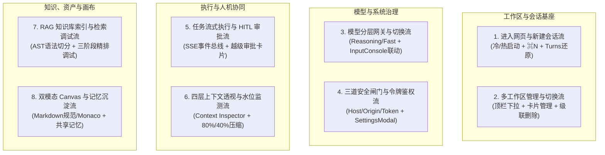
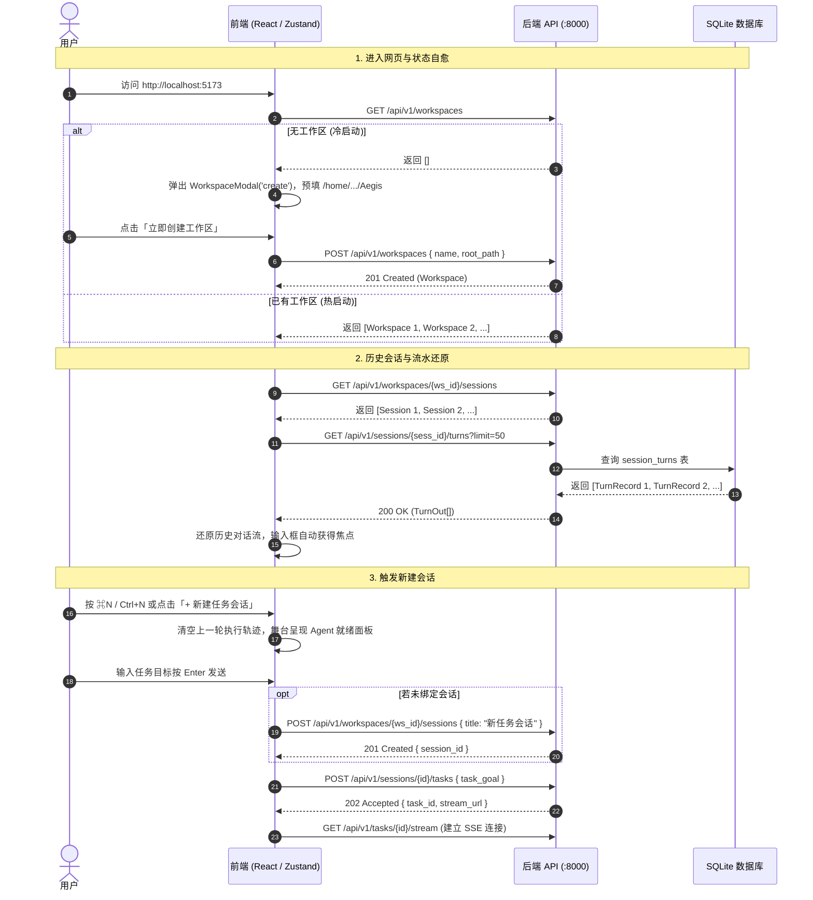
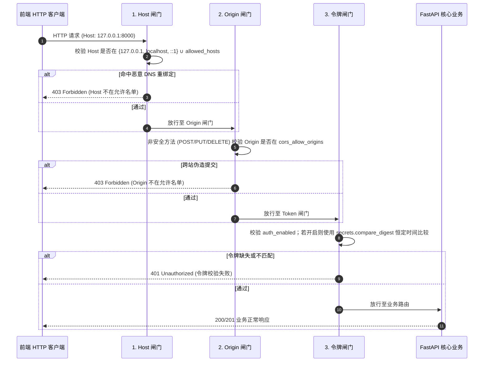
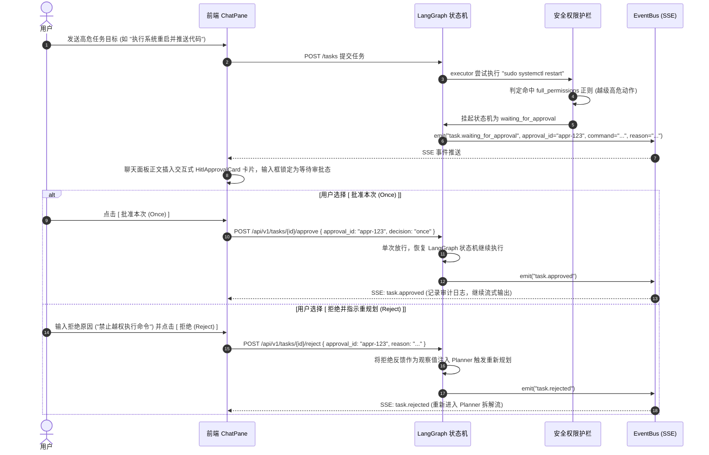
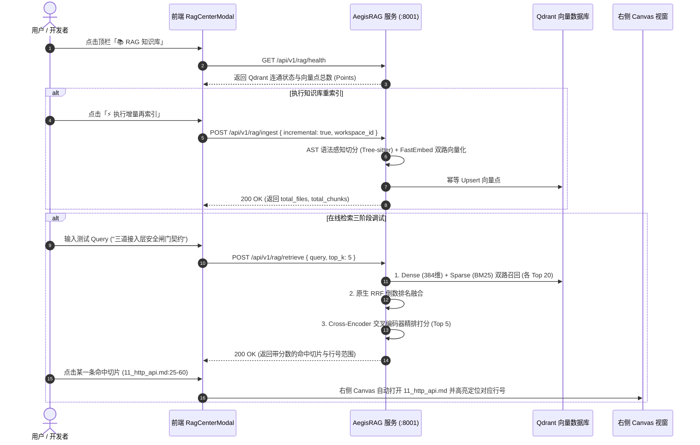

# AegisAgent 前端工作流与全场景交互设计规范 (Frontend Workflow & System Interaction Specification)

> **文档版本**：v2.0 权威全景定稿  
> **适用范围**：AegisAgent 智能体控制台、AegisRAG 知识库、工作区协同与系统治理全流程  
> **核心目标**：全面对齐前端 UI/UX 与后端契约，规范模型网关、安全闸门、四层上下文、HITL 审批、长期记忆、RAG 检索、Canvas 双模态与因果轨迹等 8 大核心工作流。

---

## 1. 核心架构实体与设计哲学

在 Aegis 系统中，用户与智能体的全部交互严格建立在 **三层实体拓扑** 与 **八大闭环工作流** 之上：

```text
┌──────────────────────────────────────────────────────────────────────────────────┐
│                   Aegis 实体层级与交互拓扑 (Entity Hierarchy)                    │
│                                                                                  │
│  [第 1 级: 工作区] Workspace (一等公民物理实体)                                   │
│  - 物理绑定: 对应磁盘真实项目根目录 root_path (如 /home/Skualeilu/Projects/Aegis) │
│  - 职能边界: 决定 Agent 工具读写范围、RAG 切片索引基准与长期跨会话共享记忆库     │
│                                      │                                           │
│                                      ▼ (1 : N 级联从属)                           │
│  [第 2 级: 会话] Session (认知隔离实体)                                          │
│  - 认知定义: 独立的任务线与上下文隔离单元                                         │
│  - 职能边界: 承载该任务线的局部情境记忆与 80%/40% 高低水位动态压缩               │
│                                      │                                           │
│                                      ▼ (1 : N 级联从属)                           │
│  [第 3 级: 对话轮次与任务] Turns & Task Execution                                │
│  - 执行载体: 人机对话流水 (session_turns) 与异步执行任务 (Task State Machine)     │
│  - 职能边界: 承载实时 SSE 事件推送、LangGraph 节点跃迁与 HITL 审批交互           │
└──────────────────────────────────────────────────────────────────────────────────┘
```

### 1.1 核心设计原则
1. **物理真源优先（Ground Truth First）**：智能体的一切工具执行、文件读写与 RAG 检索必须有明确的本地物理根路径，拒绝黑盒无归属操作。
2. **零假数据与严谨契约（Zero Fake Data）**：严禁在前端硬编码 mock 数据或传递临时占位符（如 `sess-default`）；所有 Session 与 Task 必须拥有后端 SQLite 持久化的真实 ID。
3. **状态自愈与即开即用（Instant Ready & Self-Healing）**：无论冷启动还是热启动，用户进入页面后必须秒级呈现可交互的就绪态，输入框自动聚焦，开箱即用。
4. **历史流水确定性还原（Deterministic Turns Restoration）**：切换会话时，必须通过 `GET /api/v1/sessions/{id}/turns` 完整还原历史对话，杜绝空白面板或假任务覆盖。
5. **安全与配置闭环（Security & Configuration First）**：三道接入层安全闸门、双模型网关参数、微服务沙箱配置必须具备实时修改、持久化同步与状态透明回显能力。

---

## 2. 核心工作流全景总览 (The 8 Essential Workflows)



---

## 3. 八大核心工作流详细规范与时序

### 3.1 工作流一：进入网页、新建会话与对话流水还原流 (Entry & Session Flow)



---

### 3.2 工作流二：多工作区全生命周期管理流 (Workspace Lifecycle Flow)

1. **顶栏工作区快速切换**：
   - 顶部导航栏展示当前绑定的绝对路径胶囊（`根路径: /home/Skualeilu/Projects/Aegis`）；
   - 点击下拉菜单展示已纳管工作区清单（支持即时过滤搜索），点击任意项触发 `setActiveWorkspace(id)`：
     - 切换当前 `activeWorkspaceId`；
     - 重新拉取该工作区专属的会话列表、文件树与记忆池；
     - 自动激活首个会话并还原其流水。
2. **工作区管理中心 (`WorkspaceModal: manage 模式`)**：
   - 卡片式展示所有已纳管工作区：
     - 标识 `当前活跃` 绿标；
     - 提供 `[切换进入]`、`[编辑属性]`、`[级联删除]` 动作组；
3. **高危级联删除保护**：
   - 必须在弹窗中显式输入完全匹配的工作区名称；
   - 确认后调用 `DELETE /api/v1/workspaces/{id}`，由后端 SQLite 级联物理清理其名下的所有会话、流水与记忆，本地源码保持安全。

---

### 3.3 工作流三：模型分层网关配置与动态切换流 (Model Gateway & Tiering Flow)

Aegis 严格遵循 **双模型分层协作架构**：

| 分层 | 角色与职责 | 典型模型 | 推荐温度 | 负责节点 |
| :--- | :--- | :--- | :--- | :--- |
| **思考模型层 (Reasoning Tier)** | 宏观规划、反思修正、综合交付报告 | `gpt-5.6-terra` / `deepseek-reasoner` / `o1` | `temp=0.0` | `planner`, `evaluator`, 总结节点 |
| **快速动作层 (Fast Tier)** | 工具调用参数填充、代码生成、对话压缩 | `gpt-5.4-mini` / `gpt-5.6-luna` / `gpt-4o-mini` | `temp=0.2` | `executor`, `compactor`, `tool_runner` |

#### 交互与对齐机制：
1. **动态端点读取**：
   - 前端初始化与设置打开时调用 `systemApi.getModels()`（`GET /api/v1/models`）；
   - 读取后端实际配置的 `reasoning.endpoints` 与 `fast.endpoints`（包含 OpenLux / 本地 Ollama 等配置）；
2. **控制台动态组合选择**：
   - `InputConsole.tsx` 提供直观的模型选择器：
     - `🧠 Dual-Tier: gpt-5.6-terra + gpt-5.4-mini (默认)`
     - `🧠 Dual-Tier: gpt-5.6-terra + gpt-5.6-luna (高性能)`
     - `⚡ Fast Only: gpt-5.4-mini`
     - `⚡ Fast Only: gpt-5.6-luna`
3. **设置面板参数检视与保存 (`SettingsModal: gateway 模式`)**：
   - 直观查阅思考层与快速层的当前生效 Base URL、模型别名与温度参数；
   - 支持调整并保存至运行时环境。

---

### 3.4 工作流四：接入层三道安全闸门与系统设置流 (Security Gates & Settings Flow)



#### 前端治理与配置交互：
- **令牌自动同步**：`SettingsModal.tsx` 提供当前令牌回显、一键 `[复制]` 与 `[轮转]`；
- **免密模式与鉴权自适应**：当后端 `auth_enabled = false` 时，系统自动在免密安全模式下通信；若开启鉴权，前端自动将 Token 持久化存储在 `localStorage`，并在所有请求头注入 `Authorization: Bearer <token>` 与 `X-API-Token`。

---

### 3.5 工作流五：任务流式执行与人机协同 (HITL) 审批流 (Task Execution & HITL Flow)



---

### 3.6 工作流六：四层装配上下文透视与高低水位监测流 (Context Inspector Flow)

Aegis 的 Prompt 装配体系由四层资产精确合成：
$$\text{Final Context} = \underbrace{\text{[系统提示词]}}_{\text{内置纪律} + \text{项目规则}} + \underbrace{\text{[工作区全局共享记忆]}}_{\text{架构定论} + \text{工程规范} + \text{避坑黑名单}} + \underbrace{\text{[会话已压缩记忆]}}_{\text{阶段摘要} + \text{事实清单}} + \underbrace{\text{[活跃对话滑窗]}}_{\text{低水位线以上完整轮次}} + \text{[当前用户输入]}$$

#### 前端交互与透视机制：
1. **抽屉式四层透视器 (`ContextDrawer.tsx`)**：
   - 随时点击顶栏 `[上下文]` 或主舞台 `[四层上下文透视]` 呼出；
   - 调用 `GET /api/v1/sessions/{id}/context` 结构化展开四层资产内容与分词 Token 数；
2. **动态高低水位计量器 (`WaterLevelMeter.tsx`)**：
   - 底部输入框实时展示当前 Token 水位百分比；
   - **高水位触发线 (80%)**：当活跃对话 Token 达到 80% 硬上限时，后端自动触发对话单元对齐切片；
   - **压缩目标比例 (40%)**：Fast 模型切出最古老 40% 对话进行提炼并更新 `compacted_until_turn_id`，安全回落至低水位线。

---

### 3.7 工作流七：RAG 知识库索引与在线三阶段检索调试流 (RAG Playground Flow)



---

### 3.8 工作流八：双模态 Canvas 视窗与长期共享记忆治理流 (Canvas & Shared Memory Flow)

1. **双模态 Canvas 阅读与编辑视窗 (`CanvasPane.tsx`)**：
   - **Markdown 规范阅读模式**：将技术方案、API 契约、ADR 决策阅读作为一等公民，支持 GFM 表格、Mermaid 图表与代码块一键复制；
   - **Monaco Editor 源码模式**：支持全语言高亮、行号折叠、快捷键 `Ctrl+S` 保存至本地物理磁盘；
   - **Side-by-side Git Diff 模式**：直观对比 Agent 修改前后的代码/文档差异；
   - **实时热重载感知横幅 (`LiveSyncBanner.tsx`)**：当后端 Agent 或外部工具写入磁盘文件时，右侧视窗自动滑出提示横幅，支持一键无缝重新载入。
2. **工作区长期共享记忆治理 (`MemoryDrawer.tsx`)**：
   - 点击侧边栏 `[🧠 工作区记忆]` 呼出长期共享记忆抽屉；
   - 结构化管理三大分类：
     - **架构定论 (`confirmed_architecture`)**：核心分层、端口契约；
     - **约定规范 (`project_conventions`)**：代码风格、测试覆盖纪律；
     - **避坑黑名单 (`global_failed_attempts`)**：历史不可行方案记录；
   - 支持手动新增、置顶事实或删除事实，所有定论永久共享并注入该工作区下的全部会话。

---

## 4. 全局快捷键与极客操作映射表

| 快捷键 (Mac / Linux&Win) | 触发动作 | 交互效果 |
| :--- | :--- | :--- |
| **`⌘N` / `Ctrl+N`** | **新建任务会话** | 瞬间清空当前舞台，重置为 Agent Ready 状态，输入框自动获得光标焦点 |
| **`⌘K` / `Ctrl+K`** | **唤起 RAG 检索中心** | 弹出全屏知识库管理模态窗，光标定位到检索调试输入框 |
| **`⌘B` / `Ctrl+B`** | **切换侧边栏折叠** | 展开或折叠左侧 240px 资产导航栏，扩大中间编辑视窗 |
| **`⌘S` / `Ctrl+S`** | **保存当前 Canvas 文件** | 将 Monaco 编辑器中的修改即时写回本地物理磁盘 |
| **`Enter`** (输入框内) | **提交当前任务** | 发送 Prompt 并启动异步状态机执行与 SSE 监听 |
| **`Shift+Enter`** | **输入框换行** | 多行输入任务背景与大段代码片段 |
| **`/`** (输入框首字符) | **快捷指令菜单** | 弹出 `/rag`、`/test`、`/plan` 等指令联想卡片 |

---

## 5. 前端状态存储模型与 Store 职能划分

```text
src/stores/
├── useWorkspaceStore.ts   # 工作区元数据、多工作区列表、会话切换、文件树与 Canvas 标签页状态
│   ├── workspaces: Workspace[]
│   ├── activeWorkspaceId: string | null
│   ├── sessions: Session[]
│   ├── activeSessionId: string | null
│   ├── memories: WorkspaceMemory[]
│   ├── fileTree: FileNode | null
│   ├── tabs: OpenTab[] / activeTabId: string | null
│   ├── fetchWorkspaces() / setActiveWorkspace(id)
│   ├── fetchSessions(wsId) / setActiveSession(sessId) -> 触发 getTurns
│   ├── createSession(title) / deleteSession(sessId)
│   ├── fetchMemories(wsId) / createMemory(payload)
│   └── openFileFromWorkspace(path) / saveCurrentTab()
│
├── useTaskStore.ts        # 任务执行实体、SSE 事件转译、HITL 审批与遥测数据
│   ├── currentTaskId: string | null
│   ├── tasks: Record<string, Task>
│   ├── submitTask(sessId, prompt, opts)
│   ├── approveAction(taskId, approvalId, decision, feedback)
│   └── rejectAction(taskId, approvalId, reason)
│
├── useRagStore.ts         # RAG 知识库健康、切片检视与检索调试状态
│   ├── health: RagHealth | null
│   ├── isIngesting: boolean / isSearching: boolean
│   ├── searchResult: RagRetrieveResult | null
│   ├── fetchHealth() / triggerIngest(payload)
│   └── search(query, opts)
│
└── useUiStore.ts          # 布局模态窗、侧边栏折叠、视图模式切换
    ├── sidebarOpen: boolean
    ├── activeView: 'chat' | 'trace' | 'context'
    ├── workspaceModalOpen: boolean
    ├── workspaceModalMode: 'create' | 'edit' | 'delete' | 'manage'
    ├── ragCenterModalOpen / settingsModalOpen: boolean
    └── memoryDrawerOpen / contextDrawerOpen: boolean
```

---

## 6. 验收标准与质量护栏

任何后续迭代与功能扩展必须满足以下基线：
1. **TypeScript 编译 0 报错**：严格执行 `tsc --noEmit`，禁止使用 `any` 绕过类型检查；
2. **全套自动化测试 100% 绿灯**：覆盖 `sessionApi.getTurns`、`setActiveSession` 历史还原、`submitTask` 流式流转、HITL 审批与 RAG 检索；
3. **真实接口全连通**：严禁回退引入静态 mock 数据或假 ID。
