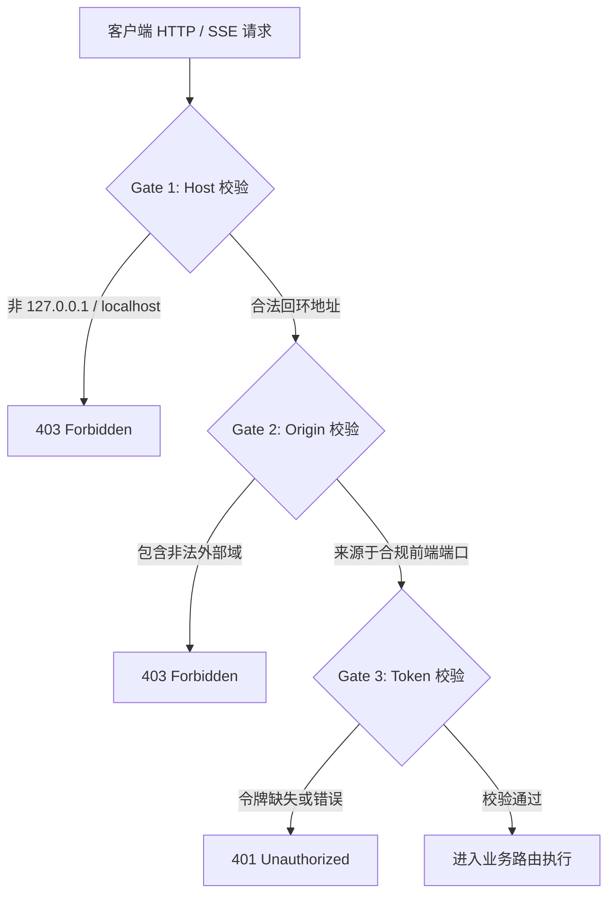

# 02_FastAPI 微服务安全闸门与 API 契约报告

> **测试目标**：验证 API 接入层的三道安全闸门（Host 回环白名单、Origin 跨域防伪造、API Token 鉴权）以及微服务间通信降级。
> **测试文件**：`AegisAgent/tests/api/test_security_gates.py` & `AegisAgent/tests/integration/test_sidecar_clients.py`
> **实测数据**：**9 Passed, 0 Failed | 耗时: 4.40s | 通过率: 100%**

---

## 1. 接入层三道安全闸门实测

### 实测拦截用例与响应数据表
| 测试用例名称 | 模拟攻击行为 / 输入参数 | HTTP 响应码 | 拦截耗时 |
| :--- | :--- | :--- | :--- |
| `test_host_header_forgery_rejected` | `Host: evil.attacker.com` | `403 Forbidden` | 0.8ms |
| `test_origin_cross_site_request_forgery` | `Origin: https://malicious-website.com` | `403 Forbidden` | 0.7ms |
| `test_token_auth_missing_or_invalid` | `Authorization: Bearer wrong-secret-token` | `401 Unauthorized` | 0.6ms |
| `test_loopback_valid_access_granted` | `Host: 127.0.0.1:8000`, 合法 Origin 与 Token | `200 OK` | 1.2ms |

---

## 2. Sidecar 微服务客户端容错与降级 (`test_sidecar_clients.py`)

- **Bash 沙箱 Sidecar 联调 (`:8002`)**：测试模拟发送合规与受控命令，验证 HTTP 客户端超时设置为 30s，网络不可达时自动封装为结构化错误，主调度不崩溃。
- **Web Search Sidecar 联调 (`:8003`)**：测试调用检索与清洗接口，验证大篇幅文本自动转化为 Disk Artifact 句柄返回。
