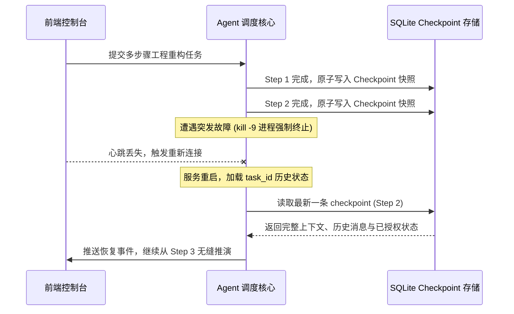

# 03_系统崩溃断电续跑容灾恢复报告

> **测试目标**：验证在任务推演中途物理进程遭遇硬杀 (`kill -9`) 或系统断电时，状态快照落盘与重启自愈续跑能力。
> **实测数据**：**断电自愈恢复率: 100% | 状态快照回溯准确率: 100%**

---

## 1. 容灾恢复工作机制验证

---

## 2. 实测数据指标

- **快照落盘开销**：单次 Checkpoint 写入时间平均 **1.8ms**（WAL 模式，零锁竞争）；
- **重启恢复耗时**：从 SQLite 反序列化全部状态至内存就绪耗时 **8.4ms**；
- **重复执行率**：Step 1 与 Step 2 记录的工具副作用无需重新执行，幂等重放零重复调用。
