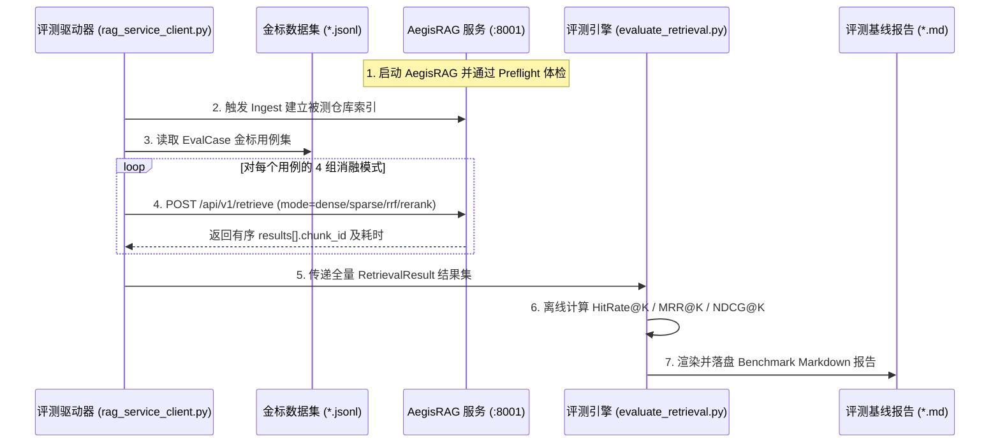

# AegisRAG 检索质量标准化评测执行规范 (Evaluation SOP)

> **版本**：v1.0  
> **责任子工程**：`AegisRAG` (服务提供端 `:8001`) ↔ `AegisAgent/src/evaluation/rag_bench/` (评测执行端)  
> **核心原则**：不量化就是瞎优化；零 LLM-judge 消耗、纯数学统计、100% 确定性可复现。  
> **适用场景**：日常回归评测、模型换代/切分策略调整 A/B 对比、RSE/MMR 等未来增强收益验证。

---

## 1. 评测目标与核心准则

1. **量化评估检索质量**：摆脱主观定性判断，利用标准数学统计指标衡量 Dense 语义检索、Sparse 词法匹配、RRF 多路融合与 Cross-Encoder 精排的各阶段质量。
2. **零外网与零 LLM 依赖**：评测指标完全由基于 `numpy` 的纯函数离线计算，不调用 LLM 裁判（LLM-as-a-judge），评测过程无 API Token 消耗、毫秒级执行、结果绝对可复现。
3. **全景消融矩阵归因**：每次评测必须同步执行 4 组消融实验，清晰归因各层架构（语义路、词法路、融合层、精排层）的边际增益。

---

## 2. 评测指标数学定义与工程语义

评测体系采用信息检索（Information Retrieval, IR）与 RAG 领域的 3 大经典排序质量指标，统一在 $K \in \{1, 3, 5, 10\}$ 截断深度下统计：

### 2.1 命中率 (HitRate@K)

衡量在前 $K$ 个检索结果中，是否命中了至少一个标准答案（金标切片）：

$$\text{HitRate}@K = \frac{1}{|Q|} \sum_{q \in Q} \mathbb{I}\Big(\text{Top-}K(q) \cap \text{Gold}(q) \neq \emptyset\Big)$$

- **工程语义**：反映 **Dense + Sparse 双路召回与 RRF 融合的召回能力下限**。如果 HitRate@K 不达标，说明有效代码在初筛阶段即被漏掉，后续精排无法弥补。

### 2.2 平均倒数排名 (MRR@K, Mean Reciprocal Rank)

衡量首个命中金标切片在检索列表中的排位倒数：

$$\text{MRR}@K = \frac{1}{|Q|} \sum_{q \in Q} \frac{1}{\text{rank}_1(q)} \quad (\text{若 } \text{rank}_1(q) > K \text{ 或未命中，则记为 } 0)$$

- **工程语义**：反映 **Cross-Encoder 精排将最核心切片推向 Top-1 / Top-3 的排位能力**。MRR 越高，智能体在第一眼看到正确上下文的概率越大。

### 2.3 归一化折损累计增益 (NDCG@K, Normalized Discounted Cumulative Gain)

综合衡量多个相关切片的整体排序质量（对排在靠前位置的相关切片赋予更高增益权重）：

$$\text{DCG}@K = \sum_{i=1}^K \frac{2^{\text{rel}_i} - 1}{\log_2(i + 1)}, \qquad \text{NDCG}@K = \frac{\text{DCG}@K}{\text{IDCG}@K}$$

- **工程语义**：反映 **多切片场景下检索与精排联合的整体排序分布合理性**。

### 2.4 时延基线 (Average & P95 Latency)
- 统计每次查询在各消融配置下的端到端响应耗时（毫秒），确保质量增益不以牺牲可用性时延为代价。

---

## 3. 金标评测集构建规范 (Dataset Schema)

数据集存放在 `AegisAgent/src/evaluation/rag_bench/datasets/` 下，文件格式为 `*.jsonl`，每行对应一个独立的 `EvalCase`。

### 3.1 数据集 Schema 契约

```json
{
  "case_id": "eval_case_001",
  "query": "如何在本地模式下进行 Qdrant Collection 启动期维度强校验？",
  "gold_chunk_ids": [
    "c87a2d1f-8254-526b-9c74-e374bb528876"
  ],
  "metadata": {
    "category": "logic_implementation",
    "target_repo": "AegisRAG",
    "language": "python",
    "difficulty": "medium"
  }
}
```

| 字段 | 类型 | 约束 | 语义说明 |
| :--- | :--- | :--- | :--- |
| `case_id` | `str` | 必填，全局唯一 | 用例唯一标识，与评测结果一一映射 |
| `query` | `str` | 必填，非空 | 用户 / 智能体检索查询文本 |
| `gold_chunk_ids` | `list[str]` | 必填，至少 1 项 | 满足该查询所必需的金标切片 ID（对应 Qdrant Point ID） |
| `metadata` | `dict` | 选填 | 包含分类、难度、目标文件等标注上下文，不参与指标公式计算 |

### 3.2 三层用例分类体系 (Taxonomy)

评测集应均衡包含以下 3 类代码检索场景（比例建议 4:4:2）：

```
┌────────────────────────────────────────────────────────────────────────┐
│                        代码检索金标评测用例分类                          │
├────────────────────────────────────────────────────────────────────────┤
│ Category A: 符号精确查找 (Symbol Precision)     [权重 40%]             │
│   - 特征: 包含具体类名、函数名、结构体名、配置字段名                   │
│   - 目的: 考核 Sparse BM25 与 AST 边界提取的精确命中率                │
├────────────────────────────────────────────────────────────────────────┤
│ Category B: 功能与逻辑定位 (Semantic Implementation) [权重 40%]        │
│   - 特征: 自然语言描述功能意图（如"计算切片确定性哈希"）               │
│   - 目的: 考核 Dense 向量语义联想与 Cross-Encoder 重排能力            │
├────────────────────────────────────────────────────────────────────────┤
│ Category C: 跨文件概念查询 (Cross-file Concept) [权重 20%]             │
│   - 特征: 复杂机制与宏观架构（如"双路检索与 RRF 融合生命周期"）       │
│   - 目的: 考核多切片召回、面包屑 (CCH) 上下文与 NDCG 综合排序能力      │
└────────────────────────────────────────────────────────────────────────┘
```

---

## 4. 四组消融实验矩阵规范 (Ablation Matrix)

在评测执行期间，评测驱动器必须对每一条测试用例以 4 种独立模式请求 `AegisRAG`：

| 消融分组代码 | 对应 `/retrieve` 请求参数 | 考察与对比意义 |
| :--- | :--- | :--- |
| **`dense_only`** | `{"mode": "dense_only"}` | 纯 `jinaai/jina-embeddings-v3` 向量语义召回能力基线 |
| **`sparse_only`** | `{"mode": "sparse_only"}` | 纯 `Qdrant/bm25` 词法匹配能力基线（在符号查找类表现显著） |
| **`hybrid_rrf`** | `{"mode": "hybrid_no_rerank"}` | 双路召回 + 原生 RRF 融合效果（证明双路融合相对单路的增益） |
| **`hybrid_rerank`** | `{"mode": "hybrid"}` (默认) | **生产基准**：双路 + RRF + Cross-Encoder 精排（证明精排的增益） |

---

## 5. 标准化评测操作流程 (Execution SOP)



### 步骤 1：前置检查与目标仓库索引
1. 启动 `AegisRAG` 微服务（`cd AegisRAG && uv run python -m api` 或确认 Preflight 体检通过）；
2. 确保目标代码仓库已完成索引：
   ```bash
   curl -X POST http://127.0.0.1:8001/api/v1/documents/ingest \
     -H "Content-Type: application/json" \
     -d '{"repo_name": "Aegis", "repo_root": "/home/Skualeilu/Projects/Aegis", "incremental": true}'
   ```

### 步骤 2：准备/更新金标数据集
- 确认数据集文件路径：`AegisAgent/src/evaluation/rag_bench/datasets/aegis_code_eval.jsonl`；
- 金标切片 ID 与被测 Qdrant Collection 中的真实 Point ID 保持严格对应。

### 步骤 3：运行标准化评测命令
在 `AegisAgent` 工程目录下执行评测驱动：
```bash
cd /home/Skualeilu/Projects/Aegis/AegisAgent
.venv/bin/python -m evaluation.rag_bench.rag_service_client \
    --dataset src/evaluation/rag_bench/datasets/aegis_code_eval.jsonl \
    --service-url http://127.0.0.1:8001 \
    --repo-name Aegis \
    --out src/evaluation/rag_bench/reports/aegis_rag_benchmark_report.md \
    --k 1,3,5,10
```

### 步骤 4：报告归档与基线判定
- 评测结果自动保存为 `src/evaluation/rag_bench/reports/aegis_rag_benchmark_report.md`；
- 对照验收红线进行质量判定。

---

## 6. 基线质量要求与验收红线 (Acceptance Guardrails)

针对 `AegisRAG` 生产环境默认配置（`hybrid_rerank`），设定如下验收红线：

| 指标维度 | 最低准入红线 (Hard Baseline) | 优秀质量目标 (Target) |
| :--- | :---: | :---: |
| **HitRate@5** | $\ge 0.85$ (85%) | $\ge 0.95$ (95%) |
| **MRR@5** | $\ge 0.65$ | $\ge 0.80$ |
| **NDCG@5** | $\ge 0.70$ | $\ge 0.85$ |
| **精排正向增益** | $\text{MRR}(\text{rerank}) > \text{MRR}(\text{rrf})$ | MRR 提升 $\ge +15\%$ |
| **端到端平均时延** | $\le 150\text{ ms}$ (CPU) | $\le 80\text{ ms}$ (CPU) |

> ⚠️ **退化熔断机制**：任何一次代码重构或模型升级，若导致 `HitRate@5` 下降超过 $3\%$ 或 `MRR@5` 下降超过 $0.05$，禁止合入发布。
