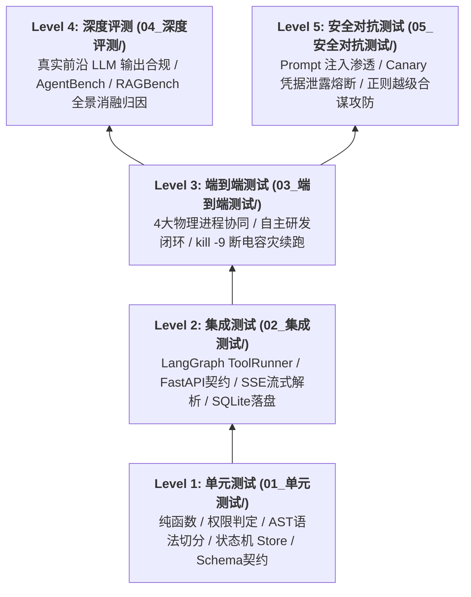

# Aegis 全景测试路线图与自动化质量保障总索引 (Master Test Index)

> **定位**：Aegis 各子系统（`AegisAgent`、`AegisRAG`、`AegisFrontend`、`端到端系统测试`）的测试架构规划、分阶段测试路线、基准评测规范与自动化质量保障总入口。
> **直观分类体系**：测试路线按照测试类型与金字塔分层彻底重构，按 **01_单元测试**、**02_集成测试**、**03_端到端测试**、**04_深度评测**、**05_安全对抗测试** 严格归类，目录结构清晰直观，文件名即测试范围。

---

## 目录结构与测试分类拓扑

```text
documents/测试路线/
├── 00_总测试路线.md                              # [总纲] 全景测试总路线、分层矩阵与质量门禁
├── README.md                                    # [当前文档] 分类总索引与测试金字塔导航
│
├── 01_单元测试/                                  # 【单元测试】纯函数、状态机原子突变与无 I/O 契约
│   ├── README.md                                # • 单元测试执行规范与环境隔离
│   ├── 01_Agent运行时单元测试路线.md             # • 权限三级判定 / 纯函数路由 / 配置校验 / Token分词
│   ├── 02_RAG切分与向量单元测试路线.md           # • Tree-sitter AST解析 / BM25 / Dense / UUIDv5确定性
│   └── 03_Frontend组件与状态单元测试路线.md      # • Zustand状态机 / 纯组件渲染 / 工具函数纯运算
│
├── 02_集成测试/                                  # 【集成测试】组件协同、状态机流转与微服务契约
│   ├── README.md                                # • 集成测试执行规范与 Mock 边界
│   ├── 01_LangGraph节点状态机集成测试路线.md     # • ToolRunner节点挂起恢复 / 原子对铁律 / SQLite持久化
│   ├── 02_FastAPI微服务与API契约测试路线.md      # • 三道安全闸门 / 任务生命周期 / RAG代理 / 沙箱Sidecar
│   └── 03_Frontend流式通信与数据流测试路线.md    # • SSE流式解析 / 同会话多轮提交消息栈 / 断网指数重连
│
├── 03_端到端测试/                                # 【端到端测试】全系统跨进程业务闭环与容灾自愈
│   ├── README.md                                # • E2E 协同拓扑与运行环境配置
│   ├── 01_全系统业务闭环E2E测试路线.md           # • UI -> Agent -> RAG -> Sandbox 自动化研发闭环
│   └── 02_系统崩溃断电续跑容灾测试路线.md        # • 真实进程 kill -9 宕机 / SQLite快照无缝恢复续跑
│
├── 04_深度评测/                                  # 【深度评测】真实模型能力基线与 RAGBench 量化
│   ├── README.md                                # • 评测体系架构与消融实验基准
│   ├── 01_真实LLM前沿模型深度评测路线.md         # • gpt-5.6-terra/luna真实驱动 / AgentBench / 长上下文
│   ├── 02_RAG检索质量评测执行规范.md             # • HitRate@K / MRR@K / NDCG@K 数学定义与 4:4:2 金标集
│   └── 03_RAG全景消融基准评测报告.md             # • 4 组消融实验实测数据与 Cross-Encoder 深度归因
│
└── 05_安全对抗测试/                              # 【安全对抗】红队攻防、Prompt 注入与越级拦截
    ├── README.md                                # • 安全防御矩阵与渗透测试靶场
    ├── 01_权限越级与沙箱合谋对抗测试路线.md      # • 正则黑名单绕过 / 批量越级合谋 / 畸形resume防御
    └── 02_Prompt注入与Canary金丝雀红队测试路线.md # • XML定界沙箱防御 / 会话级CanaryToken毫秒级硬熔断
```

---

## 测试金字塔与保障分层



---

## 五大分类路线速查与实测矩阵

| 分类目录 | 核心文档 | 覆盖子系统与范围 | 核心验证重点 | 运行环境 / 工具 | 快速执行命令 |
| :--- | :--- | :--- | :--- | :--- | :--- |
| **00 总测试路线** | [`00_总测试路线.md`](00_总测试路线.md) | 全系统总纲 | 测试金字塔、全工程执行流水线、质量门禁准则 | 全栈矩阵 | `npm test && uv run pytest` |
| **01 单元测试** | [`01_Agent运行时单元测试路线.md`](01_单元测试/01_Agent运行时单元测试路线.md)<br/>[`02_RAG切分与向量单元测试路线.md`](01_单元测试/02_RAG切分与向量单元测试路线.md)<br/>[`03_Frontend组件与状态单元测试路线.md`](01_单元测试/03_Frontend组件与状态单元测试路线.md) | `AegisAgent`<br/>`AegisRAG`<br/>`AegisFrontend` | 权限判定归一化、AST 语法切分完整性、UUIDv5 散列确定性、Zustand Store 状态突变 | `pytest` + `vitest` | `uv run pytest tests/guardrails/ && npm run test` |
| **02 集成测试** | [`01_LangGraph节点状态机集成测试路线.md`](02_集成测试/01_LangGraph节点状态机集成测试路线.md)<br/>[`02_FastAPI微服务与API契约测试路线.md`](02_集成测试/02_FastAPI微服务与API契约测试路线.md)<br/>[`03_Frontend流式通信与数据流测试路线.md`](02_集成测试/03_Frontend流式通信与数据流测试路线.md) | `StateGraph`<br/>`FastAPI (:8000/:8001)`<br/>`SSE 接入层` | `ToolRunner` 挂起恢复、原子对严格闭环、三道安全闸门（Host/Origin/Token）、SQLite Checkpoint 落盘、SSE 流解析 | `pytest-asyncio` + `httpx.AsyncClient` | `uv run pytest tests/integration/ tests/api/` |
| **03 端到端测试** | [`01_全系统业务闭环E2E测试路线.md`](03_端到端测试/01_全系统业务闭环E2E测试路线.md)<br/>[`02_系统崩溃断电续跑容灾测试路线.md`](03_端到端测试/02_系统崩溃断电续跑容灾测试路线.md) | 跨 4 大独立微服务进程 | 自动化开发交付闭环、越级高危动作与人机协同审批闭环、真实 `kill -9` 模拟宕机后断点续跑 | 多进程编排 | `pytest tests/integration/test_crash_recovery.py` |
| **04 深度评测** | [`01_真实LLM前沿模型深度评测路线.md`](04_深度评测/01_真实LLM前沿模型深度评测路线.md)<br/>[`02_RAG检索质量评测执行规范.md`](04_深度评测/02_RAG检索质量评测执行规范.md)<br/>[`03_RAG全景消融基准评测报告.md`](04_深度评测/03_RAG全景消融基准评测报告.md) | 真实模型驱动 + RAGBench | `gpt-5.6-terra/luna` 真实输出合规、4:4:2 代码金标集、HitRate@K / MRR@K / NDCG@K、4 组全景消融实验归因 | 真实 API + `numpy` 纯离线计算 | `uv run pytest tests/real_llm/ -m real_llm` |
| **05 安全对抗测试** | [`01_权限越级与沙箱合谋对抗测试路线.md`](05_安全对抗测试/01_权限越级与沙箱合谋对抗测试路线.md)<br/>[`02_Prompt注入与Canary金丝雀红队测试路线.md`](05_安全对抗测试/02_Prompt注入与Canary金丝雀红队测试路线.md) | 安全防御靶场 | 正则黑名单绕过（管道/子命令/编码）、单批次越级合谋、畸形 resume 防御、XML 沙箱注入隔离、Canary 泄露毫秒级硬熔断 | `hypothesis` + 红队靶场 | `uv run pytest tests/guardrails/test_permission_adversarial.py` |

---

## 全系统测试执行命令速查

### 1. 离线全量安全回归（零成本、零外网强依赖）
```bash
# Agent 运行时与安全守卫全量单测 (200+ 用例)
cd /home/Skualeilu/Projects/Aegis/AegisAgent
uv run pytest tests/ -m "not real_llm" -q

# RAG 检索引擎全量单测与微服务接口测试
cd /home/Skualeilu/Projects/Aegis/AegisRAG
uv run pytest tests/ -q

# Frontend 全量 Vitest 单元与组件测试 (16 测试套件)
cd /home/Skualeilu/Projects/Aegis/AegisFrontend
npm run test
```

### 2. 真实前沿评测与基准运行
```bash
# 运行真实 LLM 深度测试套件 (需要配置 TERRA_KEY 与 LUNA_KEY)
cd /home/Skualeilu/Projects/Aegis/AegisAgent
uv run pytest tests/real_llm/ -m real_llm -v -s

# 启动 RAG 微服务并运行 RAGBench 4 组消融自动化评测
uv run uvicorn src.api.server:app --port 8001 &
uv run python -m src.evaluation.rag_bench.runner
```

---

## 质量门禁与准入准出标准 (Quality Gates)

1. **原子对绝对对称（Atomic Pair Invariant）**：`AIMessage(tool_calls)` 与 `ToolMessage` 必须依据 `tool_call_id` 严格对称。无论成功、失败、审批挂起或熔断，单向孤立消息绝对阻断合并。
2. **零外网强依赖（Network Independence）**：常规单测与集成测试必须在无外网环境下可独立运行，外部模型与网络出口一律使用 `MockTransport` 或本地 ONNX 引擎。
3. **确定性幂等原则（Deterministic Idempotency）**：RAG 切片写入严格遵循 UUIDv5 散列，二次 Ingest 必须达到 `skipped == 100%`、`indexed == 0`。
4. **状态持久化与故障自愈（Crash Durability）**：任务挂起状态必须实时落盘 SQLite WAL 数据库，主进程断电重启后通过 `/resume` 无缝接续执行。
5. **安全分级与防御有效性**：`permission.py` 与 `canary.py` 覆盖率必须 $\ge 95\%$，Prompt 注入阻断率达 100%。
