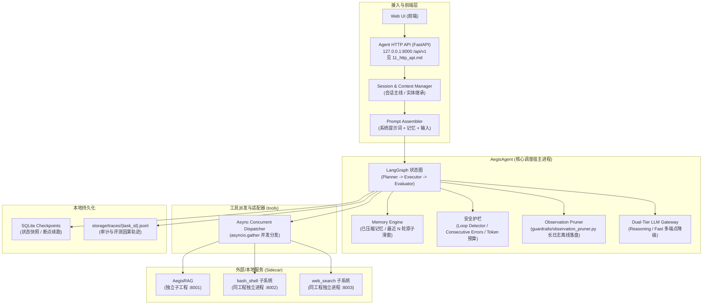

# Aegis Agent Runtime - 架构总览

## 1. 系统定位与核心特征

Aegis Agent Runtime 是一个**确定性的工程化 Agent 运行时宿主**，基于 LangGraph 与原生 AsyncOpenAI 协议构建，专为驱动长周期工程研究与代码调试任务而设计。

**核心设计特征**：
* **双子工程物理隔离（Sidecar 模式）**：`AegisAgent`（轻量调度宿主）与 `AegisRAG`（独立检索基础设施）进程与依赖完全隔离。
* **显式状态机（Explicit State Machine）**：基于 Pydantic v2 / TypedDict，状态跃迁 100% 透明可追溯。
* **物理预算确定性守卫（Deterministic Physical Guardrails）**：以 `max_steps`、`total_tokens`、`max_wall_time_sec` 替代不确定的费用预估。
* **全生态双模型分层与自动降级（Dual-Tier Fallback Chain）**：区分思考模型（Reasoning）与动作模型（Fast），支持多端点熔断降级。
* **三段式记忆与上下文治理（Context & Memory Engine）**：系统提示词 + 已压缩记忆 + 最近 N 轮滑窗 + 当前输入，杜绝单体 Checkpoint 造成的 Context 膨胀。

---

## 2. 整体工程拓扑与进程划分



---

## 3. 双工作区隔离设计原则（Why Sidecar?）

在工程实现上，`AegisAgent` 与 `AegisRAG` 划分为两个具备独立 `uv` 环境的子工程：

1. **崩溃与 OOM 强隔离**：
   - RAG 涉及底层的 C/C++ 扩展（`tree-sitter`、`onnxruntime`）；
   - 一旦代码解析发生段错误（Segmentation Fault）或向量模型撑爆内存（OOM），仅 RAG 独立进程退出，**Agent 宿主进程永不崩溃**，可通过异常捕获从容降级。
2. **消除 Python GIL 锁竞争与事件循环饥饿（Event Loop Starvation）**：
   - Agent 是单线程协作式异步事件循环，对心跳与超时极度敏感；
   - RAG 的 AST 语法树遍历和 Embedding 矩阵运算属于 CPU 密集型任务，独立在宿主之外运行，彻底消除对 Agent 主事件循环的卡顿争抢。
3. **极速迭代与热重载**：
   - `AegisAgent` 仅含纯 Python 编排库，秒级冷启动与秒级测试；
   - 调试 Agent 状态机时无需重复加载几百兆向量模型。

---

## 4. 核心组件定义

### 4.1 核心执行拓扑（Graph Topology）
* **`planner`**：调用 `models.reasoning`（如 DeepSeek-R1 / OpenAI o1）进行宏观目标分解与反思规划；
* **`executor`**：调用 `models.fast`（如 DeepSeek-V3 / GPT-4o-mini）生成具体的 ToolCall 参数，由 `tools` 使用 `asyncio.gather` 并发执行；
* **`edges/`（条件边）**：每条迁移一个模块，与 `nodes/` 一一对称；`routing.py` 仅做聚合导出。路由决策全部是纯函数（零 I/O、零 LLM），可离线单测；
* **`should_continue`（条件边）**：
  - 工具连续报错达到阈值（`consecutive_errors >= 3`）$\to$ 强行熔断并回退至 `planner` 触发重规划；
  - 参数指纹连续 3 次相同 $\to$ 判定为死循环拦截；
  - 任务达到 `max_steps` 或 `max_total_tokens` $\to$ 硬熔断至 `END`。

### 4.2 双模型分层网关（Dual-Tier LLM Gateway）
* **思考模型层（Reasoning Tier）**：
  - 职责：宏观任务分解、复杂架构归纳、重规划、最终技术报告；
  - 配置：严格 `temperature = 0.0`，主备端点自动重试降级。
* **快速动作层（Fast Tier）**：
  - 职责：工具选择与参数填充、观察结果摘要压缩、中间阶段事实提炼；
  - 配置：`temperature = 0.2`，低延迟高吞吐。

### 4.3 工作区与记忆上下文引擎（Workspace & Memory Engine）
* 参见专属技术规范：[`06_memory_and_context_management.md`](./06_memory_and_context_management.md)；
* **三级实体层次与多工作区支持**：
  - **工作区一等公民（Workspace Entity）**：支持独立创建与管理多个工作区，强绑定物理工程根路径 `root_path`；
  - **工作区全局共享记忆（Workspace Scope）**：跨会话持久共享，沉淀该项目的全局架构定论、编码规范与避坑黑名单；
  - **单会话情境记忆（Session Scope）**：一个工作区可开辟多个独立会话（1:N），会话专属维护阶段目标、局部事实与最近操作实体。
* **高低水位对话对齐动态压缩（Watermark Compaction）**：
  - 基于 `tiktoken` 精准物理计量，达到 80% Token 上限自动触发；
  - 严格按完整人机对话单元对齐，切出最古老约 40% 对话送入 Fast 模型提炼，活跃水位降回安全低水位，提供充裕呼吸空间；
* 彻底分离“用户主对话流（Session Context）”与“内部执行轨迹（Task Trajectory）”。

### 4.4 接入层（Agent HTTP API）
* **唯一用户入口**：`AegisAgent/src/agent_runtime/api/`，FastAPI 应用，监听 `127.0.0.1:8000`，基础路径 `/api/v1`；
* **职责**：工作区/会话 CRUD、任务提交与续跑、SSE 实时事件流、上下文检视、产物与轨迹读取、能力自省；
* **契约分层**：对外只暴露 `api/schemas.py` 的 DTO，**绝不**直接外发 `AgentState`（含 LangChain 消息对象）；
* **完整端点与事件契约**：见 [`11_http_api.md`](./11_http_api.md)；
* **安全红线**：仅本地回环，v1 无认证；禁止对外暴露（其工具链含受控命令执行能力）。

### 4.5 子系统部署形态（两种，不可混淆）
1. **同工程子系统**：`bash_shell`、`web_search` 位于 `AegisAgent/src/services/` 内，与 Agent 共享 `config.toml` 与依赖锁，但**各自作为独立进程**通过 HTTP 暴露（`:8002` / `:8003`）。禁止 `services/*` 反向 import `agent_runtime`。
2. **独立子工程**：`AegisRAG` 因携带 `onnxruntime`、`tree-sitter` 等重依赖与 C 扩展，作为**物理独立子工程**（独立 `uv` 环境）运行于 `:8001`。

---

## 5. 存储架构与持久化规划

```text
storage/
├── checkpoints/
│   └── aegis_state.db        # SQLite (WAL 模式)，存储 LangGraph 状态机快照与续跑状态
├── aegis_meta.db             # SQLite (WAL 模式)，存储 workspaces, workspace_memories, sessions, session_turns, session_memories
├── artifacts/                # 工具长输出离线截断文件 (如 compile_error.log, diff)
└── traces/
    └── {task_id}.jsonl       # 全量未修剪因果轨迹，供离线评测与审计
```

