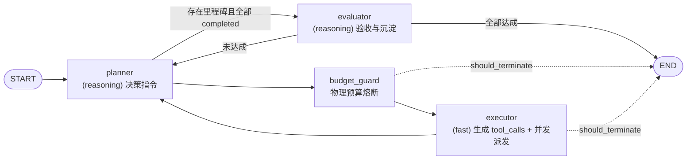

# Node 实现规范

> **责任领域**：`AegisAgent/src/agent_runtime/nodes/`
> **契约基线**：`02_state_definition.md`（AgentState 唯一真源）、`05_guardrails_implementation.md`、`07_execution_context_management.md`
> **文档状态**：统一修订版（v2）。本版废弃早期草稿中的**费用模型**与 `supervisor` 节点，与 `01_architecture_overview.md` 的**双模型分层**设计严格对齐。

---

## 0. 本版修订要点（与早期草稿的差异）

早期草稿（本文件 v1 与 `04_routing_and_control_flow.md` v1）残留了一套基于 `cost_usd` 与 `supervisor` 的通用模板，与后续定稿的物理预算规范直接冲突。统一裁决如下：

| 早期草稿表述 | 统一后规范 | 依据 |
| :--- | :--- | :--- |
| `accumulated_cost_usd` / `max_cost_usd` / `Step.cost_usd` | **彻底删除**。改用确定性物理指标 `total_tokens`、`step_count` 与挂钟时间 | `02` §1 纪律一、`05` §2 |
| `supervisor` 节点（注入修正建议 + `retry_count` 计数） | **删除该节点**。连续错误熔断由条件边强制回退 `planner` 触发重规划 | `05` §1.2 |
| `trajectory: List[Step]` 作为状态字段 | 删除。执行留痕由 `messages`（原子对）+ `confirmed_facts` + `failed_attempts` 承载，全量轨迹落盘 `storage/traces/` | `02` §2、`07` §2.4 |
| `state.user_query` / `state.last_observation` / `state.max_steps` | 改为 `task_goal` / `messages[-1]` / 由配置对象注入的守卫实例 | `02` §2 |
| `planner` 直接产出 `tool_calls`，`executor` 纯派发 | `planner`(reasoning) 产出**决策指令**；`executor`(fast) 生成**具体 `tool_calls`** 并并发派发 | `01` §4.1/§4.2、`05` §3 |

> 节点集合最终定为 **`planner` / `budget_guard` / `executor` / `evaluator`** 四个，与 `README.md` 索引及 `01` 的 `Planner -> Executor -> Evaluator` 拓扑一致。
>
> **实现位置**：每个节点一个模块（`agent_runtime/nodes/{planner,budget_guard,executor,evaluator}.py`），
> 公共契约与纯辅助在 `nodes/base.py`；与之对称的**条件边**在 `agent_runtime/edges/after_*.py`，
> 路由决策的完整定义见 `04_routing_and_control_flow.md`。

---

## 1. Node 统一执行模型

所有 Node 必须遵循同一签名：

```python
async def node_func(state: AgentState) -> Dict[str, Any]:
    """
    Node 执行函数

    输入：完整的 AgentState（只读，禁止原地修改）
    输出：部分字段的增量更新字典（由 LangGraph Reducer 合并）

    四条硬性纪律：
    1. 不阻塞：禁止任何同步 I/O 与同步阻塞调用
    2. 原子性：执行期间 state 保持不变，只在返回值中提交变更
    3. 幂等性：相同输入应产生相同输出（LLM 采样除外），便于回放与断点续跑
    4. 快速失败：不可恢复的异常立即向上传播，由 LangGraph 中断并保留 Checkpoint
    """
```

**统一约束**：

- Node 内部**所有** LLM 调用必须经过双模型网关 `agent_runtime/llm/client.py`，不得自行 `AsyncOpenAI(...)`；网关负责 tenacity 指数退避与跨端点降级（`05` §3）。
- Node 之间**禁止互相调用**，只能通过图的边串联。
- 大体积数据（编译日志、文件内容）**禁止**进入 State，必须走 Artifacts 句柄（`artifact://...`）。
- 每个发起 LLM 调用的 Node **必须**累加 `total_tokens += response.usage.total_tokens`（`02` §3.3）。

---

## 2. 状态字段归属与读写权限

字段定义以 `02_state_definition.md` 为唯一真源，此处仅声明**写入责任**，防止多个节点争抢同一字段：

| 字段 | 类型 | 写入者 | 说明 |
| :--- | :--- | :--- | :--- |
| `workspace_id` / `workspace_path` / `session_id` | `str` | 入口装配器（只读） | 全生命周期不变 |
| `task_id` / `task_goal` | `str` | 入口装配器（只读） | 永久锚定，不被修剪 |
| `milestones` | `List[Milestone]` | `planner`（更新状态）、`evaluator`（校验/回退） | 见 §4.1、§4.4 |
| `current_milestone_idx` | `int` | `planner`、`evaluator` | 里程碑推进指针 |
| `messages` | `Annotated[List[AnyMessage], add_messages]` | 全部节点（追加） | 遵循原子对约束，见 `02` §3.1 |
| `rolling_summary` | `str` | `evaluator` | 阶段跃迁时沉淀 |
| `confirmed_facts` | `List[str]` | `evaluator` | 与 `MemoryCompactor` 合并去重 |
| `failed_attempts` | `List[FailedAttempt]` | `evaluator` | 负向记忆，禁止重复踏坑 |
| `artifacts` | `Dict[str, str]` | `executor` | 离线卸载句柄映射 |
| `step_count` | `int` | `executor` | 每次工具派发批次 +1 |
| `total_tokens` | `int` | `planner` / `executor` / `evaluator` | 每次 LLM 调用累加 |
| `consecutive_errors` | `int` | `executor` | 成功清零，失败 +1 |
| `fingerprint_history` | `List[str]` | `executor` | MD5 指纹队列，保留最近 5 次 |
| `should_terminate` | `bool` | `planner` / `budget_guard` / `evaluator` | 熔断开关 |
| `termination_reason` | `str` | 同上 | 终止原因，写入最终交付 |

---

## 3. `AgentState` 与 `ExecutionContext` 的边界

`07_execution_context_management.md` 提出的 `ExecutionContext` **不是第二套状态契约**，而是 `AgentState` 在「单任务运行期」的运行时视图：

- **`AgentState`（LangGraph 持久化单位）**：`02` 定义，进入 SQLite Checkpoint，跨进程恢复。
- **`ExecutionContext`（内存草稿纸）**：单任务内存态，任务终结（Teardown）时擦除，仅把结论回写 `AgentState`，并把全量链路落盘 `storage/traces/{task_id}.jsonl`。
- 两者字段同名同义；`07` 中的 `step_history` 属于**内存态**审计视图，不进入 Checkpoint，避免 State 膨胀。

---

## 4. 节点规范

### 4.1 `planner` — 宏观规划与反思重规划

**模型**：`models.reasoning`（如 DeepSeek-R1），`temperature = 0.0`（`config.toml` 强制）。

**职责**：宏观目标分解、里程碑推进、反思重规划。产出**自然语言决策指令**（`AIMessage`），**不产出 `tool_calls`**——具体工具选择与参数填充下沉给 `executor`（`01` §4.1、`05` §3）。

**输入**：`task_goal`、`milestones`、`current_milestone_idx`、`rolling_summary`、`confirmed_facts`、`failed_attempts`、`messages`。

**输出**：`messages += [AIMessage]`（指令正文）、`milestones`（更新 `Milestone.status`）、`current_milestone_idx`、`total_tokens`。

```python
async def planner(state: AgentState) -> Dict[str, Any]:
    """宏观规划 / 反思重规划（reasoning 层）"""

    system_prompt = build_planner_prompt(
        task_goal=state["task_goal"],
        milestones=state["milestones"],
        current_milestone_idx=state["current_milestone_idx"],
        rolling_summary=state["rolling_summary"],
        confirmed_facts=state["confirmed_facts"],
        failed_attempts=state["failed_attempts"],
    )

    try:
        # 统一走双模型网关：端点内 tenacity 退避 + 跨端点降级
        response = await llm_gateway.invoke(
            tier="reasoning",
            messages=[SystemMessage(content=system_prompt), *state["messages"]],
        )
    except Exception as exc:
        # LLM 是关键路径，不可恢复 → 立即终止（§6.2）
        logger.error(f"[Planner] LLM 调用失败: {exc}")
        return {
            "should_terminate": True,
            "termination_reason": f"LLM 失败: {exc}",
        }

    # 里程碑状态由 planner 主张、evaluator 复核（§4.4）
    milestones = advance_milestones(state["milestones"], response.content)

    logger.info(f"[Planner] 指令已生成，当前里程碑 idx={state['current_milestone_idx']}")

    return {
        "messages": [response],
        "milestones": milestones,
        "total_tokens": state["total_tokens"] + response.usage.total_tokens,
    }
```

**重规划触发**：当 `executor` 检测到「连续错误 ≥ `consecutive_errors_limit`(默认 3)」或「指纹连续相同」时（`05` §1），由**条件边回退到 `planner`**。熔断原因以一条 `SystemMessage` 的形式由 `executor` 追加进 `messages`（它是唯一持有 `consecutive_errors` 与 `fingerprint_history` 的节点），而非引入独立 `supervisor` 节点。路由细节见 `04` §2.3。

**禁止**：在 `planner` 中直接构造 `tool_calls`；在 `planner` 中派发工具。

---

### 4.2 `budget_guard` — 物理预算守卫

**模型**：无 LLM、无 I/O。**纯确定性**节点，是「确定性包围非确定性」的关键落点。

**实现载体**：`05` §2 定义的自研 `PhysicalBudgetGuard`，每个任务实例化一次（实例内部持有 `start_time`，因此 `AgentState` **不需要** `start_time` 字段）。

**终止阈值**（全部来自 `config.toml` → `runtime.guardrails`）：

| 指标 | 字段 | 默认值 | 熔断条件 |
| :--- | :--- | --: | :--- |
| 步数 | `step_count` | 25 | `>= max_steps` |
| Token | `total_tokens` | 200000 | `>= max_total_tokens` |
| 挂钟时间 | 实例 `start_time` | 900 s | `elapsed >= max_wall_time_sec` |

**90% 告警**：达到任一阈值的 90% 时注入 `SystemMessage` 催促收敛，但**不终止**（`05` §2）。

```python
async def budget_guard(state: AgentState) -> Dict[str, Any]:
    """物理预算与资源守卫（纯确定性，零 LLM 消耗）"""

    guard = PhysicalBudgetGuard.from_config(get_config().runtime.guardrails)

    # 1. 硬熔断：步数 / Token / 挂钟时间
    terminated, reason = guard.check(state)
    if terminated:
        logger.error(f"[Guard] 触发物理熔断: {reason}")
        return {"should_terminate": True, "termination_reason": reason}

    # 2. 软告警：90% 阈值，仅提醒不终止
    alerts = guard.warnings(state)
    if alerts:
        alert_text = "\n".join(alerts) + "\n\n⚠️ 请收敛方案并尽快交付结论"
        logger.warning(f"[Guard] {alert_text}")
        return {"messages": [SystemMessage(content=alert_text)]}

    return {}
```

> `PhysicalBudgetGuard` 的 `check()` 返回 `Tuple[bool, Optional[str]]`，签名见 `05` §2。

---

### 4.3 `executor` — 动作生成与并发工具派发

**模型**：`models.fast`（如 DeepSeek-V3），`temperature = 0.2`。**这是 fast 层的主战场**（`01` §4.2、`05` §3）。

**职责**：
1. 读取 `planner` 的最新决策指令，生成**具体 `tool_calls`**（`AIMessage(tool_calls=...)`）；
2. 用 `asyncio.gather` **并发**派发全部工具调用（总耗时从 `Σtᵢ` 降为 `max(tᵢ)`）；
3. 为每个 `tool_call` 生成**配对**的 `ToolMessage(content=..., tool_call_id=...)`；
4. 经 **Observation Pruner** 处理超长输出；
5. 更新全部物理度量与瞬态护栏字段。

**输出**：`messages`（`AIMessage(tool_calls)` + 全部 `ToolMessage`）、`step_count`、`total_tokens`、`consecutive_errors`、`fingerprint_history`、`artifacts`。

```python
async def executor(state: AgentState) -> Dict[str, Any]:
    """生成 tool_calls 并并发派发（fast 层）"""

    # 1. fast 层：把 planner 的决策指令翻译为具体工具调用
    plan_response = await llm_gateway.invoke(tier="fast", messages=state["messages"])
    tool_calls = plan_response.tool_calls or []

    if not tool_calls:
        logger.warning("[Executor] 未生成任何工具调用，直接返回")
        return {
            "messages": [plan_response],
            "total_tokens": state["total_tokens"] + plan_response.usage.total_tokens,
        }

    # 2. 指纹登记（防无脑重复）：保留最近 5 次
    fingerprint_history = register_fingerprints(
        state["fingerprint_history"], tool_calls, keep_last=5
    )
    cfg = get_config().runtime.guardrails
    loop_detected = is_fingerprint_loop(fingerprint_history, cfg.identical_fingerprint_limit)

    async def execute_single_tool(tc) -> tuple[str, str]:
        """单个工具：带超时，异常包装为观察值，绝不 raise"""
        tool = tools_registry.get(tc.name)
        if tool is None:
            return tc.id, f"未知工具: {tc.name}"
        try:
            result = await asyncio.wait_for(tool.ainvoke(tc.args), timeout=tool.timeout_sec)
            return tc.id, result
        except asyncio.TimeoutError:
            logger.error(f"[Tool] {tc.name} 执行超时")
            return tc.id, f"工具执行超时（>{tool.timeout_sec}s）"
        except Exception as exc:
            logger.error(f"[Tool] {tc.name} 失败: {exc}")
            return tc.id, f"工具执行失败: {exc}"

    # 3. 并发派发（命中指纹死循环时改为拦截，但**仍须**补齐配对 ToolMessage）
    if loop_detected:
        logger.warning("[Executor] 指纹死循环命中，拦截本次派发")
        results = [(tc.id, "已拦截：相同工具与参数连续重复，请更换策略") for tc in tool_calls]
    else:
        results = await asyncio.gather(*(execute_single_tool(tc) for tc in tool_calls))

    # 4. 观察值治理 + 原子对组装
    tool_messages, artifacts, new_error_count = [], dict(state["artifacts"]), 0
    for tool_call_id, raw_observation in results:
        if is_failure(raw_observation):
            new_error_count += 1
        pruned = await pruner.prune(
            raw_observation,
            task_id=state["task_id"],
            step_id=state["step_count"],
        )
        if pruned.artifact_path:                      # 超长输出已离线落盘
            artifacts[pruned.artifact_id] = pruned.artifact_path
        tool_messages.append(
            ToolMessage(content=pruned.summary, tool_call_id=tool_call_id)  # 必须配对
        )

    # 5. 瞬态护栏：成功清零，失败累加（05 §1.2）
    consecutive_errors = 0 if new_error_count == 0 else state["consecutive_errors"] + new_error_count

    # 6. 熔断重规划通知：目的节点仍为 planner（详见 04 §2.3）
    if consecutive_errors >= cfg.consecutive_errors_limit or loop_detected:
        tool_messages.append(
            SystemMessage(content=build_replan_notice(state, consecutive_errors))
        )

    logger.info(
        f"[Executor] 派发 {len(tool_calls)} 个工具，失败 {new_error_count} 个，"
        f"连续错误={consecutive_errors}，指纹死循环={loop_detected}"
    )

    return {
        "messages": [plan_response, *tool_messages],
        "step_count": state["step_count"] + 1,
        "total_tokens": state["total_tokens"] + plan_response.usage.total_tokens,
        "consecutive_errors": consecutive_errors,
        "fingerprint_history": fingerprint_history,
        "artifacts": artifacts,
    }
```

**铁律**：`ToolMessage.tool_call_id` 必须与其对应的 `tool_call` 一一配对，否则下一次请求会被 OpenAI 兼容端点以 400 拒绝（`02` §3.1、`05` §4）。

---

### 4.4 `evaluator` — 里程碑验收与事实沉淀

**模型**：`models.reasoning`，`temperature = 0.0`。

**职责**：
1. **验收**当前里程碑是否真正达成，复核并修正 `planner` 写入的 `Milestone.status`；
2. 沉淀 `rolling_summary`、`confirmed_facts`、`failed_attempts`（跨轮次认知记忆，供后续 `planner` 注入）；
3. 全部里程碑达成 → 置位 `should_terminate = True`，`termination_reason = "task_goal achieved"`；否则回退 `planner` 继续推进。

**与 `MemoryCompactor` 的分工**：`evaluator` 处理**任务级**里程碑验收（reasoning 层，保证判断质量）；`MemoryCompactor` 处理**会话级**历史轮次滚动压缩（fast 层，`06` §5）。二者不在同一层级，禁止混用。

```python
async def evaluator(state: AgentState) -> Dict[str, Any]:
    """里程碑验收与认知事实沉淀（reasoning 层）"""

    response = await llm_gateway.invoke(
        tier="reasoning",
        messages=[
            SystemMessage(content=build_evaluator_prompt(state["milestones"])),
            *state["messages"],
        ],
    )
    verdict = parse_verdict(response.content)   # 严格 JSON：milestone_ok / summary / facts / attempts

    milestones = verify_milestones(state["milestones"], state["current_milestone_idx"], verdict)
    all_done = bool(milestones) and all(m.status == "completed" for m in milestones)

    return {
        "messages": [response],
        "milestones": milestones,
        "current_milestone_idx": state["current_milestone_idx"] + (1 if all_done else 0),
        "rolling_summary": verdict.summary or state["rolling_summary"],
        "confirmed_facts": merge_facts(state["confirmed_facts"], verdict.confirmed_facts),
        "failed_attempts": merge_attempts(state["failed_attempts"], verdict.failed_attempts),
        "should_terminate": all_done,
        "termination_reason": "task_goal achieved" if all_done else "",
        "total_tokens": state["total_tokens"] + response.usage.total_tokens,
    }
```

**不变量**：`evaluator` 不得自行推进 `current_milestone_idx`，除非对应里程碑已被判定 `completed`。

---

## 5. 节点间数据流



数据流向要点：

- `planner → executor` 传递的是**自然语言决策指令**，不是 `tool_calls`；
- `executor → planner` 传递的是**原子对 `AIMessage(tool_calls)` + `ToolMessage`**；
- `planner → evaluator` 的触发是**确定性条件**（里程碑全部 `completed`），不依赖 LLM 自述；
- 所有观测数据经 `Artifacts` 句柄回传，State 内只保留精炼摘要。

---

## 6. 错误处理

### 6.1 工具调用失败

**原则**：不中断，包装为观察值交回 LLM。失败同时计入 `consecutive_errors`。

```python
try:
    result = await asyncio.wait_for(tool.ainvoke(args), timeout=tool.timeout_sec)
except Exception as exc:
    result = f"工具执行失败: {exc}"    # ✓ 包装为观察值，绝不 raise
```

### 6.2 LLM 调用失败

**原则**：先由双模型网关完成「端点内退避重试 → 跨端点降级」；链路彻底耗尽才终止任务。

```python
except Exception as exc:
    return {"should_terminate": True, "termination_reason": f"LLM 全链路不可用: {exc}"}
```

### 6.3 超时处理

| 层级 | 手段 | 归属 |
| :--- | :--- | :--- |
| 单次 LLM 请求 | 端点 `timeout_sec` | `config.toml` → `models.*.endpoints` |
| 单个工具调用 | `asyncio.wait_for(timeout=tool.timeout_sec)` | `executor` |
| 单任务整体 | `max_wall_time_sec` | `budget_guard` |
| Bash 子进程 | `SIGTERM` → 2s → `SIGKILL` 两段式 | `services/bash_shell` |

---

## 7. 测试要求

节点必须是**可离线单测**的纯函数（LLM 与工具均以 mock 注入）：

```python
@pytest.mark.asyncio
async def test_executor_parallel_dispatch_and_atomic_pair():
    """executor：并发派发 + ToolMessage 原子配对 + 无费用字段"""
    state = make_state(
        messages=[AIMessage(content="执行两条命令", tool_calls=[
            ToolCall(id="c1", name="bash", args={"command": "echo hello"}),
            ToolCall(id="c2", name="bash", args={"command": "echo world"}),
        ])]
    )

    result = await executor(state)

    tool_messages = [m for m in result["messages"] if isinstance(m, ToolMessage)]
    assert len(tool_messages) == 2
    assert {m.tool_call_id for m in tool_messages} == {"c1", "c2"}   # 原子对完整
    assert "hello" in tool_messages[0].content or "hello" in tool_messages[1].content
    assert result["step_count"] == 1
    assert "accumulated_cost_usd" not in result                     # 费用模型已废弃


@pytest.mark.asyncio
async def test_budget_guard_terminates_on_physical_metrics():
    """budget_guard：物理指标硬熔断"""
    state = make_state(step_count=25, total_tokens=0)
    result = await budget_guard(state)
    assert result["should_terminate"] is True
    assert "步数" in result["termination_reason"]


def test_route_forces_replan_on_consecutive_errors():
    """连续错误达阈值时条件边回退 planner（重规划通知由独立纯函数注入）"""
    state = make_state(consecutive_errors=3)
    assert route_after_executor(state) == "planner"

    notice = build_replan_notice(state)          # 纯函数，便于单独断言
    assert "重规划" in notice.content
    assert "连续 3 次" in notice.content
```

---

## 8. 最佳实践

**应该做**：

- 返回**增量**字典；LLM 调用统一走双模型网关；所有 I/O 异步化。
- 工具失败包装为观察值并计数；超长输出走 Pruner 落盘。
- 每个 LLM 调用都累加 `total_tokens`。

**禁止做**：

- 原地修改 `state`；吞掉异常造成无声失败；同步阻塞（`time.sleep`、同步 SDK）。
- 把完整工具输出塞进 State；在 Node 之间直接函数调用。
- 重新引入 `cost_usd` / `supervisor` / `trajectory` 等已废弃概念。

---

## 9. 常见问题

**Q1：Node 中能否修改 `state`？**
不能。`state` 是只读输入，变更必须通过返回字典提交，由 LangGraph Reducer 合并。

**Q2：多个工具调用能否并行？**
必须并行。使用 `asyncio.gather` 并发派发，把总耗时从 `Σtᵢ` 压到 `max(tᵢ)`。

**Q3：为什么 `budget_guard` 用挂钟时间却不在 State 里放 `start_time`？**
`start_time` 属于守卫实例的运行时属性（`PhysicalBudgetGuard` 每任务实例化一次），放进 State 会污染 Checkpoint 语义并阻碍回放。

**Q4：如何在 Node 间传递大数据？**
不传。落盘到 `storage/artifacts/{task_id}/`，State 内只传 `artifact://` 句柄。

**Q5：Node 能否调用其他 Node？**
不能。保持节点独立，通过图的边连接；跨节点复用逻辑应下沉为纯函数工具模块。

**Q6：`executor` 为什么不用 reasoning 模型？**
职责分离：reasoning 层负责「想清楚做什么」，fast 层负责「把动作翻译成准确的工具参数」。用 reasoning 模型做参数填充既慢又贵，且无质量收益（`01` §4.2）。
