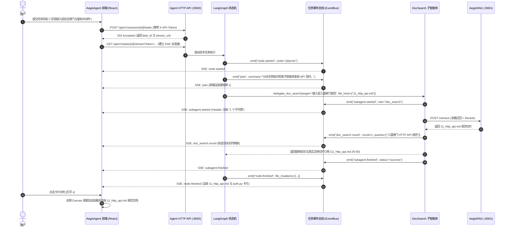
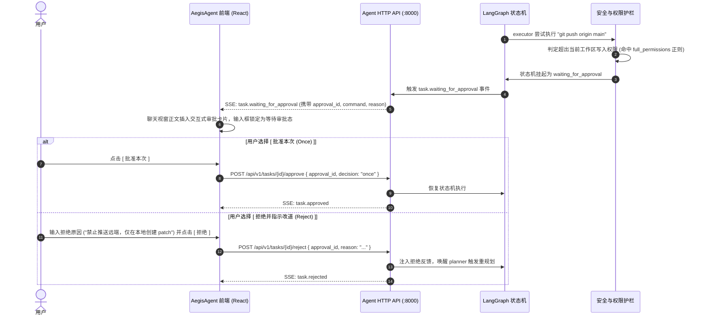

# AegisAgent + Workspace 前端架构与交互系统设计规范 (Agent + Workspace Frontend Design Specification)

> **文档版本**：v3.0 权威定稿  
> **文档定位**：专为 **`AegisAgent`（智能体运行时）与工作区（Workspace）协同体系**量身定制的工程级前端设计与实现规范。  
> **核心设计哲学**：
> 1. **工作区是一等公民**：工作区不仅是文件目录，更是 Agent 的物理真源（Ground Truth）、规范文档库（Knowledge Base）、执行沙箱（Sandbox）与长期共享记忆（Shared Memory）载体。
> 2. **双屏并行联动（Chat + Canvas）**：左屏对话编排与因果轨迹，右屏文档规范阅读、代码审查与 Diff 对比，并列为第一公民。
> 3. **全透明认知与因果追溯**：彻底透明化展示三级实体（Workspace $\to$ Session $\to$ Turn）、四层上下文装配（Context Inspector）、状态图跃迁（Trace Stream）与物理预算水位。
> 4. **安全前置与 HITL 人机协同**：三道接入层安全闸门前置，越级高危操作触发阻塞式交互审批卡片。

---

## 1. 总体架构拓扑与设计范式 (System Topology & Paradigm)

在工业级工程研发与复杂排障场景中，Agent 必须与工作区紧密绑定。前端系统采用 **三栏式响应式栅格布局（Sidebar + Dual-Pane Main Stage）**，贯通“工作区管理 $\to$ 会话编排 $\to$ 因果审计 $\to$ 文档/代码审查”完整链路。

```
+---------------------------------------------------------------------------------------------------------------------------------------------------------+
| [🛡 AegisAgent] [Toggle] | 📁 Aegis Core | 任务: 接入层三道安全闸门与鉴权实现 [2个子代理] [工作区写入] [Token/Trace 导出] | [11_http_api.md x] [Diff][Full][x] |
+--------------------------+----------------------------------------------------------------------------------------+-------------------------------------+
| [+ 新建会话]             | [💬 对话协商]  [⚡ 执行轨迹 (Trace)]  [🧠 上下文装配检视]                              | ⚠️ 磁盘文档已更新 [ 重新载入 ]      |
|                          |----------------------------------------------------------------------------------------+-------------------------------------|
| 📁 工作区: Aegis Core    |  ### Planner 阶段目标与里程碑推进 (LangGraph State Machine)                           | /home/user/projects/aegis/docs/...  |
|  ├─ 💬 接入层安全闸门 [完]|  - [x] **里程碑 1**：调用 delegate_doc_search 检索 11_http_api.md 鉴权规范             | [Markdown 规范] [源码] [Diff] [🔄]  |
|  ├─ 💬 RAG 混合检索改造   |  - [x] **里程碑 2**：在 auth.py 落地 Host -> Origin -> Token 三道闸门                  |                                     |
|  └─ 💬 记忆引擎水位压缩   |  - [ ] **里程碑 3**：运行 pytest 验证 27 个端点安全覆盖率与断线重连                     | ## 1.1 三道闸门机制                 |
|                          |                                                                                        |                                     |
| 📁 工作区: Linux Kernel  |  本次文档与代码改动 </> 11_http_api.md </> auth.py + 产物 obs_step_7_bash              | 1. **Host** 闸门：防 DNS 重绑定...  |
|  └─ 💬 eBPF 规范阅读     |  +------------------------------------+  +------------------------------------+        | 2. **Origin** 闸门：防跨站提交...   |
|                          |  | 📄 11_http_api.md           [打开v]|  | 🐍 auth.py                  [打开v]|        | 3. **令牌** 闸门：恒定时间比较...   |
| 🧠 工作区记忆 [3条定论]  |  | API 契约：三道闸门与令牌规范规范...|  | 接入层安全中间件落地实现...        |        |                                     |
| 🛡 接入令牌: [●●●●●●] 有效|  +------------------------------------+  +------------------------------------+        | ```http                             |
|                          |                                                                                        | Authorization: Bearer <token>       |
|                          |  [🛡 人机协同权限越级审批卡片 (HITL Approval)]                                        | ```                                 |
|                          |  检测到网络外联命令: git push origin main (超出当前工作区写入权限)                    |                                     |
|                          |  [ 批准本次 (Once) ]  [ 当前会话免审 (Always) ]  [ 拒绝并指示改道 (Reject) ]           |                                     |
|                          |                                                                                        |                                     |
|                          |  [👍] [👎] [📋] [🔄 重跑]  ⏱ 用时 35.8s  18:45  (Reasoning: 1.2s / Fast: 0.8s)          |                                     |
|                          |----------------------------------------------------------------------------------------+-------------------------------------|
|                          | +------------------------------------------------------------------------------------+ |                                     |
|                          | | 输入任务目标，/ 调用 Slash 指令，@ 引用工作区文档、规范或记忆                      | |                                     |
|                          | | [+] [📎] [🛡 工作区修改 v]                        [Reasoning: DeepSeek-R1 / Fast v] [↑]| |                                     |
| ⚙ 系统设置 & Sidecar 拓扑| +------------------------------------------------------------------------------------+ |                                     |
| [RAG:8001 ● Shell:8002 ●]| 🔄 5 轮 14 步 | ⚡ 271 tok/s | 📊 28.5k tok | 🎯 缓存命中 99.8% | 💧 水位 32% / 80%    |                                     |
+--------------------------+----------------------------------------------------------------------------------------+-------------------------------------+
```

---

## 2. 工作区系统一等公民设计 (Workspace as First-Class Citizen)

工作区在 Aegis 中绝非单纯的文件路径，而是整个智能体系统的**认知基准与物理边界**：

### 2.1 物理工程路径强绑定与沙箱边界
- **物理路径锚定**：工作区强绑定磁盘绝对路径 `root_path`（如 `/home/user/projects/aegis`），建立系统唯一索引；
- **CWD 与命令基准**：所有工具调用（Bash Shell、Git 命令、文件读写、AST 解析）均以该 `root_path` 作为默认当前工作目录（`cwd`）；
- **越界逃逸防护**：前端配合后端安全拦截所有试图跳出 `root_path` 的非法路径操作（返回 `422 PATH_ESCAPE_DETECTED`）。

### 2.2 工作区级跨会话长期共享记忆 (Workspace Shared Memory)
工作区维护跨会话持久共享的架构定论与避坑规范，前端提供专属检视与维护面板：
1. **项目架构与入口定论 (`confirmed_architecture`)**：记录已确认的核心模块分层、服务端口分配与依赖关系；
2. **项目编码与工程规范 (`project_conventions`)**：记录代码风格（如严格类型检查、纯函数路由、零反向依赖纪律）；
3. **全局避坑黑名单 (`global_failed_attempts`)**：沉淀历史验证失败的方案与已知不可行路径，防止未来会话重复试错。

### 2.3 工作区知识库与 RAG 索引基础设施 (`AegisRAG :8001`)
- 实时感知 `AegisRAG` 独立子工程索引状态；
- 展示工作区内工程文档（`documents/` 架构设计、ADR 决议、API 契约）与代码切片（Tree-sitter AST）的切分量与向量化状态；
- 支持手动触发或增量触发文档索引更新。

---

## 3. 多会话与任务编排系统 (Multi-Session & Task Orchestration)

### 3.1 1:N 级联从属会话模型
- 一个工作区可并行开辟 $N$ 个独立任务会话（Session）；
- 会话间局部认知严格隔离，分别维护独立的对话流水与情境记忆；
- 销毁工作区将级联清理其名下全部会话、记忆体与流水记录。

### 3.2 会话级动态记忆压缩与物理水位监控 (Watermark Compaction)
- **物理 Token 计量**：基于 `tiktoken` 实时计算当前会话活跃对话轮次的物理 Token 占用；
- **高低水位对齐压缩机制**：
  - 当活跃水位达到 **80% 上限（High Watermark）** 时，自动触发后台压缩；
  - 严格按完整人机对话单元对齐，将最古老的约 **40% 对话（Compaction Ratio）** 提取并送入 Fast 模型提炼为阶段事实摘要；
  - 活跃水位降回安全低水位，前端状态条实时回显当前水位百分比（如 `💧 水位 32% / 80%`）。

### 3.3 四层装配上下文检视器 (Context Inspector: “模型此刻看到了什么”)
前端提供专属 `[🧠 上下文装配检视]` 标签页，调用 `GET /api/v1/sessions/{id}/context` 实时透视组装送入大模型的完整视界：
$$\text{Final Context} = \underbrace{\text{[系统提示词]}}_{\text{内置纪律} + \text{项目规则}} + \underbrace{\text{[工作区全局共享记忆]}}_{\text{架构定论} + \text{工程规范} + \text{避坑黑名单}} + \underbrace{\text{[会话已压缩记忆]}}_{\text{阶段摘要} + \text{事实清单}} + \underbrace{\text{[活跃对话滑窗]}}_{\text{低水位线以上完整轮次}} + \text{[当前输入]}$$

---

## 4. 双轨主视窗详细设计 (Dual-Track Main Stage)

中间主视窗支持 **`[对话协商]`** 与 **`[执行轨迹]`** 双轨平滑切换：

### 4.1 对话与协商轨 (Chat & Decision Track)
- **里程碑达成卡片 (`milestones.updated`)**：
  - 宏观目标自动拆解为里程碑任务清单（`[x] [ ]`）；
  - 实时响应 Evaluator 节点的判定结果并动态勾选。
- **文档知识检索子智能体汇报卡片 (Doc & Knowledge Search Envelope)**：
  - 展示多轮 RAG 自适应改词过程（Query Reformulation）；
  - 呈现真实命中的文档切片与行号白名单范围（如 `11_http_api.md:25-60`）；
  - 确定性拒答状态透明回显（3 轮无果如实承认没有，杜绝幻觉推测）。
- **外部隔离研究子智能体汇报卡片 (Research Subagent Envelope)**：
  - 标记 `🛡 外部不可信数据隔离` 警示徽标；
  - 内容经过严格防 XSS 净化转义后渲染。
- **文档与文件改动专区 (Mutation Cards)**：
  - 双列网格卡片，展示多彩文件类型图标、相对路径与简要修改说明；
  - 点击 `[打开 v]` 按钮直接联动右侧 Canvas 视窗加载并定位。
- **离线长日志产物卡片 (`ObservationPruner` Handles)**：
  - 工具输出过长时自动落盘并以 `📄 obs_step_7_bash (51.2 KB, 1,820 tok)` 卡片呈现；
  - 点击卡片在右侧视窗中以只读日志模式快速阅览全文。

### 4.2 执行轨迹与因果审计轨 (Trace / Trajectory Track)
- **LangGraph 节点状态机流水**：
  - 逐步骤呈现 `planner` (Reasoning 模型) $\to$ `budget_guard` $\to$ `executor` (Fast 模型) $\to$ `tool_runner` (并发派发) $\to$ `evaluator`；
  - 展示单步耗时、Token 增量与入参/出参摘要。
- **叶子工具细粒度事件流**：
  - 实时渲染任务事件总线（`EventBus`）推送的 `subagent.started`、`subagent.step`、`subagent.tool`、`subagent.blocked`、`subagent.finished` 等内部细节。
- **物理预算确定性守卫红线**：
  - 连续 3 次相同参数死循环拦截告警；
  - 连续报错阈值告警（`consecutive_errors >= 3` 触发重规划）；
  - 90% 物理预算（步数/Token/时间）熔断预警。

### 4.3 人机协同 (HITL) 权限越级审批卡片
当 Agent 尝试执行超出当前权限基线的操作（如 `git push`、特权提升、网络外联）时，状态机挂起为 `waiting_for_approval`：
1. **高危警示展示**：回显高危动作类型（`action_type`）、具体命令与拦截理由；
2. **三态交互抉择**：
   - **`[ 批准本次 (Once) ]`**：单次放行，调用 `POST /api/v1/tasks/{id}/approve` (`decision="once"`)，恢复状态机；
   - **`[ 当前会话免审 (Always) ]`**：加入当前 Session 白名单，调用 `POST /approve` (`decision="always"`)；
   - **`[ 拒绝并指示改道 (Reject) ]`**：输入拒绝指令（如“禁止推送到远端，仅在本地生成 patch 文件”），调用 `POST /reject` 反馈给 Planner 重新规划。

---

## 5. 右侧分屏工作台：文档、规范与代码深度视窗 (Doc & Canvas Stage)

### 5.1 多标签页管理器 (Multi-Tab Manager)
- 标签项：文件类型图标 + 文档/文件名（如 `📄 11_http_api.md`）+ 脏标记 `●` + 关闭按钮 `x`；
- 工具操作栏：
  - **模式切换**：`[Markdown 规范预览]` / `[文档源码编辑]` / `[Git Diff 对比]` / `[只读产物]`；
  - `+` 快速打开工作区内任意规范文档或代码；
  - 分屏模式切换（水平/垂直）；
  - 沉浸式全屏切换。

### 5.2 Markdown 架构与设计规范阅读模式 (Reader Mode - 核心模式)
- 将**工程设计规范、技术方案、ADR 决策记录与 API 契约阅读**列为第一公民；
- 完整支持 GitHub Flavored Markdown (GFM) 表格、Mermaid 架构流程图渲染、Task List 与代码块一键复制。

### 5.3 Monaco Editor 源码编辑与 Side-by-side Git Diff 模式
- 内嵌 Monaco Editor，支持代码高亮、行号、代码折叠、Minimap 与错误语法诊断；
- 提供 Side-by-side 与 Inline 双模式 Git Diff，直观对比 Agent 修改前后的代码/文档差异。

### 5.4 实时热同步与变更感知横幅 (Live Sync Alert Banner)
- 当底层 Agent 或外部工具修改了本地磁盘文档或代码时，右侧视窗顶部自动滑出温和黄色提醒条：
  > `⚠️ 文档/代码已在磁盘更新，当前显示为旧内容。 [ 重新载入 ]`
- 点击 `[重新载入]` 即刻拉取最新磁盘内容并刷新视窗，不丢失当前阅读与滚动位置。

---

## 6. 控制台、安全治理与系统遥测 (Console, Security & Telemetry)

### 6.1 沉底悬浮输入控制台
- **命令与引用补全**：
  - `/` 弹出 Slash Commands 菜单（`/resume`、`/cancel`、`/skills`、`/mcp`、`/memory`）；
  - `@` 弹出当前工作区文档树、代码符号与共享记忆联想列表。
- **权限基线选择器 (Permission Badge Selector)**：
  - `🔒 只读免审批 (readonly)`
  - `🛡 工作区修改 (workspace_write - 默认推荐)`
  - `⚡ 全权限模式 (full_access - 需 HITL 授权)`
- **双模型分层选择器 (Dual-Tier LLM Gateway)**：
  - 思考模型层（Reasoning Tier: DeepSeek-R1 / OpenAI o1，`temp=0.0`，主负责目标拆解与反思规划）；
  - 快速动作层（Fast Tier: DeepSeek-V3 / GPT-4o-mini，`temp=0.2`，主负责工具参数填充与快速提炼）。

### 6.2 实时物理遥测状态条 (System Telemetry Status Bar)
- `🔄 5 轮 14 步`：当前任务累计迭代轮数与底层图步数；
- `⚡ 271 tok/s`：实时模型生成与吞吐速度；
- `📊 28.5k tok`：当前任务累计消耗物理 Token 计数；
- `🎯 缓存命中 99.8%`：Prompt Caching 命中率；
- `💧 水位 32% / 80%`：当前会话活跃记忆水位（临近 80% 触发自动提炼压缩）。

### 6.3 接入层三道安全闸门与 Sidecar 监控
- **三道安全闸门指示**：
  1. **Host 闸门**：主机名严格限制为回环地址，彻底防御 DNS 重绑定；
  2. **Origin 闸门**：非安全 HTTP 方法严格校验 CORS 白名单，防御跨站请求伪造；
  3. **令牌闸门**：恒定时间比较 `storage/api_token` 凭据（0600 权限落盘）。
- **Sidecar 存活探针**（`GET /api/v1/health/dependencies`）：
  - `AegisRAG (:8001)` 独立检索子工程状态；
  - `bash_shell (:8002)` 进程隔离沙箱服务状态；
  - `web_search (:8003)` 外部隔离研究服务状态。

---

## 7. 核心交互流程时序规范 (Mermaid Sequence Diagrams)

### 7.1 流程一：任务提交、SSE 事件流与文档知识检索协同



### 7.2 流程二：HITL 越级权限审批与恢复流



---

## 8. 前端技术栈与工程实现规范

| 维度 | 技术选型 | 选用理由 |
| :--- | :--- | :--- |
| **核心框架** | **React 19 + TypeScript** | 组件化架构、严格类型保障、成熟生态 |
| **构建工具** | **Vite 6** | 秒级冷启动、极速 HMR、轻量 Bundler 模式 |
| **样式与组件** | **Tailwind CSS 3.4** | 响应式设计、原子化 CSS、无缝适配 Aegis 专属 Design Tokens |
| **状态管理** | **Zustand 5 + Immer** | 轻量扁平化 Store，优雅处理多工作区、任务、会话与多标签页状态 |
| **分屏交互** | **react-resizable-panels** | 流畅拖拽调整左/中/右三栏宽度，支持沉浸式全屏切换 |
| **文档/代码视窗**| **React Markdown + @monaco-editor/react** | 双模态支持：GFM 富文本阅读渲染 + VS Code 级代码编辑器与 Diff |
| **实时通信** | **@microsoft/fetch-event-source** | 健壮的 SSE 事件流长连接与自动断线重连，原生支持 Auth Header / Token 透传 |
| **图标体系** | **Lucide React** | 统一极简风格的线条图标库 |

---

## 9. 目录组织结构与状态流设计

```text
AegisFrontend/
├── index.html                     # SPA 入口 HTML
├── package.json                   # 依赖与脚本定义
├── vite.config.ts                 # 反向代理 (:8000) 与路径别名配置
├── tailwind.config.js             # Design Tokens 与主题配置
├── tsconfig.json                  # TypeScript 严格配置
└── src/
    ├── main.tsx                   # 应用挂载入口
    ├── App.tsx                    # 顶层应用组件
    ├── index.css                  # 全局样式与滚动条
    ├── types/                     # 强类型契约 (Task, Workspace, Memory, SSE, Trace)
    ├── stores/                    # Zustand 状态存储
    │   ├── useWorkspaceStore.ts   # 工作区实体、多标签页与共享记忆 Store
    │   ├── useTaskStore.ts        # 任务生命周期、SSE 事件与遥测 Store
    │   └── useUiStore.ts          # 分屏、视图切换与全屏 Store
    ├── services/                  # 网络服务层
    │   ├── api.ts                 # REST API 客户端 (含 X-API-Token 注入)
    │   └── sse.ts                 # SSE 事件流订阅器 (fetch-event-source)
    └── components/                # 界面组件库
        ├── layout/
        │   └── AppLayout.tsx      # 基于 react-resizable-panels 的三栏主布局
        ├── sidebar/
        │   └── Sidebar.tsx        # 工作区树、会话列表、共享记忆与 Sidecar 探针
        ├── chat/
        │   └── ChatPane.tsx       # 协商流、因果轨迹、HITL 审批卡片与遥测条
        └── canvas/
            └── CanvasPane.tsx     # Markdown 规范阅读器、Monaco 编辑器与 Diff 视窗
```
