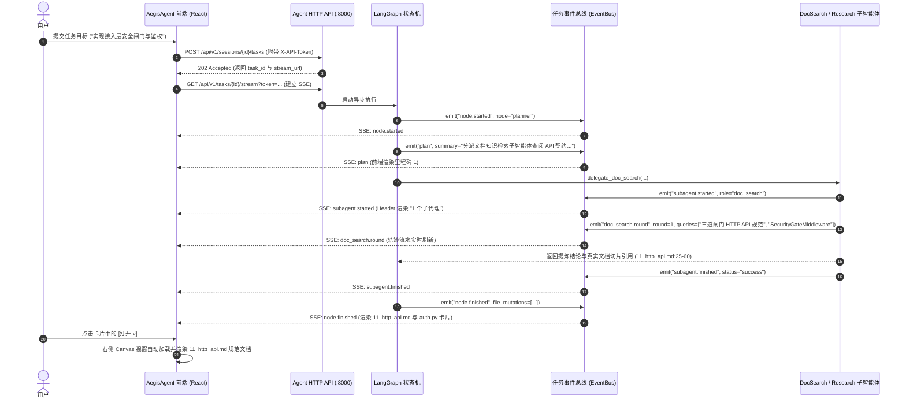
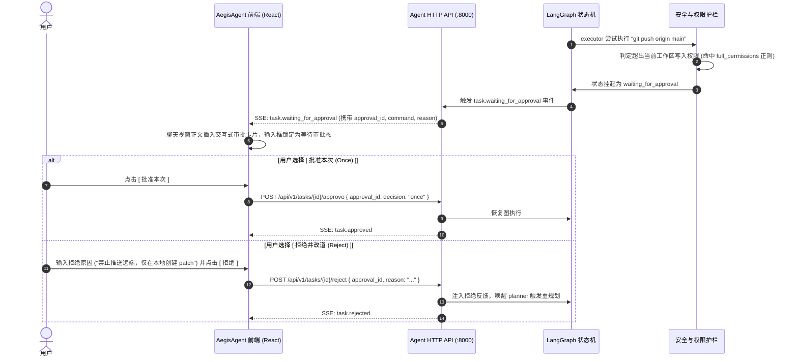

# AegisAgent Web UI 前端架构与交互设计规范文档 (Aegis Frontend Design Specification)

> **文档版本**：v2.1 权威定稿  
> **文档定位**：专为 `AegisAgent` 运行时量身定制的工程级前端设计与实现规范。深度契合 Aegis 的**双子工程隔离（Sidecar）架构、三级记忆与上下文装配引擎、三道接入层安全闸门、双模型分层调度网关、专用文档知识检索子智能体（Doc & Knowledge Search Subagent）、外部网络隔离研究子智能体（Research Subagent）及物理预算确定性守卫**。  
> **核心设计哲学**：**双屏并行联动（Chat + Canvas）、文档规范与知识深度查看为第一公民、全透明状态与因果轨迹观测、安全前置与 HITL 人机协同、多工作区与记忆治理**。

---

## 1. 整体布局范式与信息架构 (Information Architecture)

AegisAgent 前端采用 **三栏式响应式栅格布局（Sidebar + Dual-Pane Main Stage）**，将“人机对话协商/任务编排”与“**工程设计规范/架构文档/API契约/产物深度查看**”并列为第一公民，支持流畅的拖拽分栏与全屏沉浸切换。

```
+-----------------------------------------------------------------------------------------------------------------------------+
| [🛡 AegisAgent] [Toggle] | 任务: 接入层三道安全闸门与鉴权实现 [2个子代理] [工作区写入] [Token/Trace 导出] | [11_http_api.md x] [+] [Preview][Full][x] |
+--------------------------+---------------------------------------------------------------------------+------------------------------+
| [+ 新建会话]             | [对话流水]  [执行轨迹]  [🧠 上下文装配检视]                               | ⚠️ 磁盘文档已更新 [ 重新载入 ]|
|                          |---------------------------------------------------------------------------+------------------------------|
| 📁 工作区: Aegis Core    |  ### Planner 阶段目标与里程碑达成                                         | /home/user/projects/aegis/...|
|  ├─ 💬 接入层安全闸门 [完]|  - [x] 里程碑 1: 调用 delegate_doc_search 检索 11_http_api.md 鉴权规范    | [Markdown 规范] [源码] [🔄]  |
|  ├─ 💬 RAG 混合检索改造   |  - [x] 里程碑 2: 在 auth.py 落地 Host -> Origin -> Token 三道闸门        |                              |
|  └─ 💬 记忆引擎水位压缩   |  - [ ] 里程碑 3: 运行测试套件验证 27 个端点安全覆盖率                     | ## 1.1 三道闸门机制          |
|                          |                                                                           |                              |
| 📁 工作区: Linux Kernel  |  本次文档与代码改动 </> 11_http_api.md </> auth.py + 产物 obs_step_7_bash | 1. **Host** 闸门：防 DNS...  |
|  └─ 💬 eBPF 规范阅读     |  +------------------------------+  +------------------------------+       | 2. **Origin** 闸门：防跨站...|
|                          |  | 📄 11_http_api.md     [打开v]|  | 🐍 auth.py            [打开v]|       | 3. **令牌** 闸门：恒定时间...|
| 🧠 工作区记忆 [3条定论]  |  | API 契约：三道闸门与令牌规范.|  | 接入层安全中间件落地实现...  |       |                              |
| 🛡 接入令牌: [●●●●●●] 已连|  +------------------------------+  +------------------------------+       |                              |
|                          |                                                                           |                              |
|                          |  [🛡 权限越级审批卡片]                                                   |                              |
|                          |  检测到网络外联命令: git push origin main                                 |                              |
|                          |  [ 批准本次 (Once) ]  [ 当前会话免审 (Always) ]  [ 拒绝并改道 (Reject) ]  |                              |
|                          |                                                                           |                              |
|                          |  [👍] [👎] [📋] [🔄 重跑]  ⏱ 用时 35.8s  18:45                             |                              |
|                          |---------------------------------------------------------------------------+------------------------------+
|                          | +-----------------------------------------------------------------------+ |                              |
|                          | | 输入任务目标，/ 调用 Slash 指令，@ 引用工作区文档或记忆               | |                              |
|                          | | [+] [📎] [🛡 工作区修改 v]          [Reasoning: DeepSeek-R1 / Fast v] [↑]| |                              |
| ⚙ 系统设置 & Sidecar 拓扑| +-----------------------------------------------------------------------+ |                              |
| [RAG:8001 ● Shell:8002 ●]| 🔄 5 轮 14 步 | ⚡ 271 tok/s | 📊 28.5k tok | 🎯 缓存命中 99.8% | 💧 水位 32% |                              |
+--------------------------+---------------------------------------------------------------------------+------------------------------+
```

---

## 2. 核心模块详细设计规范

### 2.1 左侧工作区与导航栏 (Left Sidebar ~240px)

- **Header 品牌与安全状态**：
  - Aegis 图标徽标 + `AegisAgent` 字标；
  - 接入层安全状态指示：`Token: 0600 [有效 ●]`（支持动态配置 `X-API-Token` / Bearer 凭据）；
  - 侧边栏折叠/展开开关（快捷键 `Ctrl/Cmd + B`）。
- **Primary CTA 按钮**：
  - `+ 新建会话` 胶囊型高亮操作按钮（`Ctrl/Cmd + N`），在当前激活工作区下新建 Session。
- **多工作区与会话树 (Workspaces & Sessions Tree)**：
  - **工作区一等公民 (Workspace Entity)**：
    - 展示工作区名称与绑定的物理工程根路径 `root_path`；
    - 快速切换工作区、新建工作区、编辑与删除；
    - **工作区共享记忆入口**：点击展开全局架构定论 (`confirmed_architecture`)、项目规范 (`project_conventions`) 与全局避坑黑名单 (`global_failed_attempts`)。
  - **会话列表 (Session List)**：
    - 按 `updated_at` 倒序展示当前工作区下的会话（1:N）；
    - 会话激活态高亮、未命名会话自动生成 Prompt 摘要；
    - 单会话级联删除与重命名。
- **底部常驻入口 & Sidecar 拓扑监控**：
  - **Sidecar 依赖存活探针**（实时感知 `GET /api/v1/health/dependencies`）：
    - `AegisRAG (:8001)` 知识库与文档切片检索微服务状态点；
    - `bash_shell (:8002)` 进程隔离沙箱服务状态点；
    - `web_search (:8003)` 外部隔离研究检索服务状态点；
  - `⚙ 设置` (系统配置、模型端点、MCP 服务器、权限与令牌管理)。

---

### 2.2 中间主视窗：执行流、轨迹与协商区 (~50% 宽度)

#### A. 顶部 Header 状态栏
- **任务标题区**：展示当前正在执行或已完成的任务目标 `task_goal`。
- **动态状态徽标 (Status Badges)**：
  - **任务状态 Badge**：`running` (动态脉冲蓝) / `waiting_for_approval` (告警橙) / `succeeded` (全绿) / `terminated` (硬熔断红) / `failed`；
  - **子智能体计数 Badge**：实时统计当前任务分派的子智能体（如 `Doc & Knowledge Search`、`Research`、`General Subagent`），点击弹出子智能体运行明细抽屉；
  - **权限等级 Badge**：当前生效的权限基线（`只读免审批` / `工作区写入` / `全权限模式`）。
- **操作按钮组**：复制全量对话、下载因果轨迹 (`GET /tasks/{id}/trace` ndjson)、导出产物、终止任务 (`POST /cancel`)。

#### B. 三轨视图切换器 (View Switcher Tabs)
- **`[对话流水]` (Chat & Timeline View)**：
  - 面向用户的语义化输出；
  - 自动渲染 Markdown、表格、Task List 里程碑 (`milestones.updated`)；
  - 聚合渲染文档/文件改动卡片与离线落盘产物句柄；
  - 挂起渲染 HITL 权限审批卡片。
- **`[执行轨迹]` (Trace / Trajectory Stream)**：
  - 面向工程排障与因果审计的全量节点时序流；
  - 逐节点呈现 LangGraph 状态机跃迁：`planner` (Reasoning 模型) $\to$ `budget_guard` $\to$ `executor` (Fast 模型) $\to$ `tool_runner` (并发派发) $\to$ `evaluator`；
  - 实时展开叶子工具总线推送的 `subagent.*` 与 `research.*` 细粒度步骤与耗时。
- **`[🧠 上下文装配检视]` (Context Inspector)**：
  - 实时调用 `GET /api/v1/sessions/{id}/context`；
  - 直观透视“模型在此刻看到了什么”：系统提示词 + 工作区共享记忆 + 会话压缩情境记忆 + 活跃对话滑窗 + 当前物理 Token 预算水位条。

#### C. 消息流、产物与文档知识卡片
- **文档与文件改动专区 (Mutation Cards)**：
  - **单行概览 Bar**：`本次文档与代码改动 </> 11_http_api.md </> auth.py + 1 个产物`；
  - **双列网格卡片 (2-Column Card Grid)**：
    - 左侧专属文档/文件类型多彩 Icon（Markdown `📄`、Python `🐍`、C/C++ `🇨`、Shell `🐚` 等）；
    - 中间文件相对路径与简明摘要；
    - 右侧 `[打开 v]` 按钮，联动右侧 Canvas 视窗自动加载并切至该文档/文件 Tab。
- **离线长日志产物卡片 (Artifact Offloading Cards)**：
  - 当工具输出过长被 `ObservationPruner` 截断时，展示 `📄 obs_step_7_bash (51.2 KB, 1,820 tok)` 句柄卡片；
  - 点击 `[查看全文]` 通过 `/api/v1/tasks/{id}/artifacts/{artifact_id}` 在右侧视窗以只读日志模式打开。
- **子智能体汇报信封 (Subagent Envelope)**：
  - **文档知识检索汇报卡片 (Doc & Knowledge Search Envelope)**：展示多轮 RAG 自适应改词过程、命中的精确文档段落与行号白名单（如 `11_http_api.md:12-45`）、确定性拒答状态（“3 轮无果承认没有”）；
  - **Research 汇报卡片**：带有 `🛡 外部不可信数据隔离` 警示徽标，防 XSS 严格净化渲染。

#### D. 人机协同审批卡片 (HITL Approval Card)
当任务进入 `waiting_for_approval` 时，消息流正文插入高亮警示卡片：
1. 回显请求审批的越级动作类型（如 `network_egress` / `privileged_exec`）；
2. 完整高危命令与越级理由；
3. 交互按钮：
   - `[批准本次 (Once)]`：调用 `POST /approve`，`decision="once"`；
   - `[当前会话免审 (Always)]`：调用 `POST /approve`，`decision="always"`；
   - `[拒绝并指示改道 (Reject)]`：支持输入拒绝原因，回传 planner 触发重规划。

#### E. 沉底悬浮输入控制台 & 物理遥测状态条
- **输入框与快捷补全**：
  - `/` 触发 Slash 命令（`/resume`、`/cancel`、`/skills`、`/mcp`）；
  - `@` 触发当前工作区文档、规范与文件自动联想。
- **操作工具栏**：
  - 权限等级选择器：`🛡 工作区修改 v` / `🔒 只读免审批` / `⚡ 全权限`；
  - 双模型分层指示器：`Reasoning: DeepSeek-R1` / `Fast: DeepSeek-V3`；
  - 发送 `↑` / 中断 `■` 按钮。
- **系统物理遥测状态条 (System Telemetry Status Bar)**：
  - `🔄 5 轮 14 步`（当前任务迭代轮数与 LangGraph 步数）；
  - `⚡ 271 tok/s`（实时生成速度）；
  - `📊 28.5k tok`（当前任务累计消耗 Token）；
  - `🎯 缓存命中 99.8%`（Prompt Caching 命中率）；
  - `💧 水位 32% / 80%`（会话记忆物理水位，临近 80% 触发自动压缩）。

---

### 2.3 右侧分屏工作台：文档、规范、代码与产物深度视窗 (~50% 宽度)

#### A. 多标签页管理器 (Multi-Tab Manager)
- 标签项：文件图标 + 文档/文件名（如 `📄 11_http_api.md`）+ 脏标记 `●` + 关闭按钮 `x`；
- 工具操作栏：
  - 模式切换：`[Markdown 规范预览]` / `[文档源码编辑]` / `[Git Diff 对比]` / `[只读产物]`；
  - `+`：快速打开工作区内任意规范文档或源码；
  - 分屏模式（水平/垂直）；
  - 全屏沉浸式切换；
  - 关闭右侧视窗。

#### B. 实时热同步感知横幅 (Live Sync Alert Banner)
- 当底层 Agent 或外部工具修改了本地磁盘文档或源码时，右侧视窗顶部弹出黄色温和提醒条：
  > `⚠️ 文档/代码已在磁盘更新，当前显示为旧内容。 [ 重新载入 ]`
- 点击 `[重新载入]` 即刻拉取最新磁盘内容并刷新 Monaco Editor / Markdown 视窗，不丢失阅读光标位置。

#### C. 内容画布与 Markdown / Monaco 双引擎
- **Markdown 规范阅读模式 (Reader Mode - 核心默认模式)**：完整支持 GitHub Flavored 规范、Mermaid 架构流程图渲染、表格、Task List 与代码块一键复制；
- **Monaco Editor 模式**：支持智能语法高亮、行号、代码折叠、Minimap 与 Side-by-side Git Diff 对比。

---

## 3. 视觉规范与 Design Tokens

### 3.1 色彩体系 (Color Palette)

| 语义角色 | 颜色值 (Hex) | 用途说明 |
| :--- | :--- | :--- |
| **Canvas Primary** | `#FFFFFF` | 主视窗背景底色 |
| **Canvas Secondary** | `#F8F9FA` / `#F9FAFB` | 侧边栏、卡片底色、代码块与文档底色 |
| **Border & Divider** | `#E5E7EB` / `#E2E8F0` | 1px 细线描边、面板分割线 |
| **Text Primary** | `#111827` | 正文标题、高对比度文档阅读 |
| **Text Secondary** | `#4B5563` / `#6B7280` | 次要描述、元数据、时间戳 |
| **Brand Accent** | `#2563EB` / `#1D4ED8` | 强调色、聚焦外框、主按钮 |
| **Warning / HITL** | `#FEF3C7` (Bg) / `#D97706` (Text) | HITL 审批卡片、文档热重载横幅 |
| **Success / Clean** | `#DEF7EC` (Bg) / `#03543F` (Text) | 里程碑达成、测试全绿、任务成功 |
| **Security / Guard** | `#EEF2FF` (Bg) / `#4338CA` (Text) | 权限等级选择器徽标、安全闸门状态 |
| **Untrusted Alert** | `#FFF1F2` (Bg) / `#BE123C` (Text) | 外部不可信研究数据隔离警示 |

---

## 4. 核心交互流与 SSE 状态机

### 4.1 流程一：任务提交、SSE 事件流与文档知识检索协同



### 4.2 流程二：HITL 越级权限审批与恢复流



---

## 5. 前端技术栈与工程实现

| 维度 | 技术选型 | 选用理由 |
| :--- | :--- | :--- |
| **核心框架** | **React 19 + TypeScript** | 组件化架构、严格类型保障、成熟生态 |
| **构建工具** | **Vite 6** | 秒级冷启动、极速 HMR、轻量 Bundler 模式 |
| **样式与组件** | **Tailwind CSS 3.4** | 响应式设计、原子化 CSS、无缝适配 Aegis 专属 Design Tokens |
| **状态管理** | **Zustand 5 + Immer** | 轻量扁平化 Store，优雅处理多工作区、任务、会话与多标签页状态 |
| **分屏交互** | **react-resizable-panels** | 流畅拖拽调整左/中/右三栏宽度，支持沉浸式全屏切换 |
| **文档/代码视窗**| **React Markdown + @monaco-editor/react** | 双模态支持：GFM 富文本阅读渲染 + VS Code 级代码编辑器与 Diff |
| **实时通信** | **@microsoft/fetch-event-source** | 健壮的 SSE 事件流长连接与自动断线重连，原生支持 Auth Header / Token 透传 |
| **图标体系** | **Lucide React** | 统一极简风格的线条图标库 |
