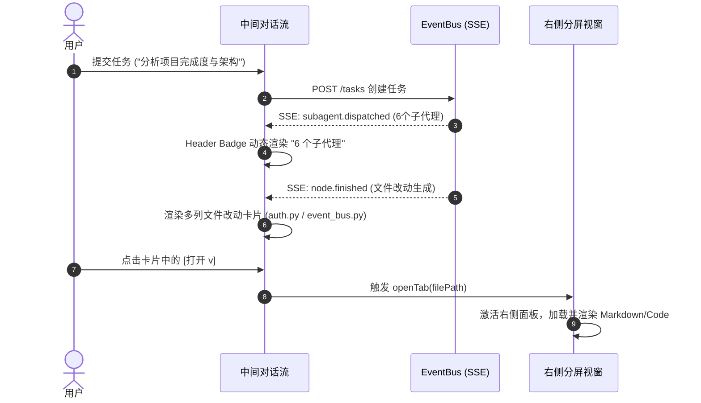
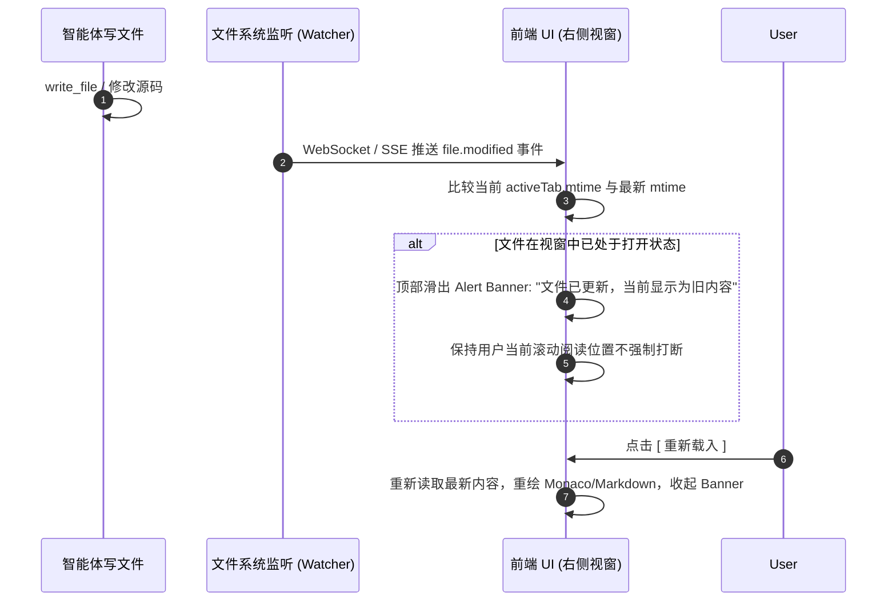

# DeepSeek Harness 前端架构与交互设计规范文档 (Frontend Design Specification)

> **文档状态**：v1.0 权威定稿  
> **文档定位**：基于 DeepSeek Harness 生产环境 UI 进行逆向提炼与标准化升华的前端工程设计规范，指导 Aegis 及智能体系统的前端 UI/UX 落地实施。  
> **核心设计哲学**：**双屏并行联动（Chat + Canvas）、工程级高信息密度、全透明状态观测、安全前置控制、双轨视图（对话/轨迹）**。

---

## 1. 整体布局范式与信息架构 (Information Architecture)

系统采用 **三栏式响应式栅格布局（Sidebar + Dual-Pane Main Stage）**，将“人机对话协商”与“代码/文档深度查看”并列为第一公民。

```
+---------------------------------------------------------------------------------------------------------+
| [deepseek HARNESS] [Toggle] | 探索项目完成度与架构定位... [6个子代理] [标准模式]   [Copy/Share/...] | [13_subagent_delegation.md x] [+]   [Split][Full][x] |
+-----------------------------+---------------------------------------------------------------------------+------------------------------------------------------+
| [+ 新会话]                  | [对话]  [轨迹]                                                            | ⚠️ 文件已更新，当前显示为旧内容。 [ 重新载入 ]       |
|                             |---------------------------------------------------------------------------+------------------------------------------------------|
| 工作区          [🔍][📑][➕]|                                                                           | /home/Skualeilu/Projects/Aegis/docs/... [Markdown][🔄]|
|  📁 Aegis                   |  ### 一处需要你知道的测试改动                                             |                                                      |
|   - 探索项目完成度... [4分钟] |  `tests/integration/...`                                                  | | 上下文隔离 | 独立上下文，原始内容... | 机制，不变 |   |
|                             |                                                                           | | 工具表独立 | 固定为网络检索工具集   | 参数化     |   |
|                             |  ### 里程碑我按双勾规范记的是 [x] [ ]                                     | | 自有预算   | 固定 [research] 配置  | 参数化     |   |
|                             |                                                                           |                                                      |
|                             |  本次文件改动 </> event_bus.py </> auth.py + 14个文件                     | 1.3 决议⑯ 的升级                                     |
|                             |  +------------------------------+  +------------------------------+       | `10_directory_structure.md` 裁决项⑯ 原本表述为...   |
|                             |  | 🐍 auth.py            [打开v]|  | 🐍 event_bus.py       [打开v]|       | 凡内部要跑模型循环的能力，一律以 tool 形态接入...    |
|                             |  | 接入层三道安全闸门...        |  | 任务事件总线：叶子工具...    |       |                                                      |
|                             |  +------------------------------+  +------------------------------+       |                                                      |
|                             |  +------------------------------+                                           |                                                      |
|                             |  | 📄 11_http_api.md     [打开v]|                                           |                                                      |
|                             |  | API 契约：新增鉴权...        |                                           |                                                      |
|                             |  +------------------------------+                                           |                                                      |
|                             |                                                                           |                                                      |
|                             |  [👍] [👎] [📋] [🔄]  ⏱ 用时 11分19秒  15:27                               |                                                      |
|                             |---------------------------------------------------------------------------+                                                      |
|                             | +-----------------------------------------------------------------------+ |                                                      |
|                             | | 发送消息创建任务，/ 调用指令，@ 文件或对话                            | |                                                      |
|                             | |                                                                       | |                                                      |
|                             | | [+] [📎] [🛡 工作区内修改 v]                [DeepSeek V4.1 Flash High v] [↑]| |                                                      |
|                             | +-----------------------------------------------------------------------+ |                                                      |
| ⚙ 设置                      | 🔄 22 轮 634 步  |  ⚡ 271 tok/s  |  📊 109M tok  |  🎯 缓存命中 99.8%     |                                                      |
+-----------------------------+---------------------------------------------------------------------------+------------------------------------------------------+
```

---

## 2. 核心模块详细设计规范

### 2.1 左侧导航栏 (Left Sidebar ~220px)

- **Header 品牌区**：
  - Logo 图标 + `deepseek HARNESS` 粗体字标；
  - 右侧集成侧边栏折叠/展开开关（Icon Button），支持一键隐藏以拓宽主工作台。
- **Primary CTA 按钮**：
  - `+ 新会话` 胶囊型高亮操作按钮，快捷键 `Ctrl/Cmd + N`。
- **工作区与会话树 (Workspaces & Sessions Tree)**：
  - 顶部工具栏：搜索过滤 `🔍`、列表视图切换 `📑`、快速新建 `➕`；
  - 树形层级展示：项目文件夹（如 `📁 Aegis`）支持折叠展开；
  - 会话项状态：
    - 当前激活态：浅灰/淡蓝底色高亮（`#F3F4F6`），左侧竖向强调指示条；
    - 标题文本超长省略；
    - 右侧辅助信息：相对时间戳（如 `4分钟` 前）。
- **底部常驻入口**：
  - `⚙ 设置` (系统配置、API Key、MCP 服务器管理、权限偏好)。

---

### 2.2 中间主视窗：执行流与对话协商区 (~50% 宽度)

#### A. 顶部 Header 状态栏
- **任务标题区**：单行文本展示当前任务目标，末尾附带省略号（Tooltip 悬停展示完整 Prompt）。
- **元数据标签组 (Metadata Badges)**：
  - **子智能体计数 Badge**：`6 个子代理` —— 实时展示当前任务并发/委派派生的子智能体数量，点击可展开子智能体状态抽屉；
  - **执行模式 Badge**：`标准模式` / `受限模式` / `自主模式`。
- **操作按钮组**：复制全文、分享链接、更多菜单 (`...`)。

#### B. 视图双轨切换器 (View Switcher Tabs)
- **`[对话]` (Chat View)**：
  - 面向用户的语义化输出；
  - 折叠底层冗长细节，聚焦决策结论、文件改动与交付物。
- **`[轨迹]` (Trace / Trajectory View)**：
  - 面向工程排障的全量执行流水；
  - 逐节点呈现 `planner`、`executor`、`tool_runner`、`evaluator` 的 Step 计数、入参/出参、耗时与 Token 增量；
  - 实时渲染 `subagent.*` 与 `code_search.*` 的底层事件总线流。

#### C. 消息流与文件改动卡片 (Message Stream & File Mutation Cards)
- **排版引擎**：高保真 GitHub-Flavored Markdown，支持代码语法高亮、表格、Task List（`[x] [ ]`）。
- **文件改动专区 (File Changes Section)**：
  - **单行概览 Bar**：`本次文件改动 </> event_bus.py </> auth.py </> errors.py ... + 14 个文件`，高亮列出触碰的核心文件。
  - **双列网格卡片 (2-Column Card Grid)**：
    - **卡片结构**：
      - 左侧：文件类型图标（Python `.py`、Markdown `.md`、C/C++、Go、Config 等专属多彩 Icon）；
      - 中间：文件名称（`auth.py`）+ 单行简明修改摘要（`接入层三道安全闸门（防 ASG）+ 令牌...`）；
      - 右侧：交互按钮 `打开 v`。
    - **联动交互**：点击 `打开` 直接在右侧 Preview 视窗新建/切换至对应 Tab，并高亮定位。
- **消息底部元数据与操作栏**：
  - 交互图标：点赞 `👍`、点踩 `👎`、复制 Markdown `📋`、重新生成 `🔄`；
  - 运行指标：`⏱ 用时 11分19秒`，完成时刻 `15:27`。

#### D. 沉底悬浮输入控制台 (Floating Input Console)
- **输入框**：
  - 占位提示符：`发送消息创建任务，/ 调用指令，@ 文件或对话`；
  - 快捷输入响应：输入 `/` 弹出 Slash Commands 菜单，输入 `@` 弹出工作区文件与符号自动补全。
- **操作工具栏 (Action Toolbar)**：
  - 左侧：
    - `+` (添加上下文 / 技能包)；
    - `📎` (上传本地附件或截图)；
    - **权限基线选择器 (Permission Badge Selector)**：`🛡 工作区内修改 v`（可一键切换 `只读免审批` / `工作区修改` / `全权限`）。
  - 右侧：
    - **模型选择器 Dropdown**：`DeepSeek V4.1 Flash High v`（带连接状态绿点）；
    - **发送/中断按钮**：圆形主题色箭头按钮 `↑`（运行态转为红色方块中断键 `■`）。
- **底部系统遥测状态条 (System Telemetry Status Bar)**：
  - `🔄 22 轮 634 步`（当前任务累计迭代轮数与底层图步数）；
  - `⚡ 271 tok/s`（实时模型生成速度）；
  - `📊 109M tok`（上下文总 Token 吞吐，含子智能体结算）；
  - `🎯 缓存命中 99.8%`（Prompt Caching 命中率，降低开销与延迟的核心指标）。

---

### 2.3 右侧分屏工作台：文档、代码与产物深度视窗 (~50% 宽度)

#### A. 多标签页管理器 (Multi-Tab Manager)
- 标签项：文件图标 + 文件名（如 `📄 13_subagent_delegation.md`）+ 关闭按钮 `x`；
- 右侧功能键：
  - `+`：新建/打开工作区文件；
  - 分屏模式切换（水平/垂直）；
  - 全屏沉浸模式；
  - 关闭/折叠右侧视窗。

#### B. 实时热同步与冲突提示 (Live Sync Alert Banner)
- **状态感知**：当底层 Agent 修改了本地磁盘文件或生成新版本时，顶部自动弹出黄色温和提醒条：
  > `⚠️ 文件已更新，当前显示为旧内容。 [ 重新载入 ]`
- **一键重新载入**：点击即刻刷新内存视图并同步最新代码，无需手动刷新页面。

#### C. 文件信息子标头 (Sub-header)
- **路径面包屑**：展示绝对路径（如 `/home/Skualeilu/Projects/Aegis/documents/agent_runtime/13_subagent_delegation.md`）；
- **格式标签**：`Markdown` / `Python` / `C++` 等；
- **刷新/复制按钮**：`🔄`。

#### D. 内容呈现与编辑器 (Content Canvas)
- **双模态呈现**：
  - **文档模式 (Reader Mode)**：完整的富文本排版引擎（支持 Tables, Mermaid 流程图, Alert Blocks）；
  - **源码/Diff 模式 (Editor/Diff Mode)**：内嵌 Monaco Editor，支持代码高亮、行号展示、语法检查及 Git Diff 对比。

---

## 3. 视觉规范与 Design Tokens

### 3.1 色彩体系 (Color Palette)

| 语义角色 | 颜色值 (Hex) | 用途说明 |
| :--- | :--- | :--- |
| **Canvas Primary** | `#FFFFFF` | 主视窗背景底色 |
| **Canvas Secondary** | `#F8F9FA` / `#F9FAFB` | 侧边栏、卡片底色、代码块背景 |
| **Border & Divider** | `#E5E7EB` / `#E2E8F0` | 1px 细线描边、面板分割线 |
| **Text Primary** | `#111827` | 正文标题、高对比度阅读 |
| **Text Secondary** | `#4B5563` / `#6B7280` | 次要描述、元数据、时间戳 |
| **Brand Accent** | `#2563EB` / `#1D4ED8` | 强调色、聚焦外框、主按钮 |
| **Warning / Sync** | `#FEF3C7` (Bg) / `#D97706` (Text) | 文件热重载横幅、未保存提醒 |
| **Success / Clean** | `#DEF7EC` (Bg) / `#03543F` (Text) | 缓存命中率高、测试全绿 Badge |
| **Security / Guard** | `#EEF2FF` (Bg) / `#4338CA` (Text) | 权限等级选择器徽标 |

### 3.2 排版字阶 (Typography Hierarchy)

- **字体族 (Font Family)**：
  - 界面与文本：`Inter, system-ui, -apple-system, PingFang SC, sans-serif`
  - 代码与行号：`JetBrains Mono, Fira Code, Menlo, Consolas, monospace`
- **字号阶梯**：
  - H1 页面主标：`20px / Bold`
  - H2 区块标题：`16px / SemiBold`
  - H3 模块子标：`14px / SemiBold`
  - Body 正文字体：`13.5px / Regular / 行高 1.6`
  - Metadata / Caption：`12px / Regular`
  - Status Telemetry：`11.5px / Medium / Monospace`

---

## 4. 核心交互流与状态机

### 4.1 流程一：人机交互与右侧分屏联动



### 4.2 流程二：文件热重载感知机制



### 4.3 流程三：权限越级与 HITL 审批卡片

当命令命中 `full_permissions` 正则时，状态机挂起：
1. 中间消息流直接插入 **交互式审批卡片 (Approval Card)**；
2. 卡片显式回显命令指纹、高危原因（如 `检测到网络外联或特权提升命令: git push`）；
3. 提供两个显式操作：`[批准本次 (Approve)]`、`[永久放行 (Always Allow)]`、`[拒绝并指示改道 (Reject)]`；
4. 审批卡片挂起期间，输入框自动切换为“等待审批输入中”，防止并发状态冲突。

---

## 5. 前端技术栈与工程化实施建议

| 维度 | 推荐技术选型 | 选用理由 |
| :--- | :--- | :--- |
| **基础框架** | **React 18 / 19** 或 **Vue 3.4** | 响应式状态管理、成熟的生态组件 |
| **构建工具** | **Vite 5** | 极速冷启动与 HMR 热更新 |
| **UI 组件库** | **Tailwind CSS + Shadcn UI** | 高度可定制、低冗余样式、轻量工程级质感 |
| **分屏交互** | **react-resizable-panels** | 流畅拖拽调整左/中/右三栏宽度 |
| **代码/Diff 视窗**| **@monaco-editor/react** | VS Code 同款内核，支持语法高亮与 Side-by-side Diff |
| **Markdown 引擎**| **react-markdown + remark-gfm + rehype-highlight** | 支持 GitHub Flavored 表格、Task List 与代码染色 |
| **实时通信** | **EventSource (SSE) + Reconnect Polyfill** | 原生契合 `/tasks/{id}/events` SSE 事件流与心跳重连 |
| **图标体系** | **Lucide Icons + File-Icons** | 统一风格的极简线条图标与丰富的文件后缀配色 |
