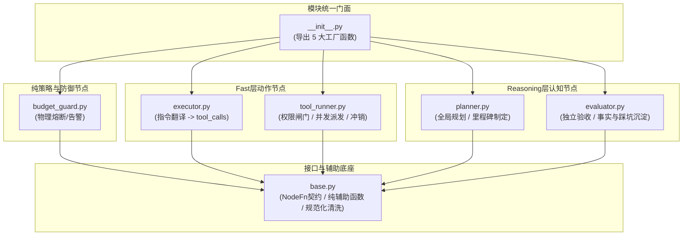

Listed directory nodes
Viewed __init__.py:1-33
Viewed base.py:1-223
Viewed budget_guard.py:1-53
Viewed executor.py:1-176
Viewed planner.py:1-334
Viewed tool_runner.py:1-369
Viewed evaluator.py:1-306
Searched for "agent_runtime.nodes"
Viewed workflow.py:30-95
Viewed workflow.py:240-320
Viewed workflow.py:380-450
Viewed workflow.py:450-485

[`AegisAgent/src/agent_runtime/nodes`](file:///home/Skualeilu/Projects/Aegis/AegisAgent/src/agent_runtime/nodes) 是 Aegis Agent 调度内核中承载 **LangGraph 状态机所有计算单元（Compute Units）** 的核心模块。以下基于当前源码实测，从外部解耦、整体职责、各文件结构、实现机理及内部组织进行系统剖析。

---

### 一、与外部模块的解耦与互相组织机制

该文件夹与外部依赖、图编排层、治理层、工具层保持高度正交解耦，核心通过以下 4 项机制协同：

1. **统一依赖注入工厂模式（Closure Factory Injection）**
   - **解耦矛盾**：LangGraph 对节点函数的契约是固定的 `NodeFn = Callable[[Mapping[str, Any]], Awaitable[Dict[str, Any]]]`，仅允许接收只读 `state` 并返回增量字典。但节点真实运转依赖模型网关、上下文装配器、提示词库、派发器等繁杂对象，这些对象绝不应污染进 Checkpoint 状态中。
   - **组织方式**：每个节点对外仅暴露 `build_xxx_node(deps) -> NodeFn` 工厂函数。外部装配层将依赖以闭包形式一次性注入，节点内部只关注状态机增量更新。
2. **与编排装配层（[`workflow.py`](file:///home/Skualeilu/Projects/Aegis/AegisAgent/src/agent_runtime/workflow.py)）的装配解耦**
   - 节点不感知自身何时被编译。在 [`workflow.py:_compile_app`](file:///home/Skualeilu/Projects/Aegis/AegisAgent/src/agent_runtime/workflow.py#L445-L485) 中集中初始化并挂载至 `StateGraph`：
     ```python
     nodes = {
         "planner": build_planner_node(...),
         "budget_guard": build_budget_guard_node(...),
         "executor": build_executor_node(...),
         "tool_runner": build_tool_runner_node(...),
         "evaluator": build_evaluator_node(...),
     }
     ```
3. **与控制流路由（[`edges/`](file:///home/Skualeilu/Projects/Aegis/AegisAgent/src/agent_runtime/edges)）完全解耦**
   - `nodes` 内部**完全没有**跳转下一个节点的硬编码逻辑。它只负责修改 `state`（如 `messages`, `milestones`, `should_terminate`）。具体的条件跳转全由 [`routing.EDGE_TABLE`](file:///home/Skualeilu/Projects/Aegis/AegisAgent/src/agent_runtime/routing.py) 和 `edges/after_*.py` 读取 State 判定，两者单向解耦。
4. **与底层工具（`tools/`）、治理（`guardrails/`）、可观测性（`observability/`）解耦**
   - `nodes` 不直接执行任何 Linux 命令或网络请求，而是将工具调用委托给 [`ToolDispatcher`](file:///home/Skualeilu/Projects/Aegis/AegisAgent/src/tools/core/dispatcher.py)。
   - 治理规则（如金丝雀泄露、死循环检测、观察值裁剪）均作为纯策略类封装在 `guardrails` 模块，节点仅调用策略接口。
   - 可观测组件（[`TaskEventBus`](file:///home/Skualeilu/Projects/Aegis/AegisAgent/src/agent_runtime/observability/event_bus.py)、[`TrajectoryRecorder`](file:///home/Skualeilu/Projects/Aegis/AegisAgent/src/agent_runtime/observability/trajectory.py)）作为可选旁路注入，缺失时优雅降级（为 `None` 不影响主线）。

---

### 二、此文件夹的代码职责

`nodes` 文件夹的核心职责是：**实现状态机闭环中各计算节点的确定性状态推演**。
主要涵盖：
1. **决策与反思**：将用户目标分解为里程碑，并在多轮执行后进行独立复核与记忆沉淀。
2. **动作生成与执行拆分**：将高阶动作意图翻译为具体工具调用，并在独立的沙箱/权限闸门中执行。
3. **安全与资源防御**：在每个关键节点处防范 Canary Token 泄露、死循环调用、物理预算超限与越级命令。

---

### 三、各文件职责一览

| 文件名 | 职责定位 | 核心模型/层级 |
| :--- | :--- | :--- |
| [`__init__.py`](file:///home/Skualeilu/Projects/Aegis/AegisAgent/src/agent_runtime/nodes/__init__.py) | 模块对外导出统一门面 | 导出 5 大节点工厂函数 |
| [`base.py`](file:///home/Skualeilu/Projects/Aegis/AegisAgent/src/agent_runtime/nodes/base.py) | 节点共享契约与纯辅助函数库（无状态） | 契约定义与数据规范化工具 |
| [`budget_guard.py`](file:///home/Skualeilu/Projects/Aegis/AegisAgent/src/agent_runtime/nodes/budget_guard.py) | 物理预算守卫节点（薄包装） | 确定性策略（无 LLM） |
| [`planner.py`](file:///home/Skualeilu/Projects/Aegis/AegisAgent/src/agent_runtime/nodes/planner.py) | 宏观规划与自愈重规划节点 | Reasoning 模型（强推理） |
| [`executor.py`](file:///home/Skualeilu/Projects/Aegis/AegisAgent/src/agent_runtime/nodes/executor.py) | 将指令翻译为工具调用的生成节点 | Fast 模型（高性价比） |
| [`tool_runner.py`](file:///home/Skualeilu/Projects/Aegis/AegisAgent/src/agent_runtime/nodes/tool_runner.py) | 权限拦截（HITL 挂起）、并发派发与观察值治理 | 确定性执行管道（无 LLM） |
| [`evaluator.py`](file:///home/Skualeilu/Projects/Aegis/AegisAgent/src/agent_runtime/nodes/evaluator.py) | 里程碑独立复核验收与跨轮次记忆沉淀 | Reasoning 模型（强推理） |

---

### 四、各文件内部符号结构详解（类、函数、变量）

#### 1. [`__init__.py`](file:///home/Skualeilu/Projects/Aegis/AegisAgent/src/agent_runtime/nodes/__init__.py)
- **导出常量与函数**：`__all__ = ["build_budget_guard_node", "build_evaluator_node", "build_executor_node", "build_planner_node", "build_tool_runner_node"]`。

#### 2. [`base.py`](file:///home/Skualeilu/Projects/Aegis/AegisAgent/src/agent_runtime/nodes/base.py)
- **类型定义**：
  - [`NodeFn`](file:///home/Skualeilu/Projects/Aegis/AegisAgent/src/agent_runtime/nodes/base.py#L30)：`Callable[[Mapping[str, Any]], Awaitable[Dict[str, Any]]]`，节点标准异步签名。
- **纯函数集合**：
  - [`latest_ai_message(messages) -> Optional[AIMessage]`](file:///home/Skualeilu/Projects/Aegis/AegisAgent/src/agent_runtime/nodes/base.py#L33)：倒序寻找最近一条 AI 消息。
  - [`to_tool_call_specs(tool_calls) -> List[tuple[str, str, Mapping[str, Any]]]`](file:///home/Skualeilu/Projects/Aegis/AegisAgent/src/agent_runtime/nodes/base.py#L48)：将网关返回规范化为 `(call_id, name, args)` 三元组。
  - [`is_failure_result(result: ToolResult) -> bool`](file:///home/Skualeilu/Projects/Aegis/AegisAgent/src/agent_runtime/nodes/base.py#L67)：基于 `ok`、`exit_code != 0` 及关键字三级确定性判定工具是否失败。
  - [`merge_unique(existing, new_items) -> List[str]`](file:///home/Skualeilu/Projects/Aegis/AegisAgent/src/agent_runtime/nodes/base.py#L91)：保序排重合并事实清单。
  - [`coerce_failed_attempts(raw) -> List[FailedAttempt]`](file:///home/Skualeilu/Projects/Aegis/AegisAgent/src/agent_runtime/nodes/base.py#L111)：将不可信输入安全转换为 `FailedAttempt` Pydantic 对象。
  - [`apply_milestone_updates(milestones, updates) -> List[Milestone]`](file:///home/Skualeilu/Projects/Aegis/AegisAgent/src/agent_runtime/nodes/base.py#L139)：安全应用状态更新（限制在合法状态集合）。
  - [`coerce_milestones(raw, max_items=8) -> List[Milestone]`](file:///home/Skualeilu/Projects/Aegis/AegisAgent/src/agent_runtime/nodes/base.py#L173)：结构清洗与防爆限制。
  - 重导出 [`extract_json_object`](file:///home/Skualeilu/Projects/Aegis/AegisAgent/src/agent_runtime/structured_output.py)。

#### 3. [`budget_guard.py`](file:///home/Skualeilu/Projects/Aegis/AegisAgent/src/agent_runtime/nodes/budget_guard.py)
- **工厂函数**：[`build_budget_guard_node(guard: PhysicalBudgetGuard) -> NodeFn`](file:///home/Skualeilu/Projects/Aegis/AegisAgent/src/agent_runtime/nodes/budget_guard.py#L21)
- **闭包内部函数**：`async def budget_guard(state: Mapping[str, Any]) -> Dict[str, Any]`
  - 属性/输入：`guard.check(state)` 检查是否触发物理硬熔断，`guard.warnings(state)` 检查软告警。
  - 产出：`{"should_terminate": True, "termination_reason": ...}` 或向 `messages` 注入告警 `SystemMessage`。

#### 4. [`planner.py`](file:///home/Skualeilu/Projects/Aegis/AegisAgent/src/agent_runtime/nodes/planner.py)
- **工具函数**：
  - [`format_structured_verdict_to_markdown(verdict: Dict[str, Any]) -> Optional[str]`](file:///home/Skualeilu/Projects/Aegis/AegisAgent/src/agent_runtime/nodes/planner.py#L42)：防御性将模型返回的复杂分析 JSON 转为优美的交付 Markdown 文本。
- **工厂函数**：[`build_planner_node(gateway, context, prompts, recorder=None, event_bus=None) -> NodeFn`](file:///home/Skualeilu/Projects/Aegis/AegisAgent/src/agent_runtime/nodes/planner.py#L139)
- **闭包内部函数**：`async def planner(state: Mapping[str, Any]) -> Dict[str, Any]`
  - 依赖：`gateway.invoke("reasoning", messages, force_json=True)`。
  - 内部防护：[`detect_canary_leak`](file:///home/Skualeilu/Projects/Aegis/AegisAgent/src/agent_runtime/guardrails/canary.py) 检测 Canary 泄露。
  - 产出增量：`messages`（包含下一步指令或最终结论）、`milestones`、`total_tokens`。

#### 5. [`executor.py`](file:///home/Skualeilu/Projects/Aegis/AegisAgent/src/agent_runtime/nodes/executor.py)
- **工厂函数**：[`build_executor_node(gateway, registry, prompts, context, recorder=None, event_bus=None) -> NodeFn`](file:///home/Skualeilu/Projects/Aegis/AegisAgent/src/agent_runtime/nodes/executor.py#L39)
- **闭包内部函数**：`async def executor(state: Mapping[str, Any]) -> Dict[str, Any]`
  - 依赖：`gateway.invoke("fast", messages, tools=tool_schemas)`。
  - 内部防护：Canary Token 泄露检测。
  - 产出增量：带有 `tool_calls` 的 `AIMessage`、步数递增 `step_count`、Token 递增 `total_tokens`。

#### 6. [`tool_runner.py`](file:///home/Skualeilu/Projects/Aegis/AegisAgent/src/agent_runtime/nodes/tool_runner.py)
- **模块常量**：
  - `FINGERPRINT_WINDOW = 5`（指纹滑动窗口）
  - `_LOOP_BLOCK_NOTICE` / `_REJECT_PREFIX`
- **辅助函数**：
  - [`async def _resolve_escalations(...) -> Set[str]`](file:///home/Skualeilu/Projects/Aegis/AegisAgent/src/agent_runtime/nodes/tool_runner.py#L294)：调用 LangGraph 的 `interrupt(payload)` 挂起图等待审批，并处理审批恢复后的结果。
- **工厂函数**：[`build_tool_runner_node(dispatcher, pruner, guardrails_config, permissions_config, *, ledger=None, authority=None, approval_allowlist=None, recorder=None) -> NodeFn`](file:///home/Skualeilu/Projects/Aegis/AegisAgent/src/agent_runtime/nodes/tool_runner.py#L72)
- **闭包内部函数**：`async def tool_runner(state: Mapping[str, Any]) -> Dict[str, Any]`
  - 产出增量：`messages`（所有配对 `ToolMessage`）、`consecutive_errors`、`fingerprint_history`、`artifacts`、`total_tokens`。

#### 7. [`evaluator.py`](file:///home/Skualeilu/Projects/Aegis/AegisAgent/src/agent_runtime/nodes/evaluator.py)
- **辅助函数**：
  - `_mark_milestone_completed(milestones, index) -> List[Milestone]`：标记里程碑完成并返回新列表。
- **工厂函数**：[`build_evaluator_node(gateway, context, prompts, recorder=None, event_bus=None) -> NodeFn`](file:///home/Skualeilu/Projects/Aegis/AegisAgent/src/agent_runtime/nodes/evaluator.py#L60)
- **闭包内部函数**：`async def evaluator(state: Mapping[str, Any]) -> Dict[str, Any]`
  - 依赖：`gateway.invoke("reasoning", messages, force_json=True)`。
  - 内部机制：死循环打回熔断保护（`prior_rejections >= 2`）、事实与踩坑抽取。
  - 产出增量：`milestones`、`current_milestone_idx`、`rolling_summary`、`confirmed_facts`、`failed_attempts`、`should_terminate`。

---

### 五、核心实现原理与设计精妙之处

#### 1. 为什么把 `executor` 与 `tool_runner` 拆分为两个独立节点？（重点设计）
- **核心原因**：LangGraph 的 `interrupt()` 在被前端审批恢复后，**机制是重新执行整个当前节点**。
- **若合并在同个节点**：如果在 LLM 生成之后做审批，用户审批完恢复时，模型调用会**再次发生一次**！这不仅白白浪费 Token，而且由于采样温度差异，重跑生成的命令可能与用户刚才在界面上批准的命令**不一致**。
- **拆分方案**：
  - `executor`：只负责调用 fast LLM 产出 `tool_calls`（含在 `AIMessage` 中）。
  - `tool_runner`：纯判定与执行引擎，无 LLM 调用。审批挂起点位于此处，即使重跑，开销仅为微秒级纯函数校验，彻底杜绝了重复扣费与命令漂移。

#### 2. `tool_runner` 的严格单向不可乱序管线（8 步铁律）
代码注释与实现严格规定了执行顺序：
```text
1. 读取上一条 AIMessage 的 tool_calls
2. 权限闸门：判定越级 -> 越级则调用 interrupt() 挂起
3. 预算账本：同步已用量 -> 串行预留准入（防止并发子任务透支）
4. 指纹登记与死循环拦截
5. asyncio.gather 并发派发
6. 观察值治理（裁剪超大输出并落盘 Artifact）+ 原子对信封封装
7. 瞬态护栏：连续失败计数 + 触发重规划通知
8. 预算冲销：把子智能体消耗冲销并入父任务 total_tokens
```
> **原子对铁律**：无论工具是被用户审批拒绝、死循环拦截还是执行报错，系统都**无条件为其生成对应的 `ToolMessage`**，防止因 OpenAI 协议要求的 `tool_call_id` 不匹配导致 400 崩溃。

#### 3. `evaluator` 的独立复核与死循环自愈熔断
- **职责分离**：Planner 负责“推进”，Evaluator 负责“挑刺验收”，避免执行者自行宣布完工。
- **打回死循环防线**：若 Evaluator 过于严苛连续打回 $\ge 2$ 次，且当前 AI 已有实质性结论交付，系统会自动触发熔断放行（`accepted = True`），防止任务陷入死循环耗尽预算。

---

### 六、文件夹内部的代码组织结构

内部依赖呈清晰的**放射型/分层拓扑**，没有任何循环依赖：



1. **底层单向依赖**：`budget_guard`、`executor`、`tool_runner`、`planner`、`evaluator` 均单向依赖 `base.py`，节点彼此之间**完全互不导入**。
2. **状态驱动协同**：节点之间唯一的信息传递纽带就是 LangGraph 的只读 `state` 输入与增量字典返回。
3. **顶层统一汇聚**：`__init__.py` 作为唯一的向外导出边界，供 [`workflow.py`](file:///home/Skualeilu/Projects/Aegis/AegisAgent/src/agent_runtime/workflow.py) 集中装配。

---

### 【下一步探索建议】
1. **深入条件边**：查看 [`agent_runtime/edges`](file:///home/Skualeilu/Projects/Aegis/AegisAgent/src/agent_runtime/edges) 如何根据这些节点的输出决定状态流转路径（如 `after_executor.py` 如何分流去 `tool_runner` 还是 `evaluator`）。
2. **查看权限拦截实现**：深入 [`guardrails/permission.py`](file:///home/Skualeilu/Projects/Aegis/AegisAgent/src/agent_runtime/guardrails/permission.py) 查看三级权限分类判定规则。
3. **查看端到端执行流**：从前端发起指令到 Node 运行再通过 SSE 吐回的完整 Execution Path。